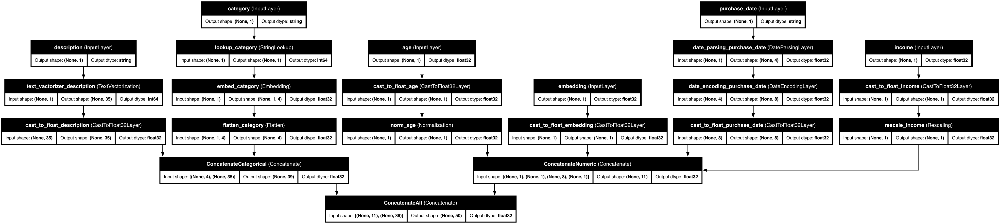

# 🌟 Keras Data Processor (KDP) - Powerful Data Preprocessing for TensorFlow 🌟

<div align="center">

  


  <p><strong>Provided and maintained by <a href="https://unicolab.ai">🦄 UnicoLab</a></strong></p>

</div>

[](https://www.python.org/downloads/)
[](https://www.tensorflow.org/)
[](https://opensource.org/licenses/MIT)
[](https://unicolab.ai)
[](https://unicolab.github.io/keras-data-processor/)

**Transform your raw data into ML-ready features with just a few lines of code!**

KDP provides a state-of-the-art preprocessing system built on TensorFlow Keras. It handles everything from feature normalization to advanced embedding techniques, making your ML pipelines faster, more robust, and easier to maintain. Built with ❤️ by [🦄 UnicoLab](https://unicolab.ai), it provides a clean, efficient, and extensible foundation for building sophisticated machine learning models for enterprise AI applications.

## ✨ Key Features

- 🚀 **Efficient Single-Pass Processing**: Process all features in one go, dramatically faster than alternatives
- 🧠 **Distribution-Aware Encoding**: Automatically detects and optimally handles different data distributions
- 👁️ **Tabular Attention**: Captures complex feature interactions for better model performance
- 🔍 **Feature Selection**: Automatically identifies and focuses on the most important features
- 🔄 **Feature-wise Mixture of Experts**: Specialized processing for different feature types
- 📦 **Production-Ready**: Deploy your preprocessing along with your model as a single unit

## 🚀 Quick Installation

```bash
# Using pip
pip install kdp

# Using Poetry
poetry add kdp
```

## 📋 Simple Example

```python
from kdp import PreprocessingModel, FeatureType

# Define your features
features_specs = {
    "age": FeatureType.FLOAT_NORMALIZED,
    "income": FeatureType.FLOAT_RESCALED,
    "occupation": FeatureType.STRING_CATEGORICAL,
    "description": FeatureType.TEXT
}

# Create and build the preprocessor
preprocessor = PreprocessingModel(
    path_data="data/my_data.csv",
    features_specs=features_specs,
    # Enable advanced features
    use_distribution_aware=True,
    tabular_attention=True
)
result = preprocessor.build_preprocessor()
model = result["model"]

# Use the preprocessor with your data
processed_features = model(input_data)
```

## 📚 Comprehensive Documentation

We've built an extensive documentation system to help you get the most from KDP:

### Core Guides

- [🚀 Quick Start Guide](docs/quick_start.md) - Get up and running in minutes
- [📊 Feature Processing](docs/features.md) - Learn about all supported feature types
- [🧙‍♂️ Auto-Configuration](docs/auto_configuration.md) - Let KDP configure itself for your data

### Advanced Topics

- [📈 Distribution-Aware Encoding](docs/distribution_aware_encoder.md) - Smart handling of different distributions
- [👁️ Tabular Attention](docs/tabular_attention.md) - Capture complex feature interactions
- [🔢 Advanced Numerical Embeddings](docs/advanced_numerical_embeddings.md) - Rich representations for numbers
- [🤖 Transformer Blocks](docs/transformer_blocks.md) - Apply transformer architecture to tabular data
- [🎯 Feature Selection](docs/feature_selection.md) - Focus on what matters in your data
- [🧠 Feature-wise Mixture of Experts](docs/feature_moe.md) - Specialized processing per feature

### Integration & Performance

- [🔗 Integration Guide](docs/integrations.md) - Use KDP with existing ML pipelines
- [🚀 Tabular Optimization](docs/tabular_optimization.md) - Supercharge your preprocessing
- [📈 Performance Tips](docs/complex_examples.md) - Handling large datasets efficiently

### Background & Resources

- [💡 Motivation](docs/motivation.md) - Why we built KDP
- [🤝 Contributing](docs/contributing.md) - Help improve KDP

## 🖼️ Model Architecture

Your preprocessing pipeline is built as a Keras model that can be used independently or as the first layer of any model:

<p align="center">
  
</p>

## 📊 Performance

KDP outperforms alternative preprocessing approaches, especially as data size increases:

<p align="center">
  
  
</p>

## 🤝 Contributing

We welcome contributions! Please check out our [Contributing Guide](docs/contributing.md) for guidelines on how to proceed.

## 💬 Join Our Community

Have questions or want to connect with other KDP users? Join us on Discord:

[](https://discord.gg/ZQHk5fV7mt)

## 🛠️ Development Tools

KDP includes tools to help developers:

- **Documentation Generation**: Automatically generate API docs from docstrings
- **Model Diagram Generation**: Visualize model architectures with `make generate_doc_content` or run:
  ```bash
  python scripts/generate_model_diagrams.py
  ```
  This creates diagram images in `docs/features/imgs/models/` for all feature types and configurations.

## 📄 License

This project is licensed under the MIT License - see the LICENSE file for details.

## 🙏 Acknowledgments

- Built with [TensorFlow](https://www.tensorflow.org/) and [Keras](https://keras.io/)
- Inspired by modern deep learning research
- Community-driven development
- All contributors who help make KDP better

---

<p align="center">

  <strong>Built with ❤️ for the ML community by 🦄 UnicoLab.ai</strong>

</p>
