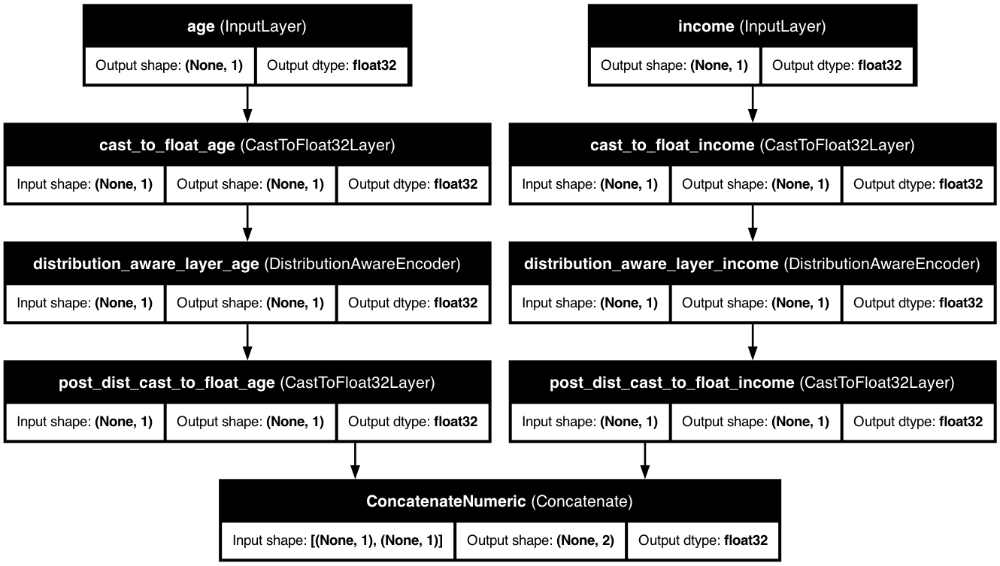

# 🔄 Distribution-Aware Encoding

<div class="feature-header">
  <div class="feature-title">
    <h2>Distribution-Aware Encoding</h2>
    <p>Automatically detect and handle various data distributions for optimal preprocessing.</p>
  </div>
</div>

## 📋 Overview

<div class="overview-card">
  <p>The <strong>Distribution-Aware Encoder</strong> is a powerful preprocessing layer that automatically detects and handles various data distributions. It intelligently transforms your data while preserving its statistical properties, leading to better model performance.</p>
</div>

<div class="key-benefits">
  <div class="benefit-card">
    <span class="benefit-icon">🔍</span>
    <h3>Automatic Distribution Detection</h3>
    <p>Identifies data patterns using statistical analysis</p>
  </div>
  <div class="benefit-card">
    <span class="benefit-icon">⚙️</span>
    <h3>Smart Transformations</h3>
    <p>Applies distribution-specific preprocessing</p>
  </div>
  <div class="benefit-card">
    <span class="benefit-icon">🚀</span>
    <h3>Production-Ready</h3>
    <p>Built with pure TensorFlow operations for deployment</p>
  </div>
  <div class="benefit-card">
    <span class="benefit-icon">🔌</span>
    <h3>Flexible Integration</h3>
    <p>Works seamlessly with KDP's preprocessing pipeline</p>
  </div>
  <div class="benefit-card">
    <span class="benefit-icon">📊</span>
    <h3>Graph Mode Compatible</h3>
    <p>Works in both eager and graph execution modes</p>
  </div>
  <div class="benefit-card">
    <span class="benefit-icon">📦</span>
    <h3>Memory Efficient</h3>
    <p>Optimized for large-scale datasets</p>
  </div>
</div>

## 🎯 Use Cases

<div class="use-cases-container">
  <div class="use-case-card">
    <span class="use-case-icon">💰</span>
    <h3>Financial Data</h3>
    <p>Handling heavy-tailed distributions in price movements</p>
  </div>
  <div class="use-case-card">
    <span class="use-case-icon">📡</span>
    <h3>Sensor Data</h3>
    <p>Processing periodic patterns in time series</p>
  </div>
  <div class="use-case-card">
    <span class="use-case-icon">👤</span>
    <h3>User Behavior</h3>
    <p>Managing sparse data with many zeros</p>
  </div>
  <div class="use-case-card">
    <span class="use-case-icon">🌍</span>
    <h3>Natural Phenomena</h3>
    <p>Handling multimodal distributions</p>
  </div>
  <div class="use-case-card">
    <span class="use-case-icon">🔢</span>
    <h3>Count Data</h3>
    <p>Processing discrete and zero-inflated distributions</p>
  </div>
</div>

## 🚀 Getting Started

### Basic Usage

<div class="code-container">

```python
from kdp import PreprocessingModel, FeatureType

# Define numerical features
features_specs = {
    "price": FeatureType.FLOAT_NORMALIZED,
    "volume": FeatureType.FLOAT_RESCALED,
    "rating": FeatureType.FLOAT_NORMALIZED
}

# Initialize model with distribution-aware encoding
preprocessor = PreprocessingModel(
    path_data="data/my_data.csv",
    features_specs=features_specs,
    use_distribution_aware=True,  # Enable distribution-aware encoding
    distribution_aware_bins=1000  # Number of bins for distribution analysis
)
```

</div>

### Advanced Configuration

<div class="code-container">

```python
from kdp.features import NumericalFeature
from kdp.layers.distribution_aware_encoder_layer import DistributionType

features_specs = {
    "price": NumericalFeature(
        name="price",
        feature_type=FeatureType.FLOAT_NORMALIZED,
        preferred_distribution=DistributionType.LOG_NORMAL  # Specify distribution
    ),
    "volume": NumericalFeature(
        name="volume",
        feature_type=FeatureType.FLOAT_RESCALED,
        preferred_distribution=DistributionType.ZERO_INFLATED  # Handle sparse data
    )
}

preprocessor = PreprocessingModel(
    path_data="data/my_data.csv",
    features_specs=features_specs,
    use_distribution_aware=True,
    distribution_aware_bins=1000,
    detect_periodicity=True,  # Enable periodic pattern detection
    handle_sparsity=True     # Enable sparse data handling
)
```

</div>

## 📊 Supported Distributions

<div class="table-container">
  <table class="distributions-table">
    <thead>
      <tr>
        <th>Distribution Type</th>
        <th>Description</th>
        <th>Detection Criteria</th>
        <th>Use Case</th>
      </tr>
    </thead>
    <tbody>
      <tr>
        <td><strong>Normal</strong></td>
        <td>Standard bell curve</td>
        <td>Skewness < 0.5, Kurtosis ≈ 3.0</td>
        <td>Height, weight measurements</td>
      </tr>
      <tr>
        <td><strong>Heavy-Tailed</strong></td>
        <td>Longer tails than normal</td>
        <td>Kurtosis > 4.0</td>
        <td>Financial returns</td>
      </tr>
      <tr>
        <td><strong>Multimodal</strong></td>
        <td>Multiple peaks</td>
        <td>Multiple histogram peaks</td>
        <td>Mixed populations</td>
      </tr>
      <tr>
        <td><strong>Uniform</strong></td>
        <td>Even distribution</td>
        <td>Bounded between 0 and 1</td>
        <td>Random sampling</td>
      </tr>
      <tr>
        <td><strong>Exponential</strong></td>
        <td>Exponential decay</td>
        <td>Positive values, skewness > 1.0</td>
        <td>Time between events</td>
      </tr>
      <tr>
        <td><strong>Log-Normal</strong></td>
        <td>Normal after log transform</td>
        <td>Positive values, skewness > 2.0</td>
        <td>Income distribution</td>
      </tr>
      <tr>
        <td><strong>Discrete</strong></td>
        <td>Finite distinct values</td>
        <td>Low unique value ratio (< 0.1)</td>
        <td>Count data</td>
      </tr>
      <tr>
        <td><strong>Periodic</strong></td>
        <td>Cyclic patterns</td>
        <td>Significant autocorrelation</td>
        <td>Seasonal data</td>
      </tr>
      <tr>
        <td><strong>Sparse</strong></td>
        <td>Many zeros</td>
        <td>Zero ratio > 0.5</td>
        <td>User activity data</td>
      </tr>
      <tr>
        <td><strong>Beta</strong></td>
        <td>Bounded with shape parameters</td>
        <td>Bounded [0,1], skewness > 0.5</td>
        <td>Proportions</td>
      </tr>
      <tr>
        <td><strong>Gamma</strong></td>
        <td>Positive, right-skewed</td>
        <td>Positive values, mild skewness</td>
        <td>Waiting times</td>
      </tr>
      <tr>
        <td><strong>Poisson</strong></td>
        <td>Count data</td>
        <td>Discrete positive values</td>
        <td>Event counts</td>
      </tr>
      <tr>
        <td><strong>Cauchy</strong></td>
        <td>Extremely heavy-tailed</td>
        <td>Very high kurtosis (> 10.0)</td>
        <td>Extreme events</td>
      </tr>
      <tr>
        <td><strong>Zero-Inflated</strong></td>
        <td>Excess zeros</td>
        <td>Moderate zero ratio (0.3-0.5)</td>
        <td>Rare events</td>
      </tr>
      <tr>
        <td><strong>Bounded</strong></td>
        <td>Known bounds</td>
        <td>Explicit bounds provided</td>
        <td>Physical measurements</td>
      </tr>
      <tr>
        <td><strong>Ordinal</strong></td>
        <td>Ordered categories</td>
        <td>Discrete ordered values</td>
        <td>Ratings, scores</td>
      </tr>
    </tbody>
  </table>
</div>

## ⚙️ Configuration Options

<div class="table-container">
  <table class="config-table">
    <thead>
      <tr>
        <th>Parameter</th>
        <th>Type</th>
        <th>Default</th>
        <th>Description</th>
      </tr>
    </thead>
    <tbody>
      <tr>
        <td><code>use_distribution_aware</code></td>
        <td>bool</td>
        <td>False</td>
        <td>Enable distribution-aware encoding</td>
      </tr>
      <tr>
        <td><code>distribution_aware_bins</code></td>
        <td>int</td>
        <td>1000</td>
        <td>Number of bins for distribution analysis</td>
      </tr>
      <tr>
        <td><code>detect_periodicity</code></td>
        <td>bool</td>
        <td>True</td>
        <td>Detect and handle periodic patterns</td>
      </tr>
      <tr>
        <td><code>handle_sparsity</code></td>
        <td>bool</td>
        <td>True</td>
        <td>Special handling for sparse data</td>
      </tr>
      <tr>
        <td><code>embedding_dim</code></td>
        <td>int</td>
        <td>None</td>
        <td>Output dimension for feature projection</td>
      </tr>
      <tr>
        <td><code>add_distribution_embedding</code></td>
        <td>bool</td>
        <td>False</td>
        <td>Add learned distribution type embedding</td>
      </tr>
      <tr>
        <td><code>epsilon</code></td>
        <td>float</td>
        <td>1e-6</td>
        <td>Small value to prevent numerical issues</td>
      </tr>
      <tr>
        <td><code>transform_type</code></td>
        <td>str</td>
        <td>"auto"</td>
        <td>Type of transformation to apply</td>
      </tr>
    </tbody>
  </table>
</div>

## 🎯 Best Practices

<div class="best-practices-container">
  <div class="best-practice-card">
    <h3>Distribution Detection</h3>
    <ul>
      <li>Start with automatic detection</li>
      <li>Specify preferred distributions only when confident</li>
      <li>Use appropriate bin sizes for your data scale</li>
      <li>Monitor detection accuracy with known distributions</li>
    </ul>
  </div>

  <div class="best-practice-card">
    <h3>Performance Optimization</h3>
    <ul>
      <li>Enable periodic detection for time series data</li>
      <li>Use sparse handling for data with many zeros</li>
      <li>Consider memory usage with large bin sizes</li>
      <li>Use appropriate embedding dimensions</li>
    </ul>
  </div>

  <div class="best-practice-card">
    <h3>Integration Tips</h3>
    <ul>
      <li>Combine with other KDP features for best results</li>
      <li>Use appropriate feature types (FLOAT_NORMALIZED, FLOAT_RESCALED)</li>
      <li>Monitor model performance with different configurations</li>
      <li>Consider using distribution embeddings for complex patterns</li>
    </ul>
  </div>
</div>

## 🔍 Examples

<div class="examples-container">
  <div class="example-card">
    <h3>Financial Data Processing</h3>
    <div class="code-container">

```python
from kdp import PreprocessingModel, FeatureType
from kdp.features import NumericalFeature
from kdp.layers.distribution_aware_encoder_layer import DistributionType

# Define financial features
features_specs = {
    "price": NumericalFeature(
        name="price",
        feature_type=FeatureType.FLOAT_NORMALIZED,
        preferred_distribution=DistributionType.LOG_NORMAL
    ),
    "volume": NumericalFeature(
        name="volume",
        feature_type=FeatureType.FLOAT_RESCALED,
        preferred_distribution=DistributionType.ZERO_INFLATED
    ),
    "volatility": NumericalFeature(
        name="volatility",
        feature_type=FeatureType.FLOAT_NORMALIZED,
        preferred_distribution=DistributionType.CAUCHY
    )
}

# Create preprocessing model
preprocessor = PreprocessingModel(
    path_data="data/financial_data.csv",
    features_specs=features_specs,
    use_distribution_aware=True,
    distribution_aware_bins=1000,
    detect_periodicity=True,  # For daily/weekly patterns
    handle_sparsity=True,    # For low-volume periods
    embedding_dim=32,        # Project to fixed dimension
    add_distribution_embedding=True  # Add distribution information
)
```

    </div>
  </div>

  <div class="example-card">
    <h3>Sensor Data Processing</h3>
    <div class="code-container">

```python
features_specs = {
    "temperature": NumericalFeature(
        name="temperature",
        feature_type=FeatureType.FLOAT_NORMALIZED,
        preferred_distribution=DistributionType.NORMAL
    ),
    "humidity": NumericalFeature(
        name="humidity",
        feature_type=FeatureType.FLOAT_NORMALIZED,
        preferred_distribution=DistributionType.BETA  # Bounded between 0-100%
    ),
    "pressure": NumericalFeature(
        name="pressure",
        feature_type=FeatureType.FLOAT_NORMALIZED,
        preferred_distribution=DistributionType.NORMAL
    )
}

preprocessor = PreprocessingModel(
    path_data="data/sensor_data.csv",
    features_specs=features_specs,
    use_distribution_aware=True,
    distribution_aware_bins=500,  # Fewer bins for simpler distributions
    detect_periodicity=True,      # For daily temperature cycles
    handle_sparsity=False,       # No sparse data expected
    embedding_dim=16             # Smaller embedding for simpler patterns
)
```

    </div>
  </div>
</div>

## 📊 Model Architecture

<div class="architecture-diagram">
  
  <div class="diagram-caption">
    <p>The distribution-aware encoder architecture automatically adapts to your data's distribution, transforming numerical features to better match their underlying statistical properties, improving model performance.</p>
  </div>
</div>

## 🔗 Related Topics

<div class="related-topics">
  <a href="../features/numerical-features.md" class="topic-link">
    <span class="topic-icon">🔢</span>
    <span class="topic-text">Numerical Features</span>
  </a>
  <a href="numerical-embeddings.md" class="topic-link">
    <span class="topic-icon">🧮</span>
    <span class="topic-text">Advanced Numerical Embeddings</span>
  </a>
  <a href="tabular-attention.md" class="topic-link">
    <span class="topic-icon">👁️</span>
    <span class="topic-text">Tabular Attention</span>
  </a>
  <a href="feature-selection.md" class="topic-link">
    <span class="topic-icon">🎯</span>
    <span class="topic-text">Feature Selection</span>
  </a>
</div>

---

<div class="nav-container">
  <a href="../features/cross-features.md" class="nav-button prev">
    <span class="nav-icon">←</span>
    <span class="nav-text">Cross Features</span>
  </a>
  <a href="numerical-embeddings.md" class="nav-button next">
    <span class="nav-text">Advanced Numerical Embeddings</span>
    <span class="nav-icon">→</span>
  </a>
</div>

<style>
/* Base styling */
body {
  font-family: -apple-system, BlinkMacSystemFont, "Segoe UI", Roboto, Helvetica, Arial, sans-serif;
  line-height: 1.6;
  color: #333;
  margin: 0;
  padding: 0;
}

/* Feature header */
.feature-header {
  background: linear-gradient(135deg, #4caf50 0%, #8bc34a 100%);
  border-radius: 10px;
  padding: 30px;
  margin: 30px 0;
  box-shadow: 0 4px 6px rgba(0,0,0,0.1);
  color: white;
}

.feature-title h2 {
  margin-top: 0;
  font-size: 28px;
}

.feature-title p {
  font-size: 18px;
  margin-bottom: 0;
  opacity: 0.9;
}

/* Overview card */
.overview-card {
  background-color: #fff;
  border-radius: 10px;
  padding: 20px 25px;
  margin: 20px 0;
  box-shadow: 0 2px 5px rgba(0,0,0,0.05);
  border-left: 4px solid #4caf50;
}

.overview-card p {
  margin: 0;
  font-size: 16px;
}

/* Key benefits */
.key-benefits {
  display: grid;
  grid-template-columns: repeat(auto-fill, minmax(250px, 1fr));
  gap: 20px;
  margin: 30px 0;
}

.benefit-card {
  background-color: #fff;
  border-radius: 10px;
  padding: 20px;
  box-shadow: 0 4px 8px rgba(0,0,0,0.05);
  transition: transform 0.3s ease, box-shadow 0.3s ease;
  display: flex;
  flex-direction: column;
  align-items: center;
  text-align: center;
}

.benefit-card:hover {
  transform: translateY(-5px);
  box-shadow: 0 8px 16px rgba(0,0,0,0.1);
}

.benefit-icon {
  font-size: 2.5em;
  margin-bottom: 15px;
}

.benefit-card h3 {
  margin: 0 0 10px 0;
  color: #4caf50;
}

.benefit-card p {
  margin: 0;
}

/* Use cases */
.use-cases-container {
  display: grid;
  grid-template-columns: repeat(auto-fill, minmax(200px, 1fr));
  gap: 20px;
  margin: 30px 0;
}

.use-case-card {
  background-color: #fff;
  border-radius: 10px;
  padding: 20px;
  box-shadow: 0 4px 8px rgba(0,0,0,0.05);
  transition: transform 0.3s ease, box-shadow 0.3s ease;
  display: flex;
  flex-direction: column;
  align-items: center;
  text-align: center;
}

.use-case-card:hover {
  transform: translateY(-5px);
  box-shadow: 0 8px 16px rgba(0,0,0,0.1);
}

.use-case-icon {
  font-size: 2.5em;
  margin-bottom: 15px;
}

.use-case-card h3 {
  margin: 0 0 10px 0;
  color: #4caf50;
}

.use-case-card p {
  margin: 0;
}

/* Code containers */
.code-container {
  background-color: #f8f9fa;
  border-radius: 8px;
  overflow: hidden;
  box-shadow: 0 2px 5px rgba(0,0,0,0.1);
  margin: 20px 0;
}

.code-container pre {
  margin: 0;
  padding: 20px;
}

/* Tables */
.table-container {
  margin: 30px 0;
  border-radius: 10px;
  overflow: hidden;
  box-shadow: 0 4px 8px rgba(0,0,0,0.05);
}

.distributions-table, .config-table {
  width: 100%;
  border-collapse: collapse;
}

.distributions-table th, .config-table th {
  background-color: #e8f5e9;
  padding: 15px;
  text-align: left;
  font-weight: 600;
  border-bottom: 2px solid #4caf50;
}

.distributions-table td, .config-table td {
  padding: 12px 15px;
  border-bottom: 1px solid #eaecef;
}

.distributions-table tr:nth-child(even), .config-table tr:nth-child(even) {
  background-color: #f8f9fa;
}

.distributions-table tr:hover, .config-table tr:hover {
  background-color: #e8f5e9;
}

/* Best practices */
.best-practices-container {
  display: grid;
  grid-template-columns: repeat(auto-fill, minmax(300px, 1fr));
  gap: 20px;
  margin: 30px 0;
}

.best-practice-card {
  background-color: #fff;
  border-radius: 10px;
  padding: 20px;
  box-shadow: 0 4px 8px rgba(0,0,0,0.05);
  transition: transform 0.3s ease, box-shadow 0.3s ease;
}

.best-practice-card:hover {
  transform: translateY(-5px);
  box-shadow: 0 8px 16px rgba(0,0,0,0.1);
}

.best-practice-card h3 {
  margin-top: 0;
  color: #4caf50;
}

.best-practice-card ul {
  margin: 0;
  padding-left: 20px;
}

.best-practice-card li {
  margin-bottom: 5px;
}

/* Examples */
.examples-container {
  display: grid;
  grid-template-columns: repeat(auto-fill, minmax(400px, 1fr));
  gap: 20px;
  margin: 30px 0;
}

.example-card {
  background-color: #fff;
  border-radius: 10px;
  padding: 20px;
  box-shadow: 0 4px 8px rgba(0,0,0,0.05);
  transition: transform 0.3s ease, box-shadow 0.3s ease;
}

.example-card:hover {
  transform: translateY(-5px);
  box-shadow: 0 8px 16px rgba(0,0,0,0.1);
}

.example-card h3 {
  margin-top: 0;
  color: #4caf50;
}

/* Architecture diagram */
.architecture-diagram {
  background-color: white;
  border-radius: 10px;
  padding: 20px;
  margin: 30px 0;
  box-shadow: 0 4px 8px rgba(0,0,0,0.05);
  text-align: center;
}

.architecture-image {
  max-width: 100%;
  border-radius: 5px;
}

.diagram-caption {
  margin-top: 20px;
  text-align: center;
  font-style: italic;
}

/* Related topics */
.related-topics {
  display: flex;
  flex-wrap: wrap;
  gap: 15px;
  margin: 30px 0;
}

.topic-link {
  display: flex;
  align-items: center;
  padding: 10px 15px;
  background-color: #e8f5e9;
  border-radius: 8px;
  text-decoration: none;
  color: #333;
  box-shadow: 0 2px 5px rgba(0,0,0,0.05);
  transition: background-color 0.3s ease, transform 0.3s ease;
}

.topic-link:hover {
  background-color: #c8e6c9;
  transform: translateY(-2px);
}

.topic-icon {
  font-size: 1.2em;
  margin-right: 10px;
}

/* Navigation */
.nav-container {
  display: flex;
  justify-content: space-between;
  margin: 40px 0;
}

.nav-button {
  display: flex;
  align-items: center;
  padding: 10px 15px;
  background-color: #f8f9fa;
  border-radius: 8px;
  text-decoration: none;
  color: #333;
  box-shadow: 0 2px 5px rgba(0,0,0,0.1);
  transition: background-color 0.3s ease, transform 0.3s ease;
}

.nav-button:hover {
  background-color: #e8f5e9;
  transform: translateY(-2px);
}

.nav-button.prev {
  padding-left: 10px;
}

.nav-button.next {
  padding-right: 10px;
}

.nav-icon {
  font-size: 1.2em;
  margin: 0 8px;
}

/* Responsive adjustments */
@media (max-width: 768px) {
  .key-benefits,
  .use-cases-container,
  .best-practices-container,
  .examples-container {
    grid-template-columns: 1fr;
  }

  .related-topics {
    flex-direction: column;
  }
}
</style>
