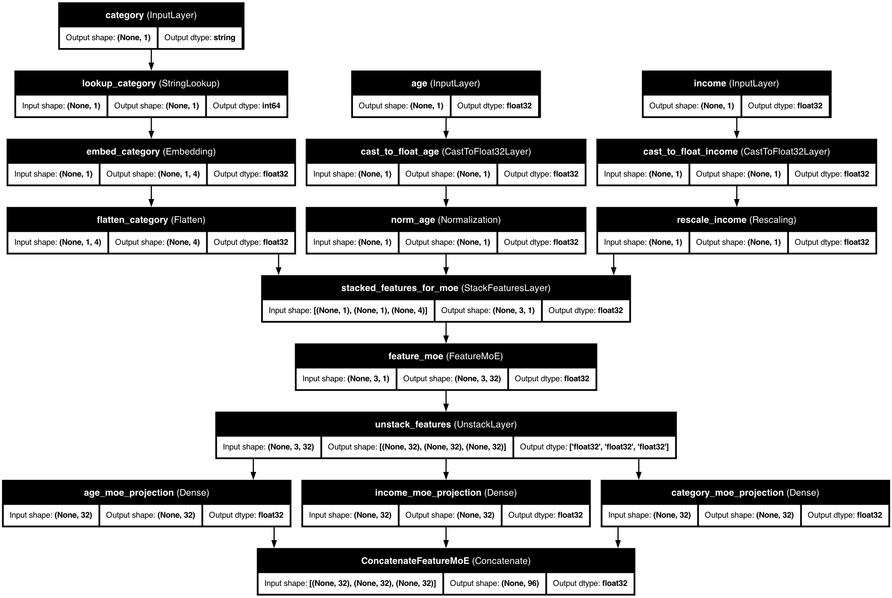

# 🧩 Feature-wise Mixture of Experts

> Specialized processing for heterogeneous tabular features

Feature-wise Mixture of Experts (MoE) is a powerful technique that applies different processing strategies to different features based on their characteristics. This approach allows for more specialized handling of each feature, improving model performance on complex, heterogeneous datasets.

## 🔍 Quick Overview

Feature MoE works by routing each feature through a set of specialized "expert" networks. Each expert can specialize in processing specific feature patterns or distributions, and a router determines which experts should handle each feature. This enables your model to handle complex, multi-modal data more effectively.

## 🚀 Basic Usage

Enable Feature MoE with just one parameter:

```python
from kdp import PreprocessingModel, FeatureType

# Define features
features = {
    "age": FeatureType.FLOAT_NORMALIZED,
    "income": FeatureType.FLOAT_RESCALED,
    "occupation": FeatureType.STRING_CATEGORICAL,
    "purchase_history": FeatureType.FLOAT_ARRAY,
}

# Create preprocessor with Feature MoE
preprocessor = PreprocessingModel(
    path_data="data.csv",
    features_specs=features,
    use_feature_moe=True,               # Turn on the magic
    feature_moe_num_experts=4,          # Four specialized experts
    feature_moe_expert_dim=64           # Size of expert representations
)

# Build and use
result = preprocessor.build_preprocessor()
model = result["model"]
```

## 🧩 How Feature MoE Works

KDP's Feature MoE uses a "divide and conquer" approach with smart routing:



1. **Expert Networks**: Each expert is a specialized neural network that processes features in its own unique way.
2. **Router Network**: Determines which experts should process each feature.
3. **Adaptive Weighting**: Features can use multiple experts with different weights.
4. **Residual Connections**: Preserve the original feature information while adding expert insights.

## 📊 Model Architecture

The Feature-wise Mixture of Experts in KDP works by:

1. Applying different specialized "expert" networks to each feature
2. Using a gating mechanism to determine how much each expert contributes
3. Combining the expert outputs to produce the final feature representation


The diagram illustrates how different features are processed by specialized expert networks, with a gating mechanism determining which experts handle each feature.

## ⚙️ Configuration Options

Customize Feature MoE behavior with these parameters:

```python
preprocessor = PreprocessingModel(
    use_feature_moe=True,
    feature_moe_num_experts=5,           # More experts for complex signals
    feature_moe_expert_dim=96,           # Larger dimension for subtle patterns
    feature_moe_hidden_dims=[128, 64],   # Expert network architecture
    feature_moe_routing="learned",       # How to assign experts
    feature_moe_sparsity=2,              # Use top-2 experts per feature
)
```

### Routing Types

You can choose between two routing methods:

**1. Learned Routing**: The model learns which experts to use for each feature during training.

```python
preprocessor = PreprocessingModel(
    use_feature_moe=True,
    feature_moe_routing="learned",
    feature_moe_sparsity=2,  # Use top 2 experts per feature
)
```

**2. Predefined Routing**: You specify which experts should handle each feature.

```python
preprocessor = PreprocessingModel(
    use_feature_moe=True,
    feature_moe_routing="predefined",
    feature_moe_assignments={
        "age": 0,              # Expert 0 for age
        "income": 1,           # Expert 1 for income
        "occupation": 2,       # Expert 2 for occupation
        "purchase_history": 3  # Expert 3 for purchase history
    }
)
```

### Key Configuration Parameters

| Parameter | Description | Default | Recommended Range |
|-----------|-------------|---------|-------------------|
| `feature_moe_num_experts` | Number of specialists | 4 | 3-5 for most tasks, 6-8 for very complex data |
| `feature_moe_expert_dim` | Size of expert output | 64 | Larger (96-128) for complex patterns |
| `feature_moe_routing` | How to assign experts | "learned" | "learned" for automatic, "predefined" for control |
| `feature_moe_sparsity` | Use only top k experts | 2 | 1-3 (lower = faster, higher = more accurate) |
| `feature_moe_hidden_dims` | Expert network size | [64, 32] | Deeper for complex relationships |

## 💡 Pro Tips for Feature MoE

1. **Group Similar Features**: Assign related features to the same expert for consistent processing:

```python
# Group demographic features to expert 0, financial to expert 1
feature_groups = {
    "age": 0, "gender": 0, "location": 0,           # Demographics
    "income": 1, "credit_score": 1, "balance": 1,   # Financial
    "item_id": 2, "brand": 2, "category": 2,        # Product
    "timestamp": 3, "day_of_week": 3, "month": 3    # Temporal
}

# Apply grouping
preprocessor = PreprocessingModel(
    use_feature_moe=True,
    feature_moe_routing="predefined",
    feature_moe_assignments=feature_groups
)
```

2. **Visualize Expert Assignments**: Examine which experts handle which features:

```python
# After training, check which experts handle each feature
preprocessor_model = result["model"]
feature_moe_layer = [layer for layer in preprocessor_model.layers
                     if "feature_moe" in layer.name][0]

# Get expert assignments
assignments = feature_moe_layer.get_expert_assignments()

# Visualize assignments
import matplotlib.pyplot as plt
import seaborn as sns

plt.figure(figsize=(10, 6))
expert_matrix = np.zeros((len(assignments), preprocessor.feature_moe_num_experts))

for i, feature_name in enumerate(assignments.keys()):
    assignment = assignments[feature_name]
    if isinstance(assignment, int):
        expert_matrix[i, assignment] = 1.0
    else:
        for expert_idx, weight in assignment.items():
            expert_matrix[i, expert_idx] = weight

sns.heatmap(expert_matrix,
            xticklabels=[f"Expert {i}" for i in
            range(preprocessor.feature_moe_num_experts)],
            yticklabels=list(assignments.keys()),
            cmap="YlGnBu")
plt.title("Feature to Expert Assignments")
plt.tight_layout()
plt.show()
```

3. **Progressive Training**: Start with frozen experts, then fine-tune:

```python
# Start with frozen experts
preprocessor = PreprocessingModel(
    use_feature_moe=True,
    feature_moe_freeze_experts=True  # Start with frozen experts
)

# Train for a few epochs, then unfreeze experts
# ...training code...

# Unfreeze experts for fine-tuning
preprocessor.feature_moe_freeze_experts = False
# ...continue training...
```

## 🔍 When to Use Feature MoE

Feature MoE is particularly effective in these scenarios:

1. **Heterogeneous Features**: When your features have very different statistical properties.

```python
# Diverse feature types benefit from specialized processing
preprocessor = PreprocessingModel(
    features_specs={
        "user_id": FeatureType.STRING_HASHED,         # Categorical
        "text_review": FeatureType.TEXT,              # Text
        "purchase_amount": FeatureType.FLOAT_NORMALIZED, # Numerical
        "purchase_date": FeatureType.DATE,           # Temporal
    },
    use_feature_moe=True,
)
```

2. **Complex Multi-Modal Data**: When features come from different sources or modalities.

```python
# Features from different sources
preprocessor = PreprocessingModel(
    features_specs={
        # User features
        "user_age": FeatureType.FLOAT_NORMALIZED,
        "user_interests": FeatureType.STRING_ARRAY,

        # Item features
        "item_price": FeatureType.FLOAT_RESCALED,
        "item_category": FeatureType.STRING_CATEGORICAL,

        # Interaction features
        "view_count": FeatureType.INT_NORMALIZED,
        "cart_add_timestamp": FeatureType.DATE,
    },
    use_feature_moe=True,
)
```

3. **Transfer Learning**: When adapting a model to new features.

```python
# Use domain-specific experts for different feature groups
preprocessor = PreprocessingModel(
    use_feature_moe=True,
    feature_moe_num_experts=3,  # One expert per domain
)
```

## 📚 Related Topics

- [Distribution-Aware Encoding](distribution-aware-encoding.md) - Another way to handle complex feature distributions
- [Advanced Numerical Embeddings](numerical-embeddings.md) - Special handling for numerical features
- [Tabular Attention](tabular-attention.md) - Alternative approach for feature interactions
- [Feature Selection](../optimization/feature-selection.md) - Complement MoE with feature selection
- [Complex Examples](../examples/complex-examples.md) - See MoE in action on complex datasets
