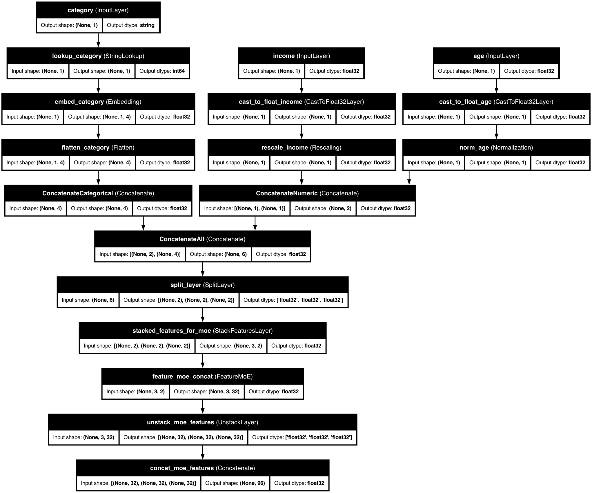

# 🧩 Feature-wise Mixture of Experts

<div class="feature-header">
  <div class="feature-title">
    <h2>Feature-wise Mixture of Experts (MoE)</h2>
    <p>Specialized processing for heterogeneous tabular features</p>
  </div>
</div>

## 📋 Overview

<div class="overview-card">
  <p>Feature-wise Mixture of Experts (MoE) is a powerful technique that applies different processing strategies to different features based on their characteristics. This approach allows for more specialized handling of each feature, improving model performance on complex, heterogeneous datasets.</p>
</div>

## 🚀 Basic Usage

<div class="code-container">

```python
from kdp import PreprocessingModel, FeatureType

# Define features
features = {
    "age": FeatureType.FLOAT_NORMALIZED,
    "income": FeatureType.FLOAT_RESCALED,
    "occupation": FeatureType.STRING_CATEGORICAL,
    "purchase_history": FeatureType.FLOAT_ARRAY,
}

# Create preprocessor with Feature MoE
preprocessor = PreprocessingModel(
    path_data="data.csv",
    features_specs=features,
    use_feature_moe=True,               # Turn on the magic
    feature_moe_num_experts=4,          # Four specialized experts
    feature_moe_expert_dim=64           # Size of expert representations
)

# Build and use
result = preprocessor.build_preprocessor()
model = result["model"]
```

</div>

## 🧩 How Feature MoE Works

<div class="architecture-diagram">
  
  <div class="diagram-caption">
    <p>KDP's Feature MoE uses a "divide and conquer" approach with smart routing: each expert is a specialized neural network, a router determines which experts should process each feature, features can use multiple experts with different weights, and residual connections preserve original feature information.</p>
  </div>
</div>

## ⚙️ Configuration Options

<div class="table-container">
  <table class="config-table">
    <thead>
      <tr>
        <th>Parameter</th>
        <th>Description</th>
        <th>Default</th>
        <th>Recommended Range</th>
      </tr>
    </thead>
    <tbody>
      <tr>
        <td><code>feature_moe_num_experts</code></td>
        <td>Number of specialists</td>
        <td>4</td>
        <td>3-5 for most tasks, 6-8 for very complex data</td>
      </tr>
      <tr>
        <td><code>feature_moe_expert_dim</code></td>
        <td>Size of expert output</td>
        <td>64</td>
        <td>Larger (96-128) for complex patterns</td>
      </tr>
      <tr>
        <td><code>feature_moe_routing</code></td>
        <td>How to assign experts</td>
        <td>"learned"</td>
        <td>"learned" for automatic, "predefined" for control</td>
      </tr>
      <tr>
        <td><code>feature_moe_sparsity</code></td>
        <td>Use only top k experts</td>
        <td>2</td>
        <td>1-3 (lower = faster, higher = more accurate)</td>
      </tr>
      <tr>
        <td><code>feature_moe_hidden_dims</code></td>
        <td>Expert network size</td>
        <td>[64, 32]</td>
        <td>Deeper for complex relationships</td>
      </tr>
    </tbody>
  </table>
</div>

## 💡 Pro Tips for Feature MoE

<div class="pro-tips-grid">
  <div class="pro-tip-card">
    <h3>Group Similar Features</h3>
    <p>Assign related features to the same expert for consistent processing, like grouping demographic, financial, product, and temporal features to different experts.</p>
  </div>

  <div class="pro-tip-card">
    <h3>Visualize Expert Assignments</h3>
    <p>Examine which experts handle which features by plotting the assignments as a heatmap to understand your model's internal decisions.</p>
  </div>

  <div class="pro-tip-card">
    <h3>Progressive Training</h3>
    <p>Start with frozen experts, then fine-tune to allow the model to learn basic patterns before specializing.</p>
  </div>
</div>

## 🔍 When to Use Feature MoE

<div class="use-cases-container">
  <div class="use-case-card">
    <h3>Heterogeneous Features</h3>
    <p>When your features have very different statistical properties (categorical, text, numerical, temporal).</p>
  </div>

  <div class="use-case-card">
    <h3>Complex Multi-Modal Data</h3>
    <p>When features come from different sources or modalities (user features, item features, interaction features).</p>
  </div>

  <div class="use-case-card">
    <h3>Transfer Learning</h3>
    <p>When adapting a model to new features with domain-specific experts for different feature groups.</p>
  </div>
</div>

## 🔗 Related Topics

<div class="related-topics">
  <a href="distribution-aware-encoding.md" class="topic-link">
    <span class="topic-icon">🔄</span>
    <span class="topic-text">Distribution-Aware Encoding</span>
  </a>
  <a href="numerical-embeddings.md" class="topic-link">
    <span class="topic-icon">🧮</span>
    <span class="topic-text">Advanced Numerical Embeddings</span>
  </a>
  <a href="tabular-attention.md" class="topic-link">
    <span class="topic-icon">👁️</span>
    <span class="topic-text">Tabular Attention</span>
  </a>
  <a href="../optimization/feature-selection.md" class="topic-link">
    <span class="topic-icon">🎯</span>
    <span class="topic-text">Feature Selection</span>
  </a>
</div>

<style>
/* Base styling */
body {
  font-family: -apple-system, BlinkMacSystemFont, "Segoe UI", Roboto, Helvetica, Arial, sans-serif;
  line-height: 1.6;
  color: #333;
  margin: 0;
  padding: 0;
}

/* Feature header */
.feature-header {
  background: linear-gradient(135deg, #ff9800 0%, #ffca28 100%);
  border-radius: 10px;
  padding: 30px;
  margin: 30px 0;
  box-shadow: 0 4px 6px rgba(0,0,0,0.1);
  color: white;
}

.feature-title h2 {
  margin-top: 0;
  font-size: 28px;
}

.feature-title p {
  font-size: 18px;
  margin-bottom: 0;
  opacity: 0.9;
}

/* Overview card */
.overview-card {
  background-color: #fff;
  border-radius: 10px;
  padding: 20px 25px;
  margin: 20px 0;
  box-shadow: 0 2px 5px rgba(0,0,0,0.05);
  border-left: 4px solid #ff9800;
}

.overview-card p {
  margin: 0;
  font-size: 16px;
}

/* Code containers */
.code-container {
  background-color: #f8f9fa;
  border-radius: 8px;
  overflow: hidden;
  box-shadow: 0 2px 5px rgba(0,0,0,0.1);
  margin: 20px 0;
}

.code-container pre {
  margin: 0;
  padding: 20px;
}

/* Architecture diagram */
.architecture-diagram {
  background-color: white;
  border-radius: 10px;
  padding: 20px;
  margin: 30px 0;
  box-shadow: 0 4px 8px rgba(0,0,0,0.05);
  text-align: center;
}

.architecture-image {
  max-width: 100%;
  border-radius: 5px;
}

.diagram-caption {
  margin-top: 20px;
  text-align: center;
  font-style: italic;
}

/* Tables */
.table-container {
  margin: 30px 0;
  border-radius: 10px;
  overflow: hidden;
  box-shadow: 0 4px 8px rgba(0,0,0,0.05);
}

.config-table {
  width: 100%;
  border-collapse: collapse;
}

.config-table th {
  background-color: #fff3e0;
  padding: 15px;
  text-align: left;
  font-weight: 600;
  border-bottom: 2px solid #ff9800;
}

.config-table td {
  padding: 12px 15px;
  border-bottom: 1px solid #eaecef;
}

.config-table tr:nth-child(even) {
  background-color: #f8f9fa;
}

.config-table tr:hover {
  background-color: #fff3e0;
}

/* Pro tips */
.pro-tips-grid {
  display: grid;
  grid-template-columns: repeat(auto-fill, minmax(300px, 1fr));
  gap: 20px;
  margin: 30px 0;
}

.pro-tip-card {
  background-color: #fff;
  border-radius: 10px;
  padding: 20px;
  box-shadow: 0 4px 8px rgba(0,0,0,0.05);
  transition: transform 0.3s ease, box-shadow 0.3s ease;
}

.pro-tip-card:hover {
  transform: translateY(-5px);
  box-shadow: 0 8px 16px rgba(0,0,0,0.1);
}

.pro-tip-card h3 {
  margin-top: 0;
  color: #ff9800;
}

/* Use cases */
.use-cases-container {
  display: grid;
  grid-template-columns: repeat(auto-fill, minmax(300px, 1fr));
  gap: 20px;
  margin: 30px 0;
}

.use-case-card {
  background-color: #fff;
  border-radius: 10px;
  padding: 20px;
  box-shadow: 0 4px 8px rgba(0,0,0,0.05);
  transition: transform 0.3s ease, box-shadow 0.3s ease;
}

.use-case-card:hover {
  transform: translateY(-5px);
  box-shadow: 0 8px 16px rgba(0,0,0,0.1);
}

.use-case-card h3 {
  margin-top: 0;
  color: #ff9800;
}

/* Related topics */
.related-topics {
  display: flex;
  flex-wrap: wrap;
  gap: 15px;
  margin: 30px 0;
}

.topic-link {
  display: flex;
  align-items: center;
  padding: 10px 15px;
  background-color: #fff3e0;
  border-radius: 8px;
  text-decoration: none;
  color: #333;
  box-shadow: 0 2px 5px rgba(0,0,0,0.05);
  transition: background-color 0.3s ease, transform 0.3s ease;
}

.topic-link:hover {
  background-color: #ffe0b2;
  transform: translateY(-2px);
}

.topic-icon {
  font-size: 1.2em;
  margin-right: 10px;
}

/* Responsive adjustments */
@media (max-width: 768px) {
  .pro-tips-grid,
  .use-cases-container {
    grid-template-columns: 1fr;
  }

  .related-topics {
    flex-direction: column;
  }
}
</style>
