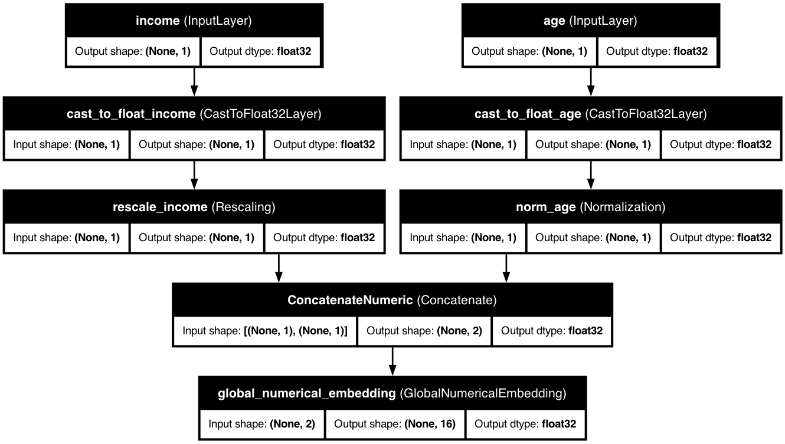

# 🔢 Advanced Numerical Embeddings

<div class="intro-container">
  <div class="intro-content">
    <h2>Transform raw numerical features into powerful representations</h2>
    <p>Enhance your model's ability to learn from numerical data with KDP's sophisticated dual-branch embedding architecture.</p>
  </div>
</div>

## 📋 Architecture Overview

<div class="architecture-container">
  <p><strong>Advanced Numerical Embeddings</strong> in KDP transform continuous values into meaningful embeddings using a dual-branch architecture:</p>

  <div class="architecture-branches">
    <div class="branch-card">
      <div class="branch-header">
        <span class="branch-number">1</span>
        <h3>Continuous Branch</h3>
      </div>
      <p>Processes raw values through a small MLP for smooth pattern learning</p>
    </div>

    <div class="branch-card">
      <div class="branch-header">
        <span class="branch-number">2</span>
        <h3>Discrete Branch</h3>
      </div>
      <p>Discretizes values into learnable bins with trainable boundaries</p>
    </div>
  </div>

  <p>The outputs from both branches are combined using a learnable gate mechanism, providing the perfect balance between continuous and discrete representations.</p>
</div>

## ✨ Key Benefits

<div class="grid-container">
  <div class="grid-item">
    <span class="feature-icon">🛠️</span>
    <h3>Dual-Branch Architecture</h3>
    <p>Combines the best of both continuous and discrete processing</p>
  </div>
  <div class="grid-item">
    <span class="feature-icon">📏</span>
    <h3>Learnable Boundaries</h3>
    <p>Adapts bin edges during training for optimal discretization</p>
  </div>
  <div class="grid-item">
    <span class="feature-icon">🎛️</span>
    <h3>Feature-Specific Processing</h3>
    <p>Each feature gets its own specialized embedding</p>
  </div>
  <div class="grid-item">
    <span class="feature-icon">💾</span>
    <h3>Memory Efficient</h3>
    <p>Optimized for handling large-scale tabular datasets</p>
  </div>
  <div class="grid-item">
    <span class="feature-icon">🔗</span>
    <h3>Flexible Integration</h3>
    <p>Works seamlessly with other KDP features</p>
  </div>
  <div class="grid-item">
    <span class="feature-icon">🔧</span>
    <h3>Residual Connections</h3>
    <p>Ensures stability during training</p>
  </div>
</div>

## 🚀 Getting Started

<div class="steps-container">
  <div class="step-card">
    <div class="step-header">
      <span class="step-number">1</span>
      <h3>Basic Usage</h3>
    </div>
    <div class="code-container">

```python
from kdp import PreprocessingModel, FeatureType

# Define numerical features
features_specs = {
    "age": FeatureType.FLOAT_NORMALIZED,
    "income": FeatureType.FLOAT_RESCALED,
    "credit_score": FeatureType.FLOAT_NORMALIZED
}

# Initialize model with numerical embeddings
preprocessor = PreprocessingModel(
    path_data="data/my_data.csv",
    features_specs=features_specs,
    use_numerical_embedding=True,  # Enable numerical embeddings
    numerical_embedding_dim=8,     # Size of each feature's embedding
    numerical_num_bins=10          # Number of bins for discretization
)
```

    </div>
  </div>

  <div class="step-card">
    <div class="step-header">
      <span class="step-number">2</span>
      <h3>Advanced Configuration</h3>
    </div>
    <div class="code-container">

```python
from kdp import PreprocessingModel
from kdp.features import NumericalFeature
from kdp.enums import FeatureType

# Define numerical features with customized embeddings
features_specs = {
    "age": NumericalFeature(
        name="age",
        feature_type=FeatureType.FLOAT_NORMALIZED,
        use_embedding=True,
        embedding_dim=8,
        num_bins=10,
        init_min=18,  # Domain-specific minimum
        init_max=90   # Domain-specific maximum
    ),
    "income": NumericalFeature(
        name="income",
        feature_type=FeatureType.FLOAT_RESCALED,
        use_embedding=True,
        embedding_dim=12,
        num_bins=15,
        init_min=0,     # Cannot be negative
        init_max=500000 # Maximum expected
    )
}

# Create preprocessing model
preprocessor = PreprocessingModel(
    path_data="data/my_data.csv",
    features_specs=features_specs,
    use_numerical_embedding=True,
    numerical_mlp_hidden_units=16,   # Hidden layer size for continuous branch
    numerical_dropout_rate=0.1,      # Regularization
    numerical_use_batch_norm=True    # Normalize activations
)
```

    </div>
  </div>
</div>

## 🧠 How It Works

### Individual Feature Embeddings (`NumericalEmbedding`)

The `NumericalEmbedding` layer processes each numerical feature through two parallel branches:

1. **Continuous Branch**:
   - Processes each feature through a small MLP
   - Applies dropout and optional batch normalization
   - Includes a residual connection for stability

2. **Discrete Branch**:
   - Maps each value to a bin using learnable min/max boundaries
   - Retrieves a learned embedding for each bin
   - Captures non-linear and discrete patterns

3. **Learnable Gate**:
   - Combines outputs from both branches using a sigmoid gate
   - Adaptively weights continuous vs. discrete representations
   - Learns optimal combination per feature and dimension

### Periodic Embeddings (`PeriodicEmbedding`)

The `PeriodicEmbedding` layer uses trigonometric functions to capture cyclical patterns:

1. **Frequency Learning**:
   - Learns optimal frequencies for each feature
   - Supports multiple initialization strategies (uniform, log-uniform, constant)
   - Frequencies are constrained to be positive

2. **Periodic Transformation**:
   - Applies sin/cos transformations: `sin(freq * x)` and `cos(freq * x)`
   - Captures cyclical patterns and smooth, differentiable representations
   - Particularly effective for features with natural periodicity

3. **Post-Processing**:
   - Optional MLP for further feature transformation
   - Residual connections for stability
   - Batch normalization and dropout for regularization

### PLE Embeddings (`PLEEmbedding`)

The `Parameterized Linear Expansion` layer provides learnable piecewise linear transformations:

1. **Segment Learning**:
   - Learns optimal segment boundaries for each feature
   - Supports uniform and quantile-based initialization
   - Each segment has learnable slope and intercept

2. **Piecewise Linear Transformation**:
   - Applies different linear transformations to different input ranges
   - Captures complex non-linear patterns through piecewise approximation
   - Supports various activation functions (ReLU, Sigmoid, Tanh)

3. **Flexible Architecture**:
   - Configurable number of segments for precision vs. efficiency trade-off
   - Optional MLP and residual connections
   - Batch normalization and dropout for regularization

### Advanced Combined Embeddings (`AdvancedNumericalEmbedding`)

The `AdvancedNumericalEmbedding` layer combines multiple embedding approaches:

1. **Multi-Modal Processing**:
   - Supports any combination of periodic, PLE, and dual-branch embeddings
   - Learnable gates to combine different embedding types
   - Adaptive weighting per feature and dimension

2. **Flexible Configuration**:
   - Choose from `['periodic', 'ple', 'dual_branch']` embedding types
   - Configure each embedding type independently
   - Enable/disable gating mechanism

3. **Optimal Performance**:
   - Empirically closes the gap between MLPs/Transformers and tree-based baselines
   - Particularly effective on tabular tasks
   - Maintains interpretability while improving performance

```
Input value
    ┌────────┐    ┌────────┐
    │  MLP   │    │Binning │
    └────────┘    └────────┘
         │             │
         ▼             ▼
   Continuous      Discrete
   Embedding       Embedding
         │             │
         └─────┬───────┘
               │
               ▼
       Gating Mechanism
               │
               ▼
       Final Embedding
```

### Global Feature Embeddings (`GlobalNumericalEmbedding`)

The `GlobalNumericalEmbedding` layer processes all numerical features together and returns a single compact representation:

1. Flattens input features (if needed)
2. Applies `NumericalEmbedding` to process all features
3. Performs global pooling (average or max) across feature dimensions
4. Returns a single vector representing all numerical features

This approach is ideal for:
- Processing large feature sets efficiently
- Capturing cross-feature interactions
- Reducing dimensionality of numerical data
- Learning a unified numerical representation

## ⚙️ Configuration Options

### Individual Embeddings

| Parameter | Type | Default | Description |
|-----------|------|---------|-------------|
| `use_numerical_embedding` | bool | False | Enable numerical embeddings |
| `numerical_embedding_dim` | int | 8 | Size of each feature's embedding |
| `numerical_mlp_hidden_units` | int | 16 | Hidden layer size for continuous branch |
| `numerical_num_bins` | int | 10 | Number of bins for discretization |
| `numerical_init_min` | float/list | -3.0 | Initial minimum for scaling |
| `numerical_init_max` | float/list | 3.0 | Initial maximum for scaling |
| `numerical_dropout_rate` | float | 0.1 | Dropout rate for regularization |
| `numerical_use_batch_norm` | bool | True | Apply batch normalization |

### Periodic Embeddings

| Parameter | Type | Default | Description |
|-----------|------|---------|-------------|
| `use_periodic_embedding` | bool | False | Enable periodic embeddings |
| `num_frequencies` | int | 4 | Number of frequency components |
| `frequency_init` | str | "log_uniform" | Frequency initialization method |
| `min_frequency` | float | 1e-4 | Minimum frequency for initialization |
| `max_frequency` | float | 1e2 | Maximum frequency for initialization |
| `use_residual` | bool | True | Use residual connections |

### PLE Embeddings

| Parameter | Type | Default | Description |
|-----------|------|---------|-------------|
| `use_ple_embedding` | bool | False | Enable PLE embeddings |
| `num_segments` | int | 8 | Number of linear segments |
| `segment_init` | str | "uniform" | Segment initialization method |
| `ple_activation` | str | "relu" | Activation function for PLE |
| `use_residual` | bool | True | Use residual connections |

### Advanced Combined Embeddings

| Parameter | Type | Default | Description |
|-----------|------|---------|-------------|
| `use_advanced_combined_embedding` | bool | False | Enable combined embeddings |
| `embedding_types` | list | ["dual_branch"] | List of embedding types to use |
| `use_gating` | bool | True | Use learnable gates to combine embeddings |

### Global Embeddings

| Parameter | Type | Default | Description |
|-----------|------|---------|-------------|
| `use_global_numerical_embedding` | bool | False | Enable global numerical embeddings |
| `global_embedding_dim` | int | 8 | Size of global embedding |
| `global_mlp_hidden_units` | int | 16 | Hidden layer size for continuous branch |
| `global_num_bins` | int | 10 | Number of bins for discretization |
| `global_init_min` | float/list | -3.0 | Initial minimum for scaling |
| `global_init_max` | float/list | 3.0 | Initial maximum for scaling |
| `global_dropout_rate` | float | 0.1 | Dropout rate for regularization |
| `global_use_batch_norm` | bool | True | Apply batch normalization |
| `global_pooling` | str | "average" | Pooling method ("average" or "max") |

## 🎯 Best Use Cases

### When to Use Individual Embeddings

- When each numerical feature conveys distinct information
- When features have different scales or distributions
- When you need fine-grained control of each feature's representation
- When memory usage is a concern (more efficient with many features)
- For explainability (each feature has its own embedding)

### When to Use Global Embeddings

- When you have many numerical features
- When features have strong interdependencies
- When dimensionality reduction is desired
- When a unified representation of all numerical data is needed
- For simpler model architectures (single vector output)

## 🔍 Examples

### Financial Risk Modeling

```python
from kdp import PreprocessingModel
from kdp.features import NumericalFeature
from kdp.enums import FeatureType

# Define financial features with domain knowledge
features_specs = {
    "income": NumericalFeature(
        name="income",
        feature_type=FeatureType.FLOAT_RESCALED,
        use_embedding=True,
        embedding_type="periodic",  # Use periodic embedding for income
        embedding_dim=8,
        num_frequencies=4
    ),
    "debt_ratio": NumericalFeature(
        name="debt_ratio",
        feature_type=FeatureType.FLOAT_NORMALIZED,
        use_embedding=True,
        embedding_type="ple",  # Use PLE for debt ratio
        embedding_dim=4,
        num_segments=8
    ),
    "credit_score": NumericalFeature(
        name="credit_score",
        feature_type=FeatureType.FLOAT_NORMALIZED,
        use_embedding=True,
        embedding_type="dual_branch",  # Traditional dual-branch
        embedding_dim=6,
        num_bins=10,
        init_min=300,
        init_max=850  # Standard credit score range
    ),
    "payment_history": NumericalFeature(
        name="payment_history",
        feature_type=FeatureType.FLOAT_NORMALIZED,
        use_embedding=True,
        embedding_type="combined",  # Combined approach
        embedding_dim=8,
        num_frequencies=4,
        num_segments=8
    )
}

# Create preprocessing model with advanced embeddings
preprocessor = PreprocessingModel(
    path_data="data/financial_data.csv",
    features_specs=features_specs,
    use_advanced_numerical_embedding=True,
    use_periodic_embedding=True,
    use_ple_embedding=True,
    use_advanced_combined_embedding=True,
    embedding_dim=8,
    num_frequencies=4,
    num_segments=8,
    dropout_rate=0.2,  # Higher dropout for financial data
    use_batch_norm=True
)
```

### Healthcare Patient Analysis with Periodic Embeddings

```python
from kdp import PreprocessingModel
from kdp.features import NumericalFeature
from kdp.enums import FeatureType

# Define patient features with periodic embeddings for cyclical patterns
features_specs = {
    "age": NumericalFeature(
        name="age",
        feature_type=FeatureType.FLOAT_NORMALIZED,
        use_embedding=True,
        embedding_type="periodic",
        embedding_dim=8,
        num_frequencies=6,  # More frequencies for age patterns
        kwargs={
            "frequency_init": "constant",
            "min_frequency": 1e-3,
            "max_frequency": 1e2
        }
    ),
    "bmi": NumericalFeature(
        name="bmi",
        feature_type=FeatureType.FLOAT_NORMALIZED,
        use_embedding=True,
        embedding_type="ple",
        embedding_dim=6,
        num_segments=12,  # More segments for BMI precision
        kwargs={
            "segment_init": "uniform",
            "ple_activation": "relu"
        }
    ),
    "blood_pressure": NumericalFeature(
        name="blood_pressure",
        feature_type=FeatureType.FLOAT_NORMALIZED,
        use_embedding=True,
        embedding_type="combined",
        embedding_dim=10,
        num_frequencies=4,
        num_segments=8,
        kwargs={
            "embedding_types": ["periodic", "ple"],
            "use_gating": True
        }
    )
}

# Create preprocessing model
preprocessor = PreprocessingModel(
    path_data="data/patient_data.csv",
    features_specs=features_specs,
    use_advanced_numerical_embedding=True,
    use_periodic_embedding=True,
    use_ple_embedding=True,
    use_advanced_combined_embedding=True,
    embedding_dim=8,
    num_frequencies=6,
    num_segments=12,
    frequency_init="constant",
    segment_init="uniform",
    ple_activation="relu",
    use_gating=True
)
```

### Time Series Forecasting with PLE Embeddings

```python
from kdp import PreprocessingModel
from kdp.features import NumericalFeature
from kdp.enums import FeatureType

# Define time series features with PLE embeddings for trend capture
features_specs = {
    "temperature": NumericalFeature(
        name="temperature",
        feature_type=FeatureType.FLOAT_NORMALIZED,
        use_embedding=True,
        embedding_type="periodic",  # Periodic for seasonal patterns
        embedding_dim=12,
        num_frequencies=8,
        kwargs={
            "frequency_init": "log_uniform",
            "min_frequency": 1e-4,
            "max_frequency": 1e3
        }
    ),
    "humidity": NumericalFeature(
        name="humidity",
        feature_type=FeatureType.FLOAT_NORMALIZED,
        use_embedding=True,
        embedding_type="ple",  # PLE for humidity trends
        embedding_dim=8,
        num_segments=16,
        kwargs={
            "segment_init": "quantile",
            "ple_activation": "sigmoid"
        }
    ),
    "pressure": NumericalFeature(
        name="pressure",
        feature_type=FeatureType.FLOAT_NORMALIZED,
        use_embedding=True,
        embedding_type="combined",  # Combined for complex patterns
        embedding_dim=10,
        num_frequencies=6,
        num_segments=12,
        kwargs={
            "embedding_types": ["periodic", "ple", "dual_branch"],
            "use_gating": True
        }
    )
}

# Create preprocessing model
preprocessor = PreprocessingModel(
    path_data="data/weather_data.csv",
    features_specs=features_specs,
    use_advanced_numerical_embedding=True,
    use_periodic_embedding=True,
    use_ple_embedding=True,
    use_advanced_combined_embedding=True,
    embedding_dim=10,
    num_frequencies=8,
    num_segments=16,
    frequency_init="log_uniform",
    segment_init="quantile",
    ple_activation="sigmoid",
    use_gating=True
)
```

### Healthcare Patient Analysis

```python
from kdp import PreprocessingModel
from kdp.features import NumericalFeature
from kdp.enums import FeatureType

# Define patient features
features_specs = {
    # Define many health metrics
    "age": NumericalFeature(...),
    "bmi": NumericalFeature(...),
    "blood_pressure": NumericalFeature(...),
    "cholesterol": NumericalFeature(...),
    "glucose": NumericalFeature(...),
    # Many more metrics...
}

# Use global embedding to handle many numerical features
preprocessor = PreprocessingModel(
    path_data="data/patient_data.csv",
    features_specs=features_specs,
    use_global_numerical_embedding=True,  # Process all features together
    global_embedding_dim=32,              # Higher dimension for complex data
    global_mlp_hidden_units=64,
    global_num_bins=20,                   # More bins for medical precision
    global_dropout_rate=0.1,
    global_use_batch_norm=True,
    global_pooling="max"                  # Use max pooling to capture extremes
)
```

## 💡 Pro Tips

1. **Choose the Right Embedding Type**
   - Use individual embeddings for interpretability and precise control
   - Use global embeddings for efficiency with many numerical features
   - Use periodic embeddings for features with cyclical patterns (time, angles, seasons)
   - Use PLE embeddings for features with complex non-linear relationships
   - Use combined embeddings for maximum performance on challenging datasets

2. **Distribution-Aware Initialization**
   - Set `init_min` and `init_max` based on your data's actual distribution
   - Use domain knowledge to set meaningful boundary points
   - Initialize closer to anticipated feature range for faster convergence
   - For periodic embeddings, use log-uniform initialization for better frequency distribution
   - For PLE embeddings, use quantile-based initialization for data-driven segment boundaries

3. **Dimensionality Guidelines**
   - Start with `embedding_dim` = 4-8 for simple features
   - Use 8-16 for complex features with non-linear patterns
   - For global embeddings, scale with the number of features (16-64)
   - For periodic embeddings, use 4-8 frequencies for most features
   - For PLE embeddings, use 8-16 segments for smooth approximations

4. **Performance Tuning**
   - Increase `num_bins` for more granular discrete representations
   - Adjust `mlp_hidden_units` to 2-4x the embedding dimension
   - Use batch normalization for faster, more stable training
   - Adjust dropout based on dataset size (higher for small datasets)
   - For periodic embeddings, experiment with different frequency ranges
   - For PLE embeddings, try different activation functions (relu, sigmoid, tanh)

5. **Advanced Embedding Strategies**
   - **Periodic Embeddings**: Best for time-based features, angles, cyclical patterns
   - **PLE Embeddings**: Best for features with piecewise linear relationships
   - **Combined Embeddings**: Best for maximum performance, especially on tabular tasks
   - **Mixed Strategies**: Use different embedding types for different features based on their characteristics

6. **Combine with Other KDP Features**
   - Pair with distribution-aware encoding for optimal numerical handling
   - Use with tabular attention to learn cross-feature interactions
   - Combine with feature selection for automatic dimensionality reduction
   - Use with transformer blocks for advanced feature interactions

## 🔗 Related Topics

- [Numerical Features](../features/numerical-features.md)
- [Distribution-Aware Encoding](distribution-aware-encoding.md)
- [Tabular Attention](tabular-attention.md)
- [Feature Selection](../optimization/feature-selection.md)

---

<div class="prev-next">
  <a href="distribution-aware-encoding.md" class="prev">← Distribution-Aware Encoding</a>
  <a href="tabular-attention.md" class="next">Tabular Attention →</a>
</div>

<style>
.prev-next {
  display: flex;
  justify-content: space-between;
  margin-top: 40px;
}
.prev-next a {
  padding: 10px 15px;
  background-color: #f1f1f1;
  border-radius: 5px;
  text-decoration: none;
  color: #333;
}
.prev-next a:hover {
  background-color: #ddd;
}
</style>

## 📊 Model Architecture

Advanced numerical embeddings transform your numerical features into rich representations:


Global numerical embeddings allow coordinated embeddings across all features:



These diagrams illustrate how KDP transforms numerical features into rich embedding spaces, capturing complex patterns and non-linear relationships.

## 💡 How to Enable

## 🧩 Dependencies

<div class="dependencies-container">
  <div class="dependencies-card">
    <h3>Core Dependencies</h3>
    <ul class="dependency-list">
      <li>🐍 Python 3.9+</li>
      <li>🔄 TensorFlow 2.18.0+</li>
      <li>🔢 NumPy 1.22.0+</li>
      <li>📊 Pandas 2.2.0+</li>
      <li>📝 loguru 0.7.2+</li>
    </ul>
  </div>

  <div class="dependencies-card">
    <h3>Optional Dependencies</h3>
    <div class="table-container">
      <table class="config-table">
        <thead>
          <tr>
            <th>Package</th>
            <th>Purpose</th>
            <th>Install Command</th>
          </tr>
        </thead>
        <tbody>
          <tr>
            <td>scipy</td>
            <td>🧪 Scientific computing and statistical functions</td>
            <td><code>pip install "kdp[dev]"</code></td>
          </tr>
          <tr>
            <td>ipython</td>
            <td>🔍 Interactive Python shell and notebook support</td>
            <td><code>pip install "kdp[dev]"</code></td>
          </tr>
          <tr>
            <td>pytest</td>
            <td>✅ Testing framework and utilities</td>
            <td><code>pip install "kdp[dev]"</code></td>
          </tr>
          <tr>
            <td>pydot</td>
            <td>📊 Graph visualization for model architecture</td>
            <td><code>pip install "kdp[dev]"</code></td>
          </tr>
          <tr>
            <td>Development Tools</td>
            <td>🛠️ All development dependencies</td>
            <td><code>pip install "kdp[dev]"</code></td>
          </tr>
          <tr>
            <td>Documentation Tools</td>
            <td>📚 Documentation generation tools</td>
            <td><code>pip install "kdp[doc]"</code></td>
          </tr>
        </tbody>
      </table>
    </div>
  </div>
</div>
