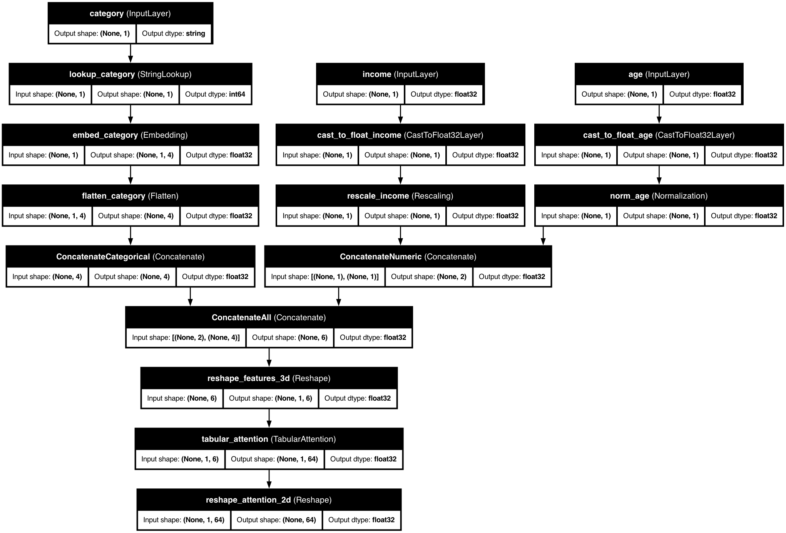

# 👁️ Tabular Attention

<div class="feature-header">
  <div class="feature-title">
    <h2>Tabular Attention</h2>
    <p>Discover hidden relationships in your data with sophisticated attention mechanisms</p>
  </div>
</div>

## 📋 Overview

<div class="overview-card">
  <p>Tabular Attention is a powerful feature in KDP that enables your models to automatically discover complex interactions between features in tabular data. Based on attention mechanisms from transformers, it helps your models focus on the most important feature relationships without explicit feature engineering.</p>
</div>

<div class="key-benefits">
  <div class="benefit-card">
    <span class="benefit-icon">🔍</span>
    <h3>Automatic Interaction Discovery</h3>
    <p>Finds complex feature relationships without manual engineering</p>
  </div>
  <div class="benefit-card">
    <span class="benefit-icon">🎯</span>
    <h3>Context-Aware Processing</h3>
    <p>Each feature is processed in the context of other features</p>
  </div>
  <div class="benefit-card">
    <span class="benefit-icon">📈</span>
    <h3>Improved Performance</h3>
    <p>Better predictions through enhanced feature understanding</p>
  </div>
  <div class="benefit-card">
    <span class="benefit-icon">🔄</span>
    <h3>Flexible Integration</h3>
    <p>Works seamlessly with other KDP processing techniques</p>
  </div>
  <div class="benefit-card">
    <span class="benefit-icon">📊</span>
    <h3>Hierarchical Learning</h3>
    <p>Captures both low-level and high-level patterns</p>
  </div>
</div>

## 🚀 Getting Started

<div class="code-container">

```python
from kdp import PreprocessingModel, FeatureType

# Define features
features_specs = {
    "age": FeatureType.FLOAT_NORMALIZED,
    "income": FeatureType.FLOAT_RESCALED,
    "occupation": FeatureType.STRING_CATEGORICAL,
    "education": FeatureType.INTEGER_CATEGORICAL
}

# Initialize model with standard tabular attention
preprocessor = PreprocessingModel(
    path_data="data/my_data.csv",
    features_specs=features_specs,
    tabular_attention=True,              # Enable tabular attention
    tabular_attention_heads=4,           # Number of attention heads
    tabular_attention_dim=64,            # Attention dimension
    tabular_attention_dropout=0.1        # Dropout rate
)
```

</div>

## 🧠 How It Works

<div class="architecture-diagram">
  
  <div class="diagram-caption">
    <p>KDP's tabular attention mechanism transforms features through a multi-head attention mechanism, allowing the model to learn complex patterns across features.</p>
  </div>
</div>

### Standard Tabular Attention

<div class="process-steps">
  <div class="process-step">
    <span class="step-number">1</span>
    <h3>Inter-Feature Attention</h3>
    <p>Features attend to each other within each sample, capturing dependencies between different features.</p>
  </div>
  <div class="process-step">
    <span class="step-number">2</span>
    <h3>Inter-Sample Attention</h3>
    <p>Samples attend to each other for each feature, capturing patterns across different samples.</p>
  </div>
  <div class="process-step">
    <span class="step-number">3</span>
    <h3>Feed-Forward Networks</h3>
    <p>Process attended features further with non-linear transformations.</p>
  </div>
</div>

### Multi-Resolution Tabular Attention

<div class="process-steps">
  <div class="process-step">
    <span class="step-number">1</span>
    <h3>Specialized Processing</h3>
    <p>Numerical and categorical features processed through type-specific attention mechanisms.</p>
  </div>
  <div class="process-step">
    <span class="step-number">2</span>
    <h3>Cross-Attention</h3>
    <p>Enables features to attend across different types, capturing complex interactions.</p>
  </div>
  <div class="process-step">
    <span class="step-number">3</span>
    <h3>Type-Specific Projections</h3>
    <p>Each feature type gets custom embedding dimensions for optimal representation.</p>
  </div>
</div>

## 📊 Model Architecture

KDP's tabular attention mechanism:


The diagram shows how tabular attention transforms features through a multi-head attention mechanism, allowing the model to learn complex patterns across features.

## 💡 How to Enable

## ⚙️ Configuration Options

### General Options

| Parameter | Type | Default | Description |
|-----------|------|---------|-------------|
| `tabular_attention` | bool | False | Enable/disable attention mechanisms |
| `tabular_attention_heads` | int | 4 | Number of attention heads |
| `tabular_attention_dim` | int | 64 | Dimension of the attention model |
| `tabular_attention_dropout` | float | 0.1 | Dropout rate for regularization |

### Multi-Resolution Options

| Parameter | Type | Default | Description |
|-----------|------|---------|-------------|
| `tabular_attention_embedding_dim` | int | 32 | Dimension for categorical embeddings |
| `tabular_attention_placement` | str | "ALL_FEATURES" | Where to apply attention |

### Placement Options

| Option | Description | Best For |
|--------|-------------|-----------|
| `ALL_FEATURES` | Apply to all features uniformly | General purpose, balanced datasets |
| `NUMERIC` | Only numerical features | Datasets dominated by numerical features |
| `CATEGORICAL` | Only categorical features | Datasets with important categorical relationships |
| `MULTI_RESOLUTION` | Type-specific attention | Mixed data types with different importance |

## 🎯 Best Use Cases

### When to Use Standard Tabular Attention

- When your features are mostly of the same type
- When you have a balanced mix of numerical and categorical features
- When feature interactions are likely uniform across feature types
- When computational efficiency is a priority

### When to Use Multi-Resolution Attention

- When you have distinctly different numerical and categorical features
- When categorical features need special handling (high cardinality)
- When feature interactions between types are expected to be important
- When certain feature types dominate your dataset

## 🔍 Examples

### Customer Analytics with Standard Attention

```python
from kdp import PreprocessingModel, FeatureType
from kdp.enums import TabularAttentionPlacementOptions

features_specs = {
    "customer_age": FeatureType.FLOAT_NORMALIZED,
    "account_age": FeatureType.FLOAT_NORMALIZED,
    "avg_purchase": FeatureType.FLOAT_RESCALED,
    "total_orders": FeatureType.FLOAT_RESCALED,
    "customer_type": FeatureType.STRING_CATEGORICAL,
    "region": FeatureType.STRING_CATEGORICAL
}

preprocessor = PreprocessingModel(
    path_data="data/customer_data.csv",
    features_specs=features_specs,
    tabular_attention=True,
    tabular_attention_heads=4,
    tabular_attention_dim=64,
    tabular_attention_dropout=0.1,
    tabular_attention_placement=TabularAttentionPlacementOptions.ALL_FEATURES.value
)
```

### Product Recommendations with Multi-Resolution Attention

```python
from kdp import PreprocessingModel, FeatureType
from kdp.enums import TabularAttentionPlacementOptions

features_specs = {
    # Numerical features
    "user_age": FeatureType.FLOAT_NORMALIZED,
    "days_since_last_purchase": FeatureType.FLOAT_RESCALED,
    "avg_session_duration": FeatureType.FLOAT_NORMALIZED,
    "total_spend": FeatureType.FLOAT_RESCALED,
    "items_viewed": FeatureType.FLOAT_RESCALED,

    # Categorical features
    "gender": FeatureType.STRING_CATEGORICAL,
    "product_category": FeatureType.STRING_CATEGORICAL,
    "device_type": FeatureType.STRING_CATEGORICAL,
    "subscription_tier": FeatureType.INTEGER_CATEGORICAL,
    "day_of_week": FeatureType.INTEGER_CATEGORICAL
}

preprocessor = PreprocessingModel(
    path_data="data/recommendation_data.csv",
    features_specs=features_specs,
    tabular_attention=True,
    tabular_attention_heads=8,              # More heads for complex interactions
    tabular_attention_dim=128,              # Larger dimension for rich representations
    tabular_attention_dropout=0.15,         # Slightly higher dropout for regularization
    tabular_attention_embedding_dim=64,     # Larger embedding for categorical features
    tabular_attention_placement=TabularAttentionPlacementOptions.MULTI_RESOLUTION.value
)
```

## 📊 Performance Considerations

### Memory Usage

- **Standard Attention**: O(n²) memory complexity for n features
- **Multi-Resolution**: O(n_num² + n_cat²) memory complexity
- For large feature sets, multi-resolution is more efficient

### Computational Cost

- Attention mechanisms introduce additional training time
- Multi-head attention scales linearly with number of heads
- Multi-resolution can be faster when categorical features dominate

### Guidelines:

| Dataset Size | Attention Type | Recommended Heads | Dimension |
|--------------|----------------|-------------------|-----------|
| Small (<10K) | Standard | 2-4 | 32-64 |
| Medium | Standard/Multi-Resolution | 4-8 | 64-128 |
| Large (>100K) | Multi-Resolution | 8-16 | 128-256 |

## 💡 Pro Tips

<div class="pro-tips-grid">
  <div class="pro-tip-card">
    <h3>Head Count Selection</h3>
    <p>Start with 4 heads for most problems, increase for complex feature interactions, but beware of overfitting with too many heads.</p>
  </div>

  <div class="pro-tip-card">
    <h3>Dimension Tuning</h3>
    <p>Choose dimensions divisible by number of heads, larger for complex patterns, but balance with dataset size to avoid overfitting.</p>
  </div>

  <div class="pro-tip-card">
    <h3>Placement Strategy</h3>
    <p>Use ALL_FEATURES for initial experimentation, MULTI_RESOLUTION for mixed data types, and NUMERIC/CATEGORICAL for targeted focus.</p>
  </div>
</div>

## 🔗 Related Topics

<div class="related-topics">
  <a href="distribution-aware-encoding.md" class="topic-link">
    <span class="topic-icon">🔄</span>
    <span class="topic-text">Distribution-Aware Encoding</span>
  </a>
  <a href="numerical-embeddings.md" class="topic-link">
    <span class="topic-icon">🧮</span>
    <span class="topic-text">Advanced Numerical Embeddings</span>
  </a>
  <a href="transformer-blocks.md" class="topic-link">
    <span class="topic-icon">⚡</span>
    <span class="topic-text">Transformer Blocks</span>
  </a>
  <a href="feature-selection.md" class="topic-link">
    <span class="topic-icon">🎯</span>
    <span class="topic-text">Feature Selection</span>
  </a>
</div>

<style>
/* Base styling */
body {
  font-family: -apple-system, BlinkMacSystemFont, "Segoe UI", Roboto, Helvetica, Arial, sans-serif;
  line-height: 1.6;
  color: #333;
  margin: 0;
  padding: 0;
}

/* Feature header */
.feature-header {
  background: linear-gradient(135deg, #2196f3 0%, #64b5f6 100%);
  border-radius: 10px;
  padding: 30px;
  margin: 30px 0;
  box-shadow: 0 4px 6px rgba(0,0,0,0.1);
  color: white;
}

.feature-title h2 {
  margin-top: 0;
  font-size: 28px;
}

.feature-title p {
  font-size: 18px;
  margin-bottom: 0;
  opacity: 0.9;
}

/* Overview card */
.overview-card {
  background-color: #fff;
  border-radius: 10px;
  padding: 20px 25px;
  margin: 20px 0;
  box-shadow: 0 2px 5px rgba(0,0,0,0.05);
  border-left: 4px solid #2196f3;
}

.overview-card p {
  margin: 0;
  font-size: 16px;
}

/* Key benefits */
.key-benefits {
  display: grid;
  grid-template-columns: repeat(auto-fill, minmax(250px, 1fr));
  gap: 20px;
  margin: 30px 0;
}

.benefit-card {
  background-color: #fff;
  border-radius: 10px;
  padding: 20px;
  box-shadow: 0 4px 8px rgba(0,0,0,0.05);
  transition: transform 0.3s ease, box-shadow 0.3s ease;
  display: flex;
  flex-direction: column;
  align-items: center;
  text-align: center;
}

.benefit-card:hover {
  transform: translateY(-5px);
  box-shadow: 0 8px 16px rgba(0,0,0,0.1);
}

.benefit-icon {
  font-size: 2.5em;
  margin-bottom: 15px;
}

.benefit-card h3 {
  margin: 0 0 10px 0;
  color: #2196f3;
}

.benefit-card p {
  margin: 0;
}

/* Process steps */
.process-steps {
  display: grid;
  grid-template-columns: repeat(auto-fill, minmax(300px, 1fr));
  gap: 20px;
  margin: 30px 0;
}

.process-step {
  background-color: #fff;
  border-radius: 10px;
  padding: 20px;
  box-shadow: 0 4px 8px rgba(0,0,0,0.05);
  transition: transform 0.3s ease, box-shadow 0.3s ease;
  position: relative;
}

.process-step:hover {
  transform: translateY(-5px);
  box-shadow: 0 8px 16px rgba(0,0,0,0.1);
}

.step-number {
  display: flex;
  align-items: center;
  justify-content: center;
  width: 30px;
  height: 30px;
  background-color: #2196f3;
  color: white;
  border-radius: 50%;
  font-weight: bold;
  margin-bottom: 15px;
}

.process-step h3 {
  margin: 0 0 10px 0;
  color: #2196f3;
}

.process-step p {
  margin: 0;
}

/* Code containers */
.code-container {
  background-color: #f8f9fa;
  border-radius: 8px;
  overflow: hidden;
  box-shadow: 0 2px 5px rgba(0,0,0,0.1);
  margin: 20px 0;
}

.code-container pre {
  margin: 0;
  padding: 20px;
}

/* Architecture diagram */
.architecture-diagram {
  background-color: white;
  border-radius: 10px;
  padding: 20px;
  margin: 30px 0;
  box-shadow: 0 4px 8px rgba(0,0,0,0.05);
  text-align: center;
}

.architecture-image {
  max-width: 100%;
  border-radius: 5px;
}

.diagram-caption {
  margin-top: 20px;
  text-align: center;
  font-style: italic;
}

/* Tables */
.table-container {
  margin: 30px 0;
  border-radius: 10px;
  overflow: hidden;
  box-shadow: 0 4px 8px rgba(0,0,0,0.05);
}

.config-table {
  width: 100%;
  border-collapse: collapse;
}

.config-table th {
  background-color: #e3f2fd;
  padding: 15px;
  text-align: left;
  font-weight: 600;
  border-bottom: 2px solid #2196f3;
}

.config-table td {
  padding: 12px 15px;
  border-bottom: 1px solid #eaecef;
}

.config-table tr:nth-child(even) {
  background-color: #f8f9fa;
}

.config-table tr:hover {
  background-color: #e3f2fd;
}

/* Pro tips */
.pro-tips-grid {
  display: grid;
  grid-template-columns: repeat(auto-fill, minmax(300px, 1fr));
  gap: 20px;
  margin: 30px 0;
}

.pro-tip-card {
  background-color: #fff;
  border-radius: 10px;
  padding: 20px;
  box-shadow: 0 4px 8px rgba(0,0,0,0.05);
  transition: transform 0.3s ease, box-shadow 0.3s ease;
}

.pro-tip-card:hover {
  transform: translateY(-5px);
  box-shadow: 0 8px 16px rgba(0,0,0,0.1);
}

.pro-tip-card h3 {
  margin-top: 0;
  color: #2196f3;
}

/* Examples */
.examples-container {
  display: grid;
  grid-template-columns: repeat(auto-fill, minmax(400px, 1fr));
  gap: 20px;
  margin: 30px 0;
}

.example-card {
  background-color: #fff;
  border-radius: 10px;
  padding: 20px;
  box-shadow: 0 4px 8px rgba(0,0,0,0.05);
  transition: transform 0.3s ease, box-shadow 0.3s ease;
}

.example-card:hover {
  transform: translateY(-5px);
  box-shadow: 0 8px 16px rgba(0,0,0,0.1);
}

.example-card h3 {
  margin-top: 0;
  color: #2196f3;
}

/* Related topics */
.related-topics {
  display: flex;
  flex-wrap: wrap;
  gap: 15px;
  margin: 30px 0;
}

.topic-link {
  display: flex;
  align-items: center;
  padding: 10px 15px;
  background-color: #e3f2fd;
  border-radius: 8px;
  text-decoration: none;
  color: #333;
  box-shadow: 0 2px 5px rgba(0,0,0,0.05);
  transition: background-color 0.3s ease, transform 0.3s ease;
}

.topic-link:hover {
  background-color: #bbdefb;
  transform: translateY(-2px);
}

.topic-icon {
  font-size: 1.2em;
  margin-right: 10px;
}

/* Responsive adjustments */
@media (max-width: 768px) {
  .key-benefits,
  .process-steps,
  .pro-tips-grid,
  .examples-container {
    grid-template-columns: 1fr;
  }

  .related-topics {
    flex-direction: column;
  }
}
</style>
