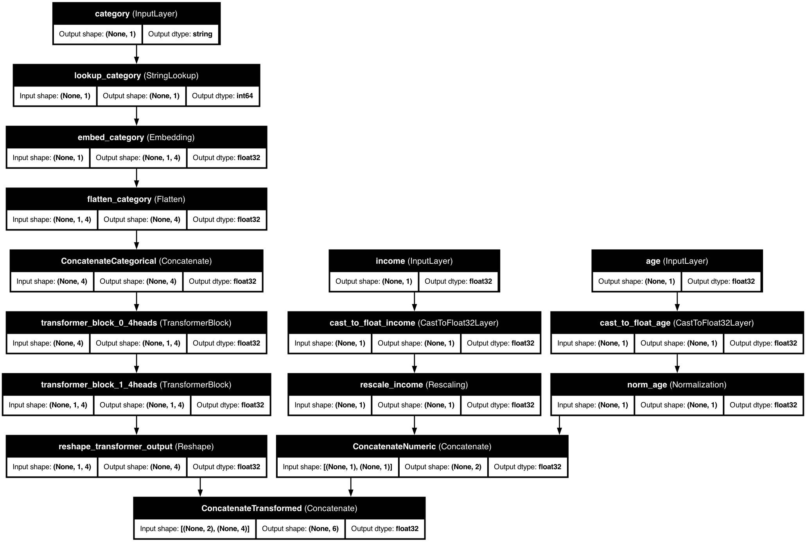

# 🤖 Transformer Blocks

> Apply the power of attention-based transformers to your tabular data.

## 📋 Overview

**Transformer Blocks** in KDP bring the revolutionary attention mechanisms from natural language processing to tabular data. These blocks enable your model to discover complex feature relationships automatically, leading to better predictions without manual feature engineering.

Inspired by the architecture that powers modern language models, KDP's transformer blocks apply self-attention to help your model focus on the most important feature relationships in your data.

### ✨ Key Benefits

- **Automatic Pattern Discovery**: Finds hidden relationships between features without explicit engineering
- **Hierarchical Learning**: Stacks multiple blocks to learn increasingly complex patterns
- **Feature Interaction Modeling**: Captures non-linear dependencies between different feature types
- **Adaptable Focus**: Attention mechanisms learn to focus on relevant feature combinations
- **Parallelizable Architecture**: Efficient training compared to sequential models

## 🚀 Getting Started

### Basic Usage

```python
from kdp import PreprocessingModel, FeatureType
from kdp.enums import TransformerBlockPlacementOptions

# Define features
features_specs = {
    "age": FeatureType.FLOAT_NORMALIZED,
    "income": FeatureType.FLOAT_RESCALED,
    "occupation": FeatureType.STRING_CATEGORICAL,
    "education": FeatureType.INTEGER_CATEGORICAL
}

# Initialize model with transformer blocks
preprocessor = PreprocessingModel(
    path_data="data/my_data.csv",
    features_specs=features_specs,
    transfo_nr_blocks=2,              # Number of transformer blocks to stack
    transfo_nr_heads=4,               # Number of attention heads per block
    transfo_ff_units=32,              # Size of feed-forward layers
    transfo_dropout_rate=0.1,         # Dropout rate for regularization
    transfo_placement=TransformerBlockPlacementOptions.CATEGORICAL.value  # Apply to categorical features
)
```

### Advanced Configuration

```python
from kdp import PreprocessingModel, FeatureType
from kdp.enums import TransformerBlockPlacementOptions

# Define features with specific types
features_specs = {
    "age": FeatureType.FLOAT_NORMALIZED,
    "income": FeatureType.FLOAT_RESCALED,
    "occupation": FeatureType.STRING_CATEGORICAL,
    "education": FeatureType.INTEGER_CATEGORICAL,
    "purchase_history": FeatureType.FLOAT_NORMALIZED,
    "location": FeatureType.STRING_CATEGORICAL
}

# Initialize model with deeper transformer architecture
preprocessor = PreprocessingModel(
    path_data="data/my_data.csv",
    features_specs=features_specs,
    transfo_nr_blocks=3,              # Deeper stack of blocks
    transfo_nr_heads=8,               # More attention heads
    transfo_ff_units=64,              # Larger feed-forward networks
    transfo_dropout_rate=0.2,         # Stronger regularization
    transfo_placement=TransformerBlockPlacementOptions.ALL_FEATURES.value  # Apply to all features
)
```

## 🧠 How It Works

Each transformer block in KDP contains:

1. **Multi-Head Self-Attention**:
   - Allows features to attend to other features
   - Multiple heads capture different types of relationships
   - Each head learns its own attention pattern

2. **Feed-Forward Network**:
   - Transforms attention outputs through non-linear operations
   - Consists of two dense layers with activation between them
   - Processes each feature independently after attention

3. **Layer Normalization & Residual Connections**:
   - Stabilizes training through normalization
   - Residual connections help with gradient flow
   - Prevents vanishing gradient problems in deep stacks

```
                    Input Features
                          │
                          ▼
               ┌──────────────────────┐
               │  Multi-Head Attention │
               └──────────────────────┘
                          │
                          ▼
                  ┌──────────────┐
                  │ Add & Normalize │
                  └──────────────┘
                          │
                          ▼
                 ┌───────────────────┐
                 │ Feed-Forward Network │
                 └───────────────────┘
                          │
                          ▼
                  ┌──────────────┐
                  │ Add & Normalize │
                  └──────────────┘
                          │
                          ▼
                    Output Features
```

When multiple blocks are stacked, the output of one block becomes the input to the next, allowing for hierarchical learning of increasingly complex patterns.

## ⚙️ Configuration Options

| Parameter | Type | Default | Description |
|-----------|------|---------|-------------|
| `transfo_nr_blocks` | int | None | Number of transformer blocks to stack |
| `transfo_nr_heads` | int | 3 | Number of attention heads per block |
| `transfo_ff_units` | int | 16 | Size of feed-forward network |
| `transfo_dropout_rate` | float | 0.2 | Dropout rate for regularization |
| `transfo_placement` | str | "categorical" | Where to apply transformer blocks |

### Placement Options

| Option | Description | Best For |
|--------|-------------|-----------|
| `CATEGORICAL` | Apply to categorical features only | When categorical features drive predictions |
| `ALL_FEATURES` | Apply to all features combined | When cross-type feature interactions matter |

## 🎯 Best Use Cases

### When to Use Categorical Placement

- When categorical features contain rich information (e.g., product categories, user types)
- When categorical features have complex hierarchical relationships
- When computational resources are limited
- When numerical features are straightforward or less important

### When to Use All-Features Placement

- When interactions between numerical and categorical features are important
- When features across different types influence each other
- When you want to capture complex cross-type dependencies
- When you have sufficient computational resources

## 🔍 Examples

### E-Commerce Customer Segmentation

```python
from kdp import PreprocessingModel, FeatureType
from kdp.enums import TransformerBlockPlacementOptions

features_specs = {
    # User profile
    "age": FeatureType.FLOAT_NORMALIZED,
    "account_age_days": FeatureType.FLOAT_RESCALED,
    "gender": FeatureType.STRING_CATEGORICAL,

    # Shopping behavior
    "avg_order_value": FeatureType.FLOAT_RESCALED,
    "purchase_frequency": FeatureType.FLOAT_NORMALIZED,
    "preferred_category": FeatureType.STRING_CATEGORICAL,
    "preferred_payment": FeatureType.STRING_CATEGORICAL,
    "device_type": FeatureType.STRING_CATEGORICAL,

    # Engagement
    "email_open_rate": FeatureType.FLOAT_NORMALIZED,
    "cart_abandonment_rate": FeatureType.FLOAT_NORMALIZED
}

# Use all-features placement to capture shopping pattern interactions
preprocessor = PreprocessingModel(
    path_data="data/customer_data.csv",
    features_specs=features_specs,
    transfo_nr_blocks=2,
    transfo_nr_heads=6,
    transfo_ff_units=48,
    transfo_dropout_rate=0.15,
    transfo_placement=TransformerBlockPlacementOptions.ALL_FEATURES.value
)
```

### Financial Fraud Detection

```python
from kdp import PreprocessingModel, FeatureType
from kdp.enums import TransformerBlockPlacementOptions

features_specs = {
    # Transaction details
    "amount": FeatureType.FLOAT_RESCALED,
    "time_since_last": FeatureType.FLOAT_NORMALIZED,
    "merchant_category": FeatureType.STRING_CATEGORICAL,
    "transaction_type": FeatureType.STRING_CATEGORICAL,

    # Location data
    "country": FeatureType.STRING_CATEGORICAL,
    "is_foreign": FeatureType.INTEGER_CATEGORICAL,
    "distance_from_home": FeatureType.FLOAT_NORMALIZED,

    # Account info
    "account_age_days": FeatureType.FLOAT_RESCALED,
    "previous_fraud_flag": FeatureType.INTEGER_CATEGORICAL
}

# Focus on categorical features for fraud patterns
preprocessor = PreprocessingModel(
    path_data="data/transactions.csv",
    features_specs=features_specs,
    transfo_nr_blocks=3,              # Deeper for complex fraud patterns
    transfo_nr_heads=8,               # More heads to capture diverse signals
    transfo_ff_units=64,
    transfo_dropout_rate=0.2,         # Stronger regularization for imbalanced data
    transfo_placement=TransformerBlockPlacementOptions.CATEGORICAL.value
)
```

## 📊 Performance Considerations

### Memory Usage

- **Block Count**: Memory scales linearly with the number of blocks
- **Head Count**: Memory scales linearly with the number of heads
- **Feature Dimension**: Memory scales quadratically with feature dimension

### Computational Cost

- Each block adds computational overhead
- Multi-head attention has O(n²) complexity with sequence length
- Deeper stacks require more training time

### Guidelines

| Dataset Size | Recommended Configuration | Memory Impact |
|--------------|---------------------------|--------------|
| Small (<10K) | 1-2 blocks, 4 heads, 32 units | Low |
| Medium | 2 blocks, 6 heads, 48 units | Moderate |
| Large (>100K) | 2-3 blocks, 8 heads, 64+ units | High |

## 💡 Pro Tips

1. **Block Depth Strategy**
   - Start with 1-2 blocks for most problems
   - Add more blocks for complex hierarchical patterns
   - Diminishing returns typically after 3-4 blocks

2. **Attention Head Tuning**
   - More heads capture more diverse relationships
   - Each head adds parameters, so balance with dataset size
   - Ensure `key_dim` is divisible by the number of heads

3. **Combining with Other Features**
   - Works well with distribution-aware encoding for numerical features
   - Combine with advanced numerical embeddings for complex numerical data
   - Consider tabular attention for alternative approach to feature interactions

4. **Regularization Strategies**
   - Increase dropout (0.2-0.3) for small datasets
   - Use moderate dropout (0.1-0.2) for medium datasets
   - Consider layer normalization for training stability

5. **Computational Efficiency**
   - Use categorical placement as a starting point
   - Monitor training time and memory usage
   - Consider cloud acceleration for large-scale training

## 🔗 Related Topics

- [Tabular Attention](tabular-attention.md)
- [Advanced Numerical Embeddings](numerical-embeddings.md)
- [Distribution-Aware Encoding](distribution-aware-encoding.md)
- [Feature Selection](../feature-selection.md)

---

<div class="prev-next">
  <a href="tabular-attention.md" class="prev">← Tabular Attention</a>
  <a href="../feature-selection.md" class="next">Feature Selection →</a>
</div>

<style>
.prev-next {
  display: flex;
  justify-content: space-between;
  margin-top: 40px;
}
.prev-next a {
  padding: 10px 15px;
  background-color: #f1f1f1;
  border-radius: 5px;
  text-decoration: none;
  color: #333;
}
.prev-next a:hover {
  background-color: #ddd;
}
</style>

## 📊 Model Architecture

KDP's transformer blocks architecture applied to tabular data:



The diagram illustrates how transformer blocks process features, using multi-head attention and feed-forward networks to capture sophisticated patterns.

## 💡 How to Enable
