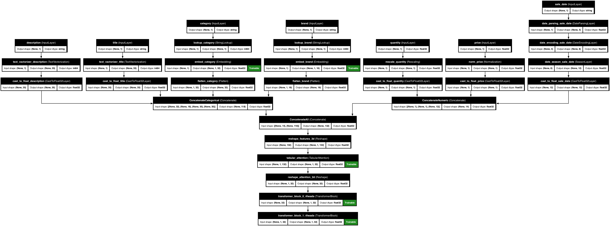

# 📚 Complex Example 🌟

This example shows how to create a compound model with both transformer blocks and attention mechanisms.

```python
import pandas as pd
import tensorflow as tf
from kdp.features import (
    NumericalFeature,
    CategoricalFeature,
    TextFeature,
    DateFeature,
    FeatureType
)
from kdp.processor import PreprocessingModel, OutputModeOptions

# Define features
features = {
    # Numerical features
    "price": NumericalFeature(
        name="price",
        feature_type=FeatureType.FLOAT_NORMALIZED
    ),
    "quantity": NumericalFeature(
        name="quantity",
        feature_type=FeatureType.FLOAT_RESCALED
    ),

    # Categorical features
    "category": CategoricalFeature(
        name="category",
        feature_type=FeatureType.STRING_CATEGORICAL,
        embedding_size=32
    ),
    "brand": CategoricalFeature(
        name="brand",
        feature_type=FeatureType.STRING_CATEGORICAL,
        embedding_size=16
    ),

    # Text features
    "description": TextFeature(
        name="description",
        feature_type=FeatureType.TEXT,
        max_tokens=100
    ),
    "title": TextFeature(
        name="title",
        feature_type=FeatureType.TEXT,
        max_tokens=50, # max number of tokens to keep
    ),

    # Date features
    "sale_date": DateFeature(
        name="sale_date",
        feature_type=FeatureType.DATE,
        add_season=True, # adds one-hot season indicator (summer, winter, etc) defaults to False
    )
}

# Create sample data
df = pd.DataFrame({
    "price": [10.5, 20.0, 15.75, 30.25, 25.50] * 20,
    "quantity": [5, 10, 3, 8, 12] * 20,
    "category": ["electronics", "books", "clothing", "food", "toys"] * 20,
    "brand": ["brandA", "brandB", "brandC", "brandD", "brandE"] * 20,
    "description": [
        "High quality product with great features",
        "Must-read book for enthusiasts",
        "Comfortable and stylish clothing",
        "Fresh and organic produce",
        "Educational toy for children"
    ] * 20,
    "title": [
        "Premium Device",
        "Best Seller Book",
        "Fashion Item",
        "Organic Food",
        "Kids Toy"
    ] * 20,
    "sale_date": [
        "2023-01-15",
        "2023-02-20",
        "2023-03-25",
        "2023-04-30",
        "2023-05-05"
    ] * 20
})

# Save to CSV
df.to_csv("sample_data.csv", index=False)

# Create preprocessor with both transformer blocks and attention
ppr = PreprocessingModel(
    path_data="sample_data.csv",
    features_specs=features,
    output_mode=OutputModeOptions.CONCAT,

    # Transformer block configuration
    transfo_placement="all_features",  # Choose between (categorical|all_features)
    transfo_nr_blocks=2,              # Number of transformer blocks
    transfo_nr_heads=4,               # Number of attention heads in transformer
    transfo_ff_units=64,              # Feed-forward units in transformer
    transfo_dropout_rate=0.1,         # Dropout rate for transformer

    # Tabular attention configuration
    tabular_attention=True,
    tabular_attention_placement="all_features",  # Choose between (none|numeric|categorical|all_features| multi_resolution)
    tabular_attention_heads=3,                   # Number of attention heads
    tabular_attention_dim=32,                    # Attention dimension
    tabular_attention_dropout=0.1,               # Attention dropout rate
    tabular_attention_embedding_dim=16,          # Embedding dimension

    # Other parameters
    overwrite_stats=True,             # Force stats generation, recommended to be set to True
)

# Build the preprocessor
result = ppr.build_preprocessor()
```

Now if one wants to plot, use the Neural Network for predictions or just get the statistics, use the following:

```python
# Plot the model architecture
ppr.plot_model("complex_model.png")

# Get predictions with an example test batch from the example data
test_batch = tf.data.Dataset.from_tensor_slices(dict(df.head(3))).batch(3)
predictions = result["model"].predict(test_batch)
print("Output shape:", predictions.shape)

# Print feature statistics
print("\nFeature Statistics:")
for feature_type, features in ppr.get_feature_statistics().items():
    if isinstance(features, dict):
        print(f"\n{feature_type}:")
        for feature_name, stats in features.items():
            print(f"  {feature_name}: {list(stats.keys())}")
```


Here is the plot of the model:

