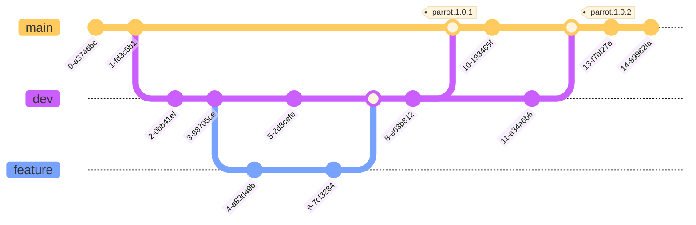

# 💻 Contributing to the Project

## 💡 New Ideas / Features Requests

If you wan't to request a new feature or you have detected an issue, please use the following link:
[PARROT ISSUES](https://github.com/adeo/dataplatform--bigdata--the-parrot/issues)

## 🚀 Typical Project Lifecycle

Genreal life-cylcle of this repository can be represented by the following chart:



You start developping from the `dev` branch using your custom branch c.f.: `feat`. You split your project to several Merge Requests (MR) with the smallest functionality possible.
Once the code is ready and approved you merge into `dev` branch. At this point some of the automatic CI/CD actions will take place (...).
Realeses are going to be done from the `main` branch so we will frequentle merge the `dev` branch into the `main` branch. The release process is semi-automatic and you need to start it manually). This means that the simple `main` merge won't do anything excep preparing code for the release. We use the semantic release to automatically generate and propagate the project changelogs (tag/close issues, tag merge requests, send Slack notifications etc).

When you start developping a new feature within Parrot, you can follow the typical development pattern:

## ❤️‍🔥 Contribution Cycle Guidelines

- [x] Make sure you have installed the pre-commit hook locally

  ??? installation-guide
  Before using pre-commit hook you need to install it in your python environment.

        ```bash
        conda install -c conda-forge pre-commit
        ```

        go to the root folder of this repository, activate your venv and use the following command:

        ```bash
        pre-commit install
        ```

- [x] Create a new branch from DEV to package your code

  ??? Branch-naming-convention
  The bets way to organize your local git history would be to use the following branch naming convention:

        ```{ACRONYM}/{LABEL (CI|FEAT|TEST|DOCS ...)}/{message}```

        i.e.: ```CEREBRO/DOCS/doc_adding_contribution_explanation```

- [x] Use standarized commit message:

  `{LABEL}(ACRONYM): {message}`

  This is very important for the automatic releases (semantic release) and to have clean history on the master branch.

  ??? Labels-types

        | Label    | Usage                                                                                                                                                                                                                                             |
        | -------- | ------------------------------------------------------------------------------------------------------------------------------------------------------------------------------------------------------------------------------------------------- |
        | break    | `break` is used to identify changes related to old compatibility or functionality that breaks the current usage (major)                                                                                                                           |
        | feat     | `feat` is used to identify changes related to new backward-compatible abilities or functionality (minor)                                                                                                                                          |
        | init     | `init` is used to indentify the starting related to the project (minor)                                                                                                                                                                           |
        | enh      | `enh` is used to indentify changes related to amelioration of abilities or functionality (patch)                                                                                                                                                  |
        | build    | `build` (also known as `chore`) is used to identify **development** changes related to the build system (involving scripts, configurations, or tools) and package dependencies (patch)                                                            |
        | ci       | `ci` is used to identify **development** changes related to the continuous integration and deployment system - involving scripts, configurations, or tools (minor)                                                                                |
        | docs     | `docs`  is used to identify documentation changes related to the project; whether intended externally for the end-users or internally for the developers (patch)                                                                                  |
        | perf     | `perf`  is used to identify changes related to backward-compatible **performance improvements** (patch)                                                                                                                                           |
        | refactor | `refactor` is used to identify changes related to modifying the codebase, which neither adds a feature nor fixes a bug - such as removing redundant code, simplifying the code, renaming variables, etc.<br />i.e. handy for your wip ; ) (patch) |
        | style    | `style`  is used to identify **development** changes related to styling the codebase, regardless of the meaning - such as indentations, semi-colons, quotes, trailing commas, and so on (patch)                                                   |
        | test     | `test` is used to identify **development** changes related to tests - such as refactoring existing tests or adding new tests. (minor)                                                                                                             |
        | fix      | `fix`  is used to identify changes related to backward-compatible bug fixes. (patch)                                                                                                                                                              |
        | ops      | `ops` is used to identify changes related to deployment files like `values.yml`, `gateway.yml,` or `Jenkinsfile` in the **ops** directory. (minor)                                                                                                |
        | hotfix   | `hotfix` is used to identify **production** changes related to backward-compatible bug fixes (patch)                                                                                                                                              |
        | revert   | `revert` is used to identify backward changes (patch)                                                                                                                                                                                             |
        | maint    | `maint` is used to identify **maintenance** changes related to project (patch)                                                                                                                                                                    |

- [x] Create your first Merge Request (MR) as soon as possible.

  > Merge requests will be responsible for semantic-release storytelling and so use them wisely! The changelog report generated automatically will be based on your commits merged into main branch and should cover all the thins you did for the project, as an example:

- [x] Separate your merge requests based on LABEL or functionality if you are working on `feat` label

  > This about what part of feature you are working on, (messages) i.e.:

        - `initializaing base pre-processing code`
        - `init repo structure`
        - `adding pre-processing unit-tests`

- [x] Once the code is ready create a Merge Request (MR) into the DEV branch with a proper naming convention

  > The name of your MR should follow the same exact convention as your commits (we have a dedicated check for this in the CI):

        `{LABEL}(ACRONYM): {message}`

  Your MR creation should be communicated using dedicated Slack Channel

- [x] Use small Merge Requests but do them more ofthen < 400 ligns for quicker and simple review and not the whole project !

- [x] Ask for a Code Review !

- [x] Once your MR is approved, solve all your unresolved conversation and pass all the CI check before you can merge it.

- [x] All the Tests for your code should pass -> REMEMBER NO TESTS = NO MERGE 🚨

- [x] Remember to squash your commits (or squash & merge) during the merge !

  !!! warning
  Always check if the last commit (the once that is going to be used for the merge) follows the convention and describes the work you did in the correct way.
