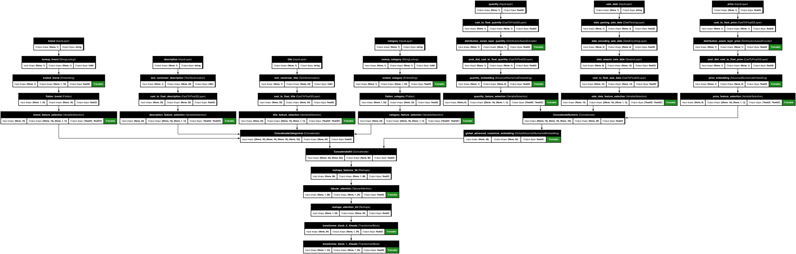
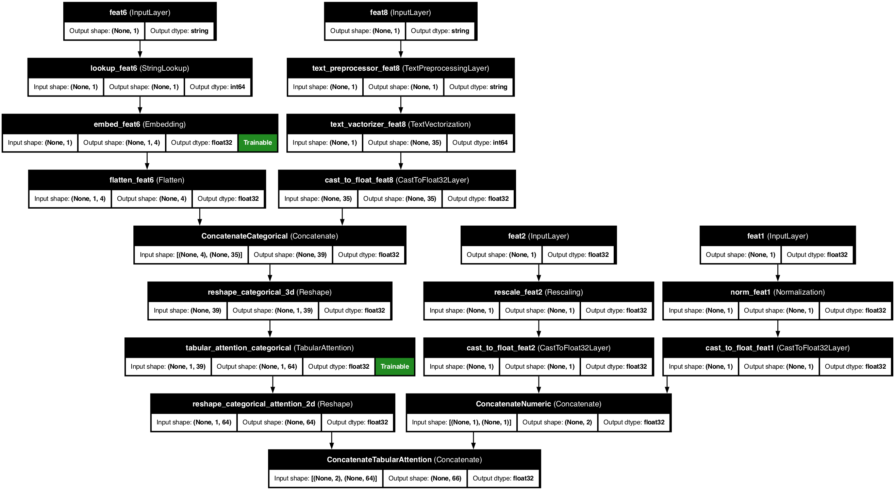
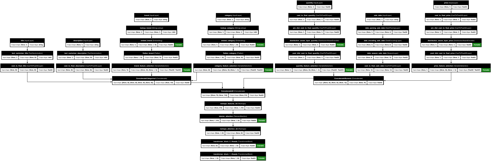
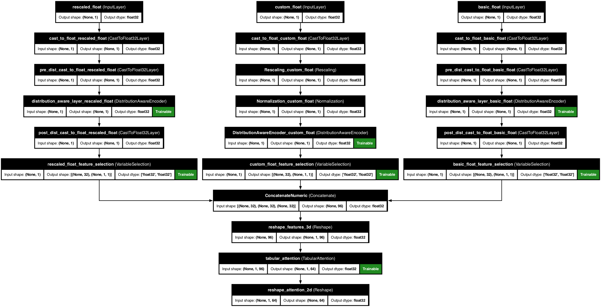
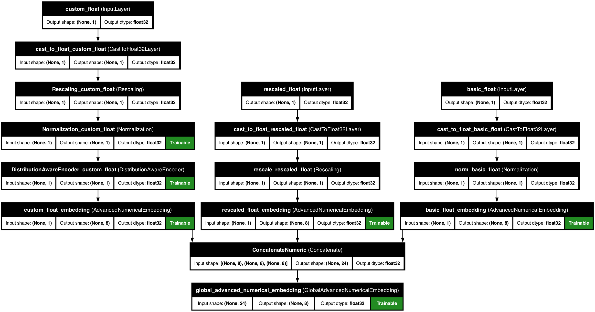

# Example usages

Let us go trough some different examples of case scenarios. To get a feeling how one could use the library to their advantage with ease and comfort.

## Example 1: Numerical features

```python
from kdp.features import NumericalFeature, FeatureType
from kdp.processor import PreprocessingModel, OutputModeOptions

# Define features
features = {
    # 1. Basic float feature (no preprocessing)
    "basic_float": NumericalFeature(
        name="basic_float",
        feature_type=FeatureType.FLOAT
    ),

    # 2. Basic float feature (no preprocessing)
    "basic_float2": NumericalFeature(
        name="basic_float2",
        feature_type=FeatureType.FLOAT
    ),

    # 3. Normalized float feature
    "normalized_float": NumericalFeature(
        name="normalized_float",
        feature_type=FeatureType.FLOAT_NORMALIZED
    ),

    # 4. Rescaled float feature
    "rescaled_float": NumericalFeature(
        name="rescaled_float",
        feature_type=FeatureType.FLOAT_RESCALED,
        scale=2.0  # Optional scale parameter
    ),

    # 5. Discretized float feature
    "discretized_float": NumericalFeature(
        name="discretized_float",
        feature_type=FeatureType.FLOAT_DISCRETIZED,
        bin_boundaries=[0.0, 1.0, 2.0]  # Required for discretization
    ),

    # 6. Custom preprocessing pipeline
    "custom_float": NumericalFeature(
        name="custom_float",
        feature_type=FeatureType.FLOAT,
        preprocessors=[
            tf.keras.layers.Rescaling,
            tf.keras.layers.Normalization,
        ],
        # Additional kwargs for the preprocessors
        bin_boundaries=[0.0, 1.0, 2.0],
        mean=0.0,
        variance=1.0,
        scale=4.0  # Added required scale parameter for Rescaling layer
    ),
}

# Define cross-feature between 2 arbitrary features, though tabular attention would be more useful for feature crossings
feature_crosses = [("normalized_float", "rescaled_float", 10)] # 10 is the number of bins to hash into

# Now we can create a preprocessing model with the features
ppr = PreprocessingModel(
    path_data="sample_data.csv",
    features_specs=features,
    feature_crosses=feature_crosses,
    features_stats_path="features_stats.json",
    overwrite_stats=True,
    output_mode=OutputModeOptions.CONCAT,

    # Add feature selection to get the most important features
    feature_selection_placement="numeric", # Choose between (all_features|numeric|categorical)
    feature_selection_units=32,
    feature_selection_dropout=0.10,

    # Add tabular attention to check for feature interactions
    tabular_attention=True,
    tabular_attention_placement="all_features",  # Choose between (none|numeric|categorical|all_features|multi_resolution)
    tabular_attention_heads=3,                   # Number of attention heads
    tabular_attention_dim=32,                    # Attention dimension
    tabular_attention_dropout=0.1,               # Attention dropout rate
    tabular_attention_embedding_dim=16,          # Embedding dimension
)

# Build the preprocessor
result = ppr.build_preprocessor()

# Transform data using direct model prediction
transformed_data = ppr.model.predict(test_batch)

# Get feature importances
feature_importances = ppr.get_feature_importances()
```

### Visualize the model architecture

You can visualize the model architecture to understand how the features are processed:

```python
ppr.plot_model("numerical_example_model.png")
```




## Example 2: Categorical features

```python

from kdp.features import CategoricalFeature, FeatureType, CategoryEncodingOptions
from kdp.processor import PreprocessingModel, OutputModeOptions

# Define features
features = {
    # 1. Basic string categorical feature with embedding
    "basic_category": CategoricalFeature(
        name="basic_category",
        feature_type=FeatureType.STRING_CATEGORICAL,
        category_encoding=CategoryEncodingOptions.EMBEDDING,
        embedding_size=8  # Custom embedding size
    ),

    # 2. Basic integer categorical feature with one-hot encoding
    "basic_int_category": CategoricalFeature(
        name="basic_int_category",
        feature_type=FeatureType.INTEGER_CATEGORICAL,
        category_encoding=CategoryEncodingOptions.ONE_HOT_ENCODING
    ),

    # 3. High cardinality categorical feature with embedding
    "high_card_category": CategoricalFeature(
        name="high_card_category",
        feature_type=FeatureType.STRING_CATEGORICAL,
        category_encoding=CategoryEncodingOptions.EMBEDDING,
        # embedding size will be automatically determined based on cardinality
    ),

    # 4. Binary categorical feature with one-hot encoding
    "binary_category": CategoricalFeature(
        name="binary_category",
        feature_type=FeatureType.STRING_CATEGORICAL,
        category_encoding=CategoryEncodingOptions.ONE_HOT_ENCODING
    ),
}

feature_crosses = [("basic_category", "basic_int_category", 8)]  # Using existing features

# Now we can create a preprocessing model with the features
ppr = PreprocessingModel(
    path_data="sample_data.csv",
    features_specs=features,
    feature_crosses=feature_crosses,
    features_stats_path="features_stats.json",
    overwrite_stats=True,
    output_mode=OutputModeOptions.CONCAT,

    # Add feature selection
    feature_selection_placement="categorical",
    feature_selection_units=32,
    feature_selection_dropout=0.1,

    # Add tabular attention
    tabular_attention=True,
    tabular_attention_placement="categorical",  # Apply attention only to categorical features
    tabular_attention_heads=4,
    tabular_attention_dim=32,
    tabular_attention_dropout=0.1,
    tabular_attention_embedding_dim=16,

    # Add transformer blocks to make it learn sophisticated feature interactions
    transfo_nr_blocks=2,
    transfo_nr_heads=4,
    transfo_ff_units=32,
    transfo_dropout_rate=0.1,
    transfo_placement="categorical",  # Apply transformer only to categorical features
)

# Build the preprocessor
result = ppr.build_preprocessor()

# Transform data using direct model prediction
transformed_data = ppr.model.predict(test_batch)

# Get feature importances
feature_importances = ppr.get_feature_importances()
```

You can visualize the model architecture:

```python
ppr.plot_model("categorical_example_model.png")
```




## Example 3: Multi-feature model

```python
from kdp.features import NumericalFeature, CategoricalFeature, TextFeature, DateFeature, FeatureType
from kdp.processor import PreprocessingModel, OutputModeOptions

# Define features
features = {
    # Numerical features
    "price": NumericalFeature(
        name="price",
        feature_type=FeatureType.FLOAT_NORMALIZED
    ),
    "quantity": NumericalFeature(
        name="quantity",
        feature_type=FeatureType.FLOAT_RESCALED,
        scale=1.0
    ),

    # Categorical features
    "category": CategoricalFeature(
        name="category",
        feature_type=FeatureType.STRING_CATEGORICAL,
        embedding_size=32
    ),
    "brand": CategoricalFeature(
        name="brand",
        feature_type=FeatureType.STRING_CATEGORICAL,
        embedding_size=16
    ),

    # Text features
    "description": TextFeature(
        name="description",
        feature_type=FeatureType.TEXT,
        max_tokens=100
    ),
    "title": TextFeature(
        name="title",
        feature_type=FeatureType.TEXT,
        max_tokens=50, # max number of tokens to keep

    ),

    # Date features
    "sale_date": DateFeature(
        name="sale_date",
        feature_type=FeatureType.DATE,
        add_season=True, # adds one-hot season indicator (summer, winter, etc) defaults to False
    )
}

# Create preprocessor with both transformer blocks and attention
ppr = PreprocessingModel(
    path_data="sample_data.csv",
    features_stats_path="features_stats.json",
    overwrite_stats=True,             # Force stats generation, recommended to be set to True
    features_specs=features,
    output_mode=OutputModeOptions.CONCAT,

    # Transformer block configuration
    transfo_placement="all_features",  # Choose between (categorical|all_features)
    transfo_nr_blocks=2,              # Number of transformer blocks
    transfo_nr_heads=4,               # Number of attention heads in transformer
    transfo_ff_units=64,              # Feed-forward units in transformer
    transfo_dropout_rate=0.1,         # Dropout rate for transformer

    # Tabular attention configuration
    tabular_attention=True,
    tabular_attention_placement="all_features",  # Choose between (none|numeric|categorical|all_features| multi_resolution)
    tabular_attention_heads=3,                   # Number of attention heads
    tabular_attention_dim=32,                    # Attention dimension
    tabular_attention_dropout=0.1,               # Attention dropout rate
    tabular_attention_embedding_dim=16,          # Embedding dimension

    # Feature selection configuration
    feature_selection_placement="all_features", # Choose between (all_features|numeric|categorical)
    feature_selection_units=32,
    feature_selection_dropout=0.15,
)

# Build the preprocessor
result = ppr.build_preprocessor()
```

You can visualize the model architecture:

```python
ppr.plot_model("complex_model.png")
```




## Example 4: Numerical features with distribution aware encoder

Normally the distribution aware encoder works well in automatic mode, once use_distribution_aware=True is set.
However we can also manually set the prefered distribution for each numerical feature if we would like to.

```python
from kdp.features import NumericalFeature, FeatureType
from kdp.processor import PreprocessingModel, OutputModeOptions
from kdp.layers.distribution_aware_encoder_layer import DistributionAwareEncoder


# Define features
features = {
    # 1. Default automatic distribution detection
    "basic_float": NumericalFeature(
        name="basic_float",
        feature_type=FeatureType.FLOAT,
    ),

    # 2. Manually setting a gamma distribution
    "rescaled_float": NumericalFeature(
        name="rescaled_float",
        feature_type=FeatureType.FLOAT_RESCALED,
        scale=2.0,
        prefered_distribution="gamma"
    ),
    # 3. Custom preprocessing pipeline with a custom set normal distribution
    "custom_float": NumericalFeature(
        name="custom_float",
        feature_type=FeatureType.FLOAT,
        preprocessors=[
            tf.keras.layers.Rescaling,
            tf.keras.layers.Normalization,
            DistributionAwareEncoder,
        ],
        bin_boundaries=[0.0, 1.0, 2.0],
        mean=0.0,
        variance=1.0,
        scale=4.0,
        prefered_distribution="normal"
    ),
}

# Now we can create a preprocessing model with the features
ppr = PreprocessingModel(
    path_data="sample_data.csv",
    features_specs=features,
    features_stats_path="features_stats.json",
    overwrite_stats=True,
    output_mode=OutputModeOptions.CONCAT,

    # Add feature selection to get the most important features
    feature_selection_placement="numeric", # Choose between (all_features|numeric|categorical)

    # Add tabular attention to check for feature interactions
    tabular_attention=True,

    # Add distribution aware encoder
    use_distribution_aware=True
)

# Build the preprocessor
result = ppr.build_preprocessor()

# Transform data using direct model prediction
transformed_data = ppr.model.predict(test_batch)

# Get feature importances
feature_importances = ppr.get_feature_importances()
```

```python
ppr.plot_model("model_with_distribution_aware.png")
```




## Example 5: Numerical features with numerical embedding

Numerical embedding is a technique that allows us to embed numerical features into a higher dimensional space.
This can be useful for capturing non-linear relationships within/between numerical feature/s.

```python
from kdp.features import NumericalFeature, FeatureType
from kdp.processor import PreprocessingModel, OutputModeOptions


# Define features
features = {
    "basic_float": NumericalFeature(
        name="basic_float",
        feature_type=FeatureType.FLOAT,
    ),

    "rescaled_float": NumericalFeature(
        name="rescaled_float",
        feature_type=FeatureType.FLOAT_RESCALED,
        scale=2.0,
    ),

    "custom_float": NumericalFeature(
        name="custom_float",
        feature_type=FeatureType.FLOAT,
        preprocessors=[
            tf.keras.layers.Rescaling,
            tf.keras.layers.Normalization,
            DistributionAwareEncoder,
        ],
    ),
}

# Now we can create a preprocessing model with the features
ppr = PreprocessingModel(
    path_data="sample_data.csv",
    features_specs=features,
    features_stats_path="features_stats.json",
    overwrite_stats=True,

    # Add numerical embedding
    # Use advanced numerical embedding for individual features
    use_advanced_numerical_embedding=True,
    # Use global numerical embedding for all features
    use_global_numerical_embedding=True,

    output_mode=OutputModeOptions.CONCAT,
)

# Build the preprocessor
result = ppr.build_preprocessor()

# Transform data using direct model prediction
transformed_data = ppr.model.predict(test_batch)

# Get feature importances
feature_importances = ppr.get_feature_importances()
```

```python
ppr.plot_model("model_with_advanced_numerical_embedding.png")
```


