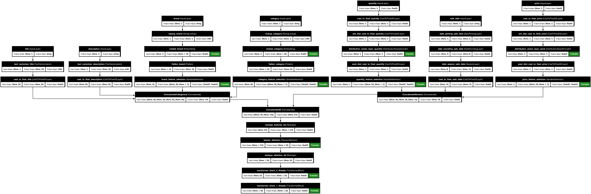

# 🚀 Real-World KDP Examples

## 📋 Quick Overview

Ready to see KDP in action? This guide showcases complete, practical examples that demonstrate how to use KDP's advanced features for real-world scenarios. Each example includes detailed explanations, code snippets, and visualization of the resulting preprocessing pipeline.

## 💼 E-commerce Product Analytics

This example demonstrates how to preprocess product data for an e-commerce recommendation system, combining numerical, categorical, text, and date features with advanced KDP capabilities.

### 1️⃣ Setting Up Features

```python
import pandas as pd
import tensorflow as tf
from kdp.features import (
    NumericalFeature, CategoricalFeature, TextFeature, DateFeature, FeatureType
)
from kdp.processor import PreprocessingModel, OutputModeOptions

# Define features with specialized processing for each type
features = {
    # Numerical features with different processing strategies
    "price": NumericalFeature(
        name="price",
        feature_type=FeatureType.FLOAT_NORMALIZED,
        use_embedding=True,                  # Create richer representation
        embedding_dim=8                      # Size of embedding
    ),
    "quantity": NumericalFeature(
        name="quantity",
        feature_type=FeatureType.FLOAT_RESCALED,
        preferred_distribution="poisson"     # Handle count data appropriately
    ),

    # Categorical features with semantic embeddings
    "category": CategoricalFeature(
        name="category",
        feature_type=FeatureType.STRING_CATEGORICAL,
        embedding_dim=32,                    # Larger embeddings for complex categories
        max_vocabulary_size=1000            # Limit vocabulary size
    ),
    "brand": CategoricalFeature(
        name="brand",
        feature_type=FeatureType.STRING_CATEGORICAL,
        embedding_dim=16
    ),

    # Text features with different token limits
    "description": TextFeature(
        name="description",
        feature_type=FeatureType.TEXT,
        max_tokens=100,                      # Longer limit for descriptions
        output_mode="embedding"              # Use text embeddings
    ),
    "title": TextFeature(
        name="title",
        feature_type=FeatureType.TEXT,
        max_tokens=50                        # Shorter limit for titles
    ),

    # Date features with seasonality
    "sale_date": DateFeature(
        name="sale_date",
        feature_type=FeatureType.DATE,
        add_season=True,                     # Add seasonal indicators
        add_day_of_week=True                 # Add day of week information
    )
}
```

### 2️⃣ Creating the Advanced Preprocessor

```python
# Create a comprehensive preprocessor with multiple advanced features
preprocessor = PreprocessingModel(
    path_data="ecommerce_data.csv",
    features_specs=features,
    output_mode=OutputModeOptions.CONCAT,

    # Enable distribution-aware processing
    use_distribution_aware=True,
    distribution_aware_bins=1000,

    # Enable transformer blocks for complex interactions
    transfo_nr_blocks=2,
    transfo_nr_heads=4,
    transfo_ff_units=64,
    transfo_dropout_rate=0.1,
    transfo_placement="all_features",

    # Enable tabular attention for feature relationships
    tabular_attention=True,
    tabular_attention_placement="multi_resolution",
    tabular_attention_heads=3,
    tabular_attention_dim=32,

    # Enable feature selection to focus on what matters
    feature_selection_placement="all_features",
    feature_selection_units=32,

    # Enable caching for better performance
    enable_caching=True
)

# Build the preprocessor
result = preprocessor.build_preprocessor()
model = result["model"]
```

### 3️⃣ Using the Preprocessor

```python
# Generate predictions on test data
test_batch = tf.data.Dataset.from_tensor_slices(dict(test_df)).batch(32)
processed_features = model.predict(test_batch)

# Analyze feature importance
feature_importances = preprocessor.get_feature_importances()
print("Top features:", sorted(
    feature_importances.items(),
    key=lambda x: x[1],
    reverse=True
)[:3])

# Visualize the model architecture
preprocessor.plot_model("ecommerce_model.png")
```



## 📊 Financial Time Series Analysis

This example demonstrates using KDP to preprocess financial time series data for forecasting, focusing on distribution-aware encoding and feature interactions.

### Setting Up Features

```python
# Define financial features
features = {
    # Price data with custom distribution handling
    "close_price": NumericalFeature(
        name="close_price",
        feature_type=FeatureType.FLOAT_RESCALED,
        use_embedding=True,
        embedding_dim=16,
        preferred_distribution="heavy_tailed"  # Handle market data distributions
    ),
    "volume": NumericalFeature(
        name="volume",
        feature_type=FeatureType.FLOAT_RESCALED,
        preferred_distribution="log_normal"    # Common for volume data
    ),

    # Technical indicators
    "rsi": NumericalFeature(
        name="rsi",
        feature_type=FeatureType.FLOAT_NORMALIZED,  # RSI is already 0-100
        preferred_distribution="normal"
    ),
    "macd": NumericalFeature(
        name="macd",
        feature_type=FeatureType.FLOAT_NORMALIZED,
        preferred_distribution="normal"
    ),

    # Categorical market data
    "market_regime": CategoricalFeature(
        name="market_regime",
        feature_type=FeatureType.STRING_CATEGORICAL,
        embedding_dim=8
    ),

    # Date information with market-specific features
    "date": DateFeature(
        name="date",
        feature_type=FeatureType.DATE,
        add_day_of_week=True,  # Markets behave differently on different days
        add_month=True         # Capture seasonal effects
    )
}

# Create financial preprocessor
financial_preprocessor = PreprocessingModel(
    path_data="market_data.csv",
    features_specs=features,

    # Enable advanced numerical embeddings for better pattern detection
    use_numerical_embedding=True,
    numerical_embedding_dim=32,

    # Enable distribution-aware encoding for market data
    use_distribution_aware=True,

    # Enable feature selection to identify important signals
    feature_selection_placement="ALL_FEATURES",

    # Financial time series benefits from attention mechanisms
    tabular_attention=True,
    tabular_attention_heads=8
)

# Build the preprocessor
financial_result = financial_preprocessor.build_preprocessor()
```

## 👥 User Behavior Analysis

This example shows how to preprocess user behavior data for churn prediction or personalization algorithms.

### Setting Up Features

```python
# Define user behavior features
features = {
    # User demographics
    "age": NumericalFeature(
        name="age",
        feature_type=FeatureType.FLOAT_NORMALIZED
    ),
    "gender": CategoricalFeature(
        name="gender",
        feature_type=FeatureType.STRING_CATEGORICAL,
        embedding_dim=4
    ),
    "location": CategoricalFeature(
        name="location",
        feature_type=FeatureType.STRING_CATEGORICAL,
        embedding_dim=16,
        max_vocabulary_size=500  # Limit to top locations
    ),

    # Behavioral metrics
    "days_since_last_login": NumericalFeature(
        name="days_since_last_login",
        feature_type=FeatureType.FLOAT_RESCALED,
        preferred_distribution="exponential"  # Often follows exponential distribution
    ),
    "total_purchases": NumericalFeature(
        name="total_purchases",
        feature_type=FeatureType.FLOAT_RESCALED,
        preferred_distribution="zero_inflated"  # Many users have zero purchases
    ),
    "average_session_time": NumericalFeature(
        name="average_session_time",
        feature_type=FeatureType.FLOAT_RESCALED
    ),

    # Categorical engagement data
    "subscription_tier": CategoricalFeature(
        name="subscription_tier",
        feature_type=FeatureType.STRING_CATEGORICAL,
        embedding_dim=8
    ),

    # Textual data
    "user_feedback": TextFeature(
        name="user_feedback",
        feature_type=FeatureType.TEXT,
        max_tokens=150
    ),

    # Time-based features
    "account_creation_date": DateFeature(
        name="account_creation_date",
        feature_type=FeatureType.DATE,
        add_season=True
    )
}

# Create user behavior preprocessor
user_preprocessor = PreprocessingModel(
    path_data="user_data.csv",
    features_specs=features,

    # Enable mixture of experts for specialized handling
    use_feature_moe=True,
    feature_moe_num_experts=5,

    # Enable feature selection to identify churn indicators
    feature_selection_placement="ALL_FEATURES",

    # Enable distribution-aware encoding
    use_distribution_aware=True,

    # User behavior data benefits from transformer blocks
    transfo_nr_blocks=2,
    transfo_nr_heads=4
)

# Build the preprocessor
user_result = user_preprocessor.build_preprocessor()
```

## 💡 Pro Tips

1. **Start Simple, Then Add Complexity**
   - Begin with basic feature definitions
   - Add advanced features one at a time
   - Test each addition's impact

2. **Monitor Resource Usage**
   - Complex models can be memory-intensive
   - Use batch processing for large datasets
   - Monitor preprocessing time and adjust accordingly

3. **Balance Preprocessing Complexity**
   - More complex preprocessing isn't always better
   - Focus on features that provide the most value
   - Use `get_feature_importances()` to identify key features

4. **Save Your Preprocessing Pipeline**
   ```python
   # Save the complete pipeline for reuse
   preprocessor.save_model("my_preprocessor.keras")

   # Load it when needed
   from kdp import PreprocessingModel
   loaded_preprocessor = PreprocessingModel.load_model("my_preprocessor.keras")
   ```

## 🔗 Related Topics

- [Quick Start Guide](../getting-started/quick-start.md)
- [Feature Processing Guide](../features/overview.md)
- [Advanced Numerical Embeddings](../advanced/numerical-embeddings.md)
- [Distribution-Aware Encoding](../advanced/distribution-aware-encoding.md)
