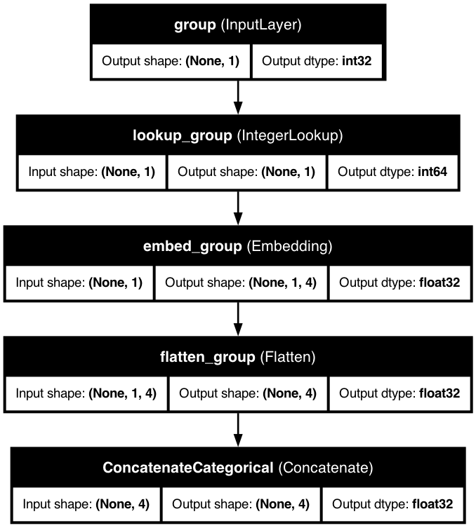
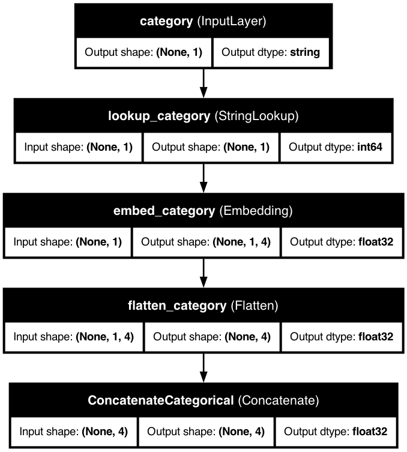

# 🏷️ Categorical Features

> Transform discrete categories like product types, occupations, or regions into powerful feature representations.

## 📋 Quick Overview

Categorical features represent discrete items or categories from a finite set of values. KDP offers several ways to encode these features, from simple one-hot encoding to advanced neural embeddings.

## 🎯 Types and Use Cases

| Type | Best For | Example Values | When to Use |
|------|----------|----------------|-------------|
| `STRING_CATEGORICAL` | Text categories | "Manager", "New York" | For most categorical data |
| `INTEGER_CATEGORICAL` | Numeric codes | 1, 2, 3 (representing categories) | For pre-encoded categories |

## 🚀 Basic Usage

The simplest way to define categorical features is with the `FeatureType` enum:

```python
from kdp import PreprocessingModel, FeatureType

# Quick categorical feature definition
features = {
    "occupation": FeatureType.STRING_CATEGORICAL,     # Text categories
    "education_level": FeatureType.INTEGER_CATEGORICAL, # Numeric categories
    "product_category": FeatureType.STRING_CATEGORICAL,
    "store_id": FeatureType.STRING_CATEGORICAL
}

# Create your preprocessor
preprocessor = PreprocessingModel(
    path_data="customer_data.csv",
    features_specs=features
)
```

## 🧠 Advanced Configuration

For more control, use the `CategoricalFeature` class:

```python
from kdp.features import CategoricalFeature
from kdp.features.enums import CategoryEncodingOptions

features = {
    # Basic categorical with embeddings
    "occupation": CategoricalFeature(
        name="occupation",
        feature_type=FeatureType.STRING_CATEGORICAL,
        category_encoding=CategoryEncodingOptions.EMBEDDING,  # Use embeddings
        embedding_size=16                  # Custom embedding size
    ),

    # One-hot encoding for low-cardinality feature
    "day_of_week": CategoricalFeature(
        name="day_of_week",
        feature_type=FeatureType.STRING_CATEGORICAL,
        category_encoding=CategoryEncodingOptions.ONE_HOT_ENCODING,  # One-hot encoding
        vocabulary=["Mon", "Tue", "Wed", "Thu", "Fri", "Sat", "Sun"]  # Pre-defined vocabulary
    )
}
```

## ⚙️ Key Configuration Options

| Parameter | Description | Default | Suggested Range |
|-----------|-------------|---------|----------------|
| `feature_type` | Base feature type | Based on data | `STRING_CATEGORICAL`, `INTEGER_CATEGORICAL` |
| `category_encoding` | Encoding method | `EMBEDDING` | `EMBEDDING`, `ONE_HOT_ENCODING` |
| `embedding_size` | Dimensionality of embedding | Auto-scaled | 8-128 |
| `vocabulary` | Pre-defined vocabulary | `None` | List of categories |

## 🔥 Power Features

### Automatic Embedding Sizing

KDP automatically determines optimal embedding sizes based on cardinality:

```python
# Let KDP determine embedding dimensions
preprocessor = PreprocessingModel(
    features_specs=features,
    categorical_embedding_dim="auto"   # Auto-scale embeddings based on cardinality
)
```

### Handling High-Cardinality Features

When dealing with many categories, KDP automatically adjusts the embedding size:

```python
# For features with many categories
preprocessor = PreprocessingModel(
    features_specs={
        "user_id": CategoricalFeature(
            name="user_id",
            feature_type=FeatureType.STRING_CATEGORICAL,
            category_encoding=CategoryEncodingOptions.EMBEDDING,
            # embedding size will be automatically determined based on cardinality
        )
    }
)
```

## 📊 Model Architecture

Below are visualizations of categorical feature processing in KDP:

### String Categorical Feature


### Integer Categorical Feature



### Custom Categorical Feature

For more control, you can use the `CategoricalFeature` class:



## 💡 Pro Tips

1. **Choose the Right Encoding**
   - Use `ONE_HOT_ENCODING` for very low cardinality (< 10 categories)
   - Use `EMBEDDING` for medium to high cardinality (≥ 10 categories)

2. **Embedding Dimension Rules of Thumb**
   - KDP automatically calculates optimal embedding size using the rule: `min(500, 1.6 * num_categories^0.56)`
   - For very important features, you can override with custom `embedding_size`

3. **Vocabulary Management**
   - For low-cardinality features, consider providing a pre-defined vocabulary
   - This ensures consistent encoding across different datasets

4. **Cross Features for Interactions**
   - Use cross features when combinations have special meaning
   - Example: "product_category" × "user_location" for regional preferences

## 🔗 Related Topics

- [Cross Features](cross-features.md) - Model interactions between features
- [Tabular Attention](../advanced/tabular-attention.md) - Learn feature relationships
- [Feature Selection](../advanced/feature-selection.md) - Finding important features

---

<div class="prev-next">
  <a href="numerical-features.md" class="prev">← Numerical Features</a>
  <a href="text-features.md" class="next">Text Features →</a>
</div>

<style>
.prev-next {
  display: flex;
  justify-content: space-between;
  margin-top: 40px;
}
.prev-next a {
  padding: 10px 15px;
  background-color: #f1f1f1;
  border-radius: 5px;
  text-decoration: none;
  color: #333;
}
.prev-next a:hover {
  background-color: #ddd;
}
</style>
