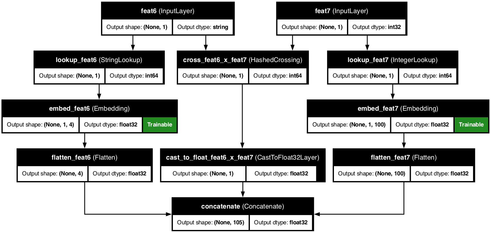

# ➕ Cross Features

<div class="feature-header">
  <div class="feature-title">
    <h2>Cross Features in KDP</h2>
    <p>Capture powerful interactions between features to uncover hidden patterns in your data.</p>
  </div>
</div>

## 📋 Overview

<div class="overview-card">
  <p>Cross features model the interactions between input features, unlocking patterns that individual features alone might miss. They're especially powerful for capturing relationships like "product category × user location" or "day of week × hour of day" that drive important outcomes in your data.</p>
</div>

<div class="key-benefits">
  <div class="benefit-card">
    <span class="benefit-icon">🔗</span>
    <h3>Feature Interaction</h3>
    <p>Capture complex relationships between features</p>
  </div>
  <div class="benefit-card">
    <span class="benefit-icon">🎯</span>
    <h3>Pattern Discovery</h3>
    <p>Uncover hidden correlations in your data</p>
  </div>
  <div class="benefit-card">
    <span class="benefit-icon">⚡</span>
    <h3>Efficient Processing</h3>
    <p>Optimized for large-scale feature crosses</p>
  </div>
  <div class="benefit-card">
    <span class="benefit-icon">🧠</span>
    <h3>Smart Embeddings</h3>
    <p>Learn meaningful feature combinations</p>
  </div>
</div>

## 🧠 How Cross Features Work

<div class="architecture-diagram">
  
  <div class="diagram-caption">
    <p>KDP's cross features combine input features through a sophisticated embedding process, creating rich representations of feature interactions.</p>
  </div>
</div>

<div class="approaches-container">
  <div class="approach-card">
    <span class="approach-icon">🔄</span>
    <h3>Feature Combination</h3>
    <p>Merging values from different features</p>
  </div>

  <div class="approach-card">
    <span class="approach-icon">📊</span>
    <h3>Vocabulary Creation</h3>
    <p>Building a vocabulary of meaningful combinations</p>
  </div>

  <div class="approach-card">
    <span class="approach-icon">🧮</span>
    <h3>Embedding Generation</h3>
    <p>Creating dense representations of combined features</p>
  </div>

  <div class="approach-card">
    <span class="approach-icon">🔍</span>
    <h3>Pattern Discovery</h3>
    <p>Finding non-linear relationships between features</p>
  </div>
</div>

## 📝 Basic Usage

<div class="code-container">

```python
from kdp import PreprocessingModel, FeatureType

# Define your features
features = {
    "product_category": FeatureType.STRING_CATEGORICAL,
    "user_country": FeatureType.STRING_CATEGORICAL,
    "age_group": FeatureType.STRING_CATEGORICAL
}

# Create a preprocessor with cross features
preprocessor = PreprocessingModel(
    path_data="customer_data.csv",
    features_specs=features,

    # Define crosses as (feature1, feature2, embedding_dim)
    feature_crosses=[
        ("product_category", "user_country", 32),  # Cross with 32-dim embedding
        ("age_group", "user_country", 16)          # Cross with 16-dim embedding
    ]
)
```

</div>

## ⚙️ Key Configuration Parameters

<div class="table-container">
  <table class="config-table">
    <thead>
      <tr>
        <th>Parameter</th>
        <th>Description</th>
        <th>Default</th>
        <th>Suggested Range</th>
      </tr>
    </thead>
    <tbody>
      <tr>
        <td><code>feature1</code></td>
        <td>First feature to cross</td>
        <td>-</td>
        <td>Any feature name</td>
      </tr>
      <tr>
        <td><code>feature2</code></td>
        <td>Second feature to cross</td>
        <td>-</td>
        <td>Any feature name</td>
      </tr>
      <tr>
        <td><code>embedding_dim</code></td>
        <td>Dimensionality of cross embedding</td>
        <td>16</td>
        <td>8-64</td>
      </tr>
      <tr>
        <td><code>hash_bucket_size</code></td>
        <td>Size of hash space for combinations</td>
        <td>10000</td>
        <td>1000-100000</td>
      </tr>
      <tr>
        <td><code>use_attention</code></td>
        <td>Apply attention to cross embeddings</td>
        <td>False</td>
        <td>Boolean</td>
      </tr>
    </tbody>
  </table>
</div>

## 🛠️ Cross Feature Types

<div class="features-container">
  <div class="feature-type-card">
    <h3>Categorical × Categorical</h3>
    <p>The most common type, capturing relationships between discrete features:</p>
    <div class="code-container">

```python
# Creating categorical crosses
preprocessor = PreprocessingModel(
    features_specs={
        "product_category": FeatureType.STRING_CATEGORICAL,
        "user_country": FeatureType.STRING_CATEGORICAL
    },
    feature_crosses=[
        ("product_category", "user_country", 32)
    ]
)
```

    </div>
  </div>

  <div class="feature-type-card">
    <h3>Categorical × Numerical</h3>
    <p>Capture how numerical relationships change across categories:</p>
    <div class="code-container">

```python
# Creating categorical × numerical crosses
preprocessor = PreprocessingModel(
    features_specs={
        "product_category": FeatureType.STRING_CATEGORICAL,
        "price": FeatureType.FLOAT_RESCALED
    },
    feature_crosses=[
        ("product_category", "price", 32)
    ]
)
```

    </div>
  </div>

  <div class="feature-type-card">
    <h3>Date Component Crosses</h3>
    <p>Useful for temporal patterns that depend on multiple time components:</p>
    <div class="code-container">

```python
# Creating date component crosses
from kdp.features import DateFeature

preprocessor = PreprocessingModel(
    features_specs={
        "transaction_time": DateFeature(
            name="transaction_time",
            add_day_of_week=True,
            add_hour=True
        )
    },
    # Cross day of week with hour of day
    feature_crosses=[
        ("transaction_time_day_of_week", "transaction_time_hour", 16)
    ]
)
```

    </div>
  </div>

  <div class="feature-type-card">
    <h3>Multiple Crosses</h3>
    <p>Combine multiple cross features to capture complex interactions:</p>
    <div class="code-container">

```python
# Creating multiple crosses
preprocessor = PreprocessingModel(
    features_specs={
        "product_category": FeatureType.STRING_CATEGORICAL,
        "user_country": FeatureType.STRING_CATEGORICAL,
        "device_type": FeatureType.STRING_CATEGORICAL,
        "user_age": FeatureType.FLOAT_NORMALIZED
    },
    # Define multiple crosses to capture different interactions
    feature_crosses=[
        ("product_category", "user_country", 32),
        ("device_type", "user_country", 16),
        ("product_category", "user_age", 24)
    ]
)
```

    </div>
  </div>
</div>

## 💡 Advanced Cross Feature Techniques

<div class="power-features">
  <div class="power-feature-card">
    <h3>🔍 Attention-Enhanced Crosses</h3>
    <p>Apply attention mechanisms to learn which interactions matter most:</p>
    <div class="code-container">

```python
# Creating cross features with attention
from kdp import PreprocessingModel, FeatureType
from kdp.features import CrossFeature

preprocessor = PreprocessingModel(
    features_specs={
        "product_id": FeatureType.STRING_CATEGORICAL,
        "user_id": FeatureType.STRING_CATEGORICAL
    },
    feature_crosses=[
        # Define cross with attention
        CrossFeature(
            feature1="product_id",
            feature2="user_id",
            embedding_dim=32,
            use_attention=True,
            attention_heads=4
        )
    ]
)
```

    </div>
  </div>

  <div class="power-feature-card">
    <h3>🧠 Multi-way Crosses</h3>
    <p>Create complex interactions between three or more features:</p>
    <div class="code-container">

```python
# Creating multi-way crosses (3+ features)
from kdp.features import CompoundFeature, CrossFeature

# First create a cross of two features
product_location_cross = CrossFeature(
    name="product_location_cross",
    feature1="product_category",
    feature2="user_location",
    embedding_dim=32
)

# Then cross the result with a third feature
preprocessor = PreprocessingModel(
    features_specs={
        "product_category": FeatureType.STRING_CATEGORICAL,
        "user_location": FeatureType.STRING_CATEGORICAL,
        "time_of_day": FeatureType.STRING_CATEGORICAL,
        # Add the intermediate cross
        "product_location_cross": product_location_cross
    },
    # Cross the intermediate with a third feature
    feature_crosses=[
        ("product_location_cross", "time_of_day", 48)
    ]
)
```

    </div>
  </div>
</div>

## 🔧 Real-World Examples

<div class="examples-container">
  <div class="example-card">
    <h3>E-commerce Recommendations</h3>
    <div class="code-container">

```python
# Cross features for e-commerce recommendations
from kdp import PreprocessingModel, FeatureType
from kdp.features import CategoricalFeature, DateFeature

preprocessor = PreprocessingModel(
    path_data="ecommerce_data.csv",
    features_specs={
        # User features
        "user_segment": FeatureType.STRING_CATEGORICAL,
        "user_device": FeatureType.STRING_CATEGORICAL,

        # Product features
        "product_category": CategoricalFeature(
            name="product_category",
            feature_type=FeatureType.STRING_CATEGORICAL,
            embedding_dim=32
        ),
        "product_price_range": FeatureType.STRING_CATEGORICAL,

        # Temporal features
        "browse_time": DateFeature(
            name="browse_time",
            add_day_of_week=True,
            add_hour=True,
            add_is_weekend=True
        )
    },

    # Define crosses for recommendation patterns
    feature_crosses=[
        # User segment × product category (what segments like what categories)
        ("user_segment", "product_category", 48),

        # Device × price range (mobile users prefer different price points)
        ("user_device", "product_price_range", 16),

        # Temporal × product (weekend browsing patterns)
        ("browse_time_is_weekend", "product_category", 32),

        # Time of day × product (morning vs evening preferences)
        ("browse_time_hour", "product_category", 32)
    ]
)
```

    </div>
  </div>

  <div class="example-card">
    <h3>Fraud Detection</h3>
    <div class="code-container">

```python
# Cross features for fraud detection
from kdp import PreprocessingModel, FeatureType
from kdp.features import NumericalFeature, DateFeature

preprocessor = PreprocessingModel(
    path_data="transactions.csv",
    features_specs={
        # Transaction features
        "transaction_amount": NumericalFeature(
            name="transaction_amount",
            feature_type=FeatureType.FLOAT_RESCALED,
            use_distribution_aware=True
        ),
        "merchant_category": FeatureType.STRING_CATEGORICAL,
        "payment_method": FeatureType.STRING_CATEGORICAL,

        # User features
        "user_country": FeatureType.STRING_CATEGORICAL,
        "account_age_days": FeatureType.FLOAT_NORMALIZED,

        # Time features
        "transaction_time": DateFeature(
            name="transaction_time",
            add_hour=True,
            add_day_of_week=True,
            add_is_weekend=True
        )
    },

    # Cross features for fraud patterns
    feature_crosses=[
        # Country × merchant (unusual combinations)
        ("user_country", "merchant_category", 32),

        # Payment method × amount (unusual payment methods for large amounts)
        ("payment_method", "transaction_amount", 24),

        # Time × amount (unusual times for large transactions)
        ("transaction_time_hour", "transaction_amount", 24),

        # Country × time (transactions from unusual locations at odd hours)
        ("user_country", "transaction_time_hour", 32)
    ],

    # Enable tabular attention for additional interaction discovery
    tabular_attention=True
)
```

    </div>
  </div>
</div>

## 📊 Model Architecture

<div class="architecture-diagram">
  <div class="mermaid">
    graph TD
      A1[Feature 1] --> C[Feature Combination]
      A2[Feature 2] --> C
      C --> D[Hash/Lookup]
      D --> E[Embedding Layer]
      E --> F[Cross Representation]

      style A1 fill:#e3f2fd,stroke:#64b5f6,stroke-width:2px
      style A2 fill:#e3f2fd,stroke:#64b5f6,stroke-width:2px
      style C fill:#e8f5e9,stroke:#66bb6a,stroke-width:2px
      style D fill:#fff8e1,stroke:#ffd54f,stroke-width:2px
      style E fill:#f3e5f5,stroke:#ce93d8,stroke-width:2px
      style F fill:#e8eaf6,stroke:#7986cb,stroke-width:2px
  </div>
  <div class="diagram-caption">
    <p>KDP combines features, creates a vocabulary or hash space for combinations, and embeds these into dense representations to capture meaningful interactions.</p>
  </div>
</div>

## 💎 Pro Tips

<div class="pro-tips-grid">
  <div class="pro-tip-card">
    <h3>🎯 Choose Meaningful Crosses</h3>
    <p>Focus on feature pairs with likely interactions based on domain knowledge:</p>
    <ul>
      <li>Product × location (regional preferences)</li>
      <li>Time × event (temporal patterns)</li>
      <li>User × item (personalization)</li>
      <li>Price × category (price sensitivity)</li>
    </ul>
  </div>

  <div class="pro-tip-card">
    <h3>⚠️ Beware of Sparsity</h3>
    <p>Crosses between high-cardinality features can create sparse combinations:</p>
    <ul>
      <li>Use embeddings (default in KDP) rather than one-hot encoding</li>
      <li>Consider hashing for very high cardinality crosses</li>
      <li>Use category_encoding="hashing" for feature types with many values</li>
    </ul>
  </div>

  <div class="pro-tip-card">
    <h3>📏 Cross Dimensionality</h3>
    <p>Choose embedding dimension based on cross importance and complexity:</p>
    <ul>
      <li>More important crosses deserve higher dimensionality</li>
      <li>Simple crosses: 8-16 dimensions</li>
      <li>Complex crosses: 32-64 dimensions</li>
      <li>Rule of thumb: ⁴√(possible combinations)</li>
    </ul>
  </div>

  <div class="pro-tip-card">
    <h3>🔄 Alternative Approaches</h3>
    <p>Consider other interaction modeling techniques alongside crosses:</p>
    <ul>
      <li>Enable tabular_attention=True to automatically discover interactions</li>
      <li>Use transformer_blocks for more sophisticated feature relationships</li>
      <li>Try dot-product interactions for numerical features</li>
    </ul>
  </div>
</div>

## 🔄 Comparing With Alternatives

<div class="table-container">
  <table class="comparison-table">
    <thead>
      <tr>
        <th>Approach</th>
        <th>Pros</th>
        <th>Cons</th>
        <th>When to Use</th>
      </tr>
    </thead>
    <tbody>
      <tr>
        <td><strong>Cross Features</strong></td>
        <td>Explicit modeling of specific interactions</td>
        <td>Need to specify each interaction</td>
        <td>When you know which interactions matter</td>
      </tr>
      <tr>
        <td><strong>Tabular Attention</strong></td>
        <td>Automatic discovery of interactions</td>
        <td>Less control</td>
        <td>When you're unsure which interactions matter</td>
      </tr>
      <tr>
        <td><strong>Transformer Blocks</strong></td>
        <td>Most powerful interaction modeling</td>
        <td>Most computationally expensive</td>
        <td>For complex interaction patterns</td>
      </tr>
      <tr>
        <td><strong>Feature MoE</strong></td>
        <td>Adaptive feature processing</td>
        <td>Higher complexity</td>
        <td>For heterogeneous feature sets</td>
      </tr>
    </tbody>
  </table>
</div>

## 🔗 Related Topics

<div class="related-topics">
  <a href="categorical-features.md" class="topic-link">
    <span class="topic-icon">🏷️</span>
    <span class="topic-text">Categorical Features</span>
  </a>
  <a href="date-features.md" class="topic-link">
    <span class="topic-icon">📅</span>
    <span class="topic-text">Date Features</span>
  </a>
  <a href="../advanced/tabular-attention.md" class="topic-link">
    <span class="topic-icon">👁️</span>
    <span class="topic-text">Tabular Attention</span>
  </a>
  <a href="../examples/feature-crosses.md" class="topic-link">
    <span class="topic-icon">📚</span>
    <span class="topic-text">Feature Cross Examples</span>
  </a>
</div>

---

<div class="nav-container">
  <a href="date-features.md" class="nav-button prev">
    <span class="nav-icon">←</span>
    <span class="nav-text">Date Features</span>
  </a>
  <a href="../advanced/distribution-aware-encoding.md" class="nav-button next">
    <span class="nav-text">Distribution-Aware Encoding</span>
    <span class="nav-icon">→</span>
  </a>
</div>

<style>
/* Base styling */
body {
  font-family: -apple-system, BlinkMacSystemFont, "Segoe UI", Roboto, Helvetica, Arial, sans-serif;
  line-height: 1.6;
  color: #333;
  margin: 0;
  padding: 0;
}

/* Feature header */
.feature-header {
  background: linear-gradient(135deg, #2196f3 0%, #1976d2 100%);
  border-radius: 10px;
  padding: 30px;
  margin: 30px 0;
  box-shadow: 0 4px 6px rgba(0,0,0,0.1);
  color: white;
}

.feature-title h2 {
  margin-top: 0;
  font-size: 28px;
}

.feature-title p {
  font-size: 18px;
  margin-bottom: 0;
  opacity: 0.9;
}

/* Overview card */
.overview-card {
  background-color: #fff;
  border-radius: 10px;
  padding: 20px 25px;
  margin: 20px 0;
  box-shadow: 0 2px 5px rgba(0,0,0,0.05);
  border-left: 4px solid #2196f3;
}

.overview-card p {
  margin: 0;
  font-size: 16px;
}

/* Key benefits */
.key-benefits {
  display: grid;
  grid-template-columns: repeat(auto-fill, minmax(250px, 1fr));
  gap: 20px;
  margin: 30px 0;
}

.benefit-card {
  background-color: #fff;
  border-radius: 10px;
  padding: 20px;
  box-shadow: 0 4px 8px rgba(0,0,0,0.05);
  transition: transform 0.3s ease, box-shadow 0.3s ease;
  display: flex;
  flex-direction: column;
  align-items: center;
  text-align: center;
}

.benefit-card:hover {
  transform: translateY(-5px);
  box-shadow: 0 8px 16px rgba(0,0,0,0.1);
}

.benefit-icon {
  font-size: 2.5em;
  margin-bottom: 15px;
}

.benefit-card h3 {
  margin: 0 0 10px 0;
  color: #2196f3;
}

.benefit-card p {
  margin: 0;
}

/* Architecture diagram */
.architecture-diagram {
  background-color: white;
  border-radius: 10px;
  padding: 20px;
  margin: 30px 0;
  box-shadow: 0 4px 8px rgba(0,0,0,0.05);
  text-align: center;
}

.architecture-image {
  max-width: 100%;
  border-radius: 5px;
}

.diagram-caption {
  margin-top: 20px;
  text-align: center;
  font-style: italic;
}

/* Approaches container */
.approaches-container {
  display: grid;
  grid-template-columns: repeat(auto-fill, minmax(250px, 1fr));
  gap: 20px;
  margin: 30px 0;
}

.approach-card {
  background-color: #fff;
  border-radius: 10px;
  padding: 20px;
  box-shadow: 0 4px 8px rgba(0,0,0,0.05);
  transition: transform 0.3s ease, box-shadow 0.3s ease;
  display: flex;
  flex-direction: column;
  align-items: center;
  text-align: center;
}

.approach-card:hover {
  transform: translateY(-5px);
  box-shadow: 0 8px 16px rgba(0,0,0,0.1);
}

.approach-icon {
  font-size: 2.5em;
  margin-bottom: 15px;
}

.approach-card h3 {
  margin: 0 0 10px 0;
  color: #2196f3;
}

.approach-card p {
  margin: 0;
}

/* Code containers */
.code-container {
  background-color: #f8f9fa;
  border-radius: 8px;
  overflow: hidden;
  box-shadow: 0 2px 5px rgba(0,0,0,0.1);
  margin: 20px 0;
}

.code-container pre {
  margin: 0;
  padding: 20px;
}

/* Tables */
.table-container {
  margin: 30px 0;
  border-radius: 10px;
  overflow: hidden;
  box-shadow: 0 4px 8px rgba(0,0,0,0.05);
}

.config-table {
  width: 100%;
  border-collapse: collapse;
}

.config-table th {
  background-color: #e3f2fd;
  padding: 15px;
  text-align: left;
  font-weight: 600;
  border-bottom: 2px solid #2196f3;
}

.config-table td {
  padding: 12px 15px;
  border-bottom: 1px solid #eaecef;
}

.config-table tr:nth-child(even) {
  background-color: #f8f9fa;
}

.config-table tr:hover {
  background-color: #e3f2fd;
}

/* Features container */
.features-container {
  display: grid;
  grid-template-columns: repeat(auto-fill, minmax(400px, 1fr));
  gap: 20px;
  margin: 30px 0;
}

.feature-type-card {
  background-color: #fff;
  border-radius: 10px;
  padding: 20px;
  box-shadow: 0 4px 8px rgba(0,0,0,0.05);
  transition: transform 0.3s ease, box-shadow 0.3s ease;
}

.feature-type-card:hover {
  transform: translateY(-5px);
  box-shadow: 0 8px 16px rgba(0,0,0,0.1);
}

.feature-type-card h3 {
  margin-top: 0;
  color: #2196f3;
}

/* Power features */
.power-features {
  display: grid;
  grid-template-columns: repeat(auto-fill, minmax(400px, 1fr));
  gap: 20px;
  margin: 30px 0;
}

.power-feature-card {
  background-color: #fff;
  border-radius: 10px;
  padding: 20px;
  box-shadow: 0 4px 8px rgba(0,0,0,0.05);
  transition: transform 0.3s ease, box-shadow 0.3s ease;
}

.power-feature-card:hover {
  transform: translateY(-5px);
  box-shadow: 0 8px 16px rgba(0,0,0,0.1);
}

.power-feature-card h3 {
  margin-top: 0;
  color: #2196f3;
}

/* Examples */
.examples-container {
  display: grid;
  grid-template-columns: repeat(auto-fill, minmax(400px, 1fr));
  gap: 20px;
  margin: 30px 0;
}

.example-card {
  background-color: #fff;
  border-radius: 10px;
  padding: 20px;
  box-shadow: 0 4px 8px rgba(0,0,0,0.05);
  transition: transform 0.3s ease, box-shadow 0.3s ease;
}

.example-card:hover {
  transform: translateY(-5px);
  box-shadow: 0 8px 16px rgba(0,0,0,0.1);
}

.example-card h3 {
  margin-top: 0;
  color: #2196f3;
}

/* Pro tips */
.pro-tips-grid {
  display: grid;
  grid-template-columns: repeat(auto-fill, minmax(300px, 1fr));
  gap: 20px;
  margin: 30px 0;
}

.pro-tip-card {
  background-color: #fff;
  border-radius: 10px;
  padding: 20px;
  box-shadow: 0 4px 8px rgba(0,0,0,0.05);
  transition: transform 0.3s ease, box-shadow 0.3s ease;
}

.pro-tip-card:hover {
  transform: translateY(-5px);
  box-shadow: 0 8px 16px rgba(0,0,0,0.1);
}

.pro-tip-card h3 {
  margin-top: 0;
  color: #2196f3;
}

.pro-tip-card p {
  margin-bottom: 10px;
}

.pro-tip-card ul {
  margin: 0;
  padding-left: 20px;
}

.pro-tip-card li {
  margin-bottom: 5px;
}

/* Related topics */
.related-topics {
  display: flex;
  flex-wrap: wrap;
  gap: 15px;
  margin: 30px 0;
}

.topic-link {
  display: flex;
  align-items: center;
  padding: 10px 15px;
  background-color: #f3e5f5;
  border-radius: 8px;
  text-decoration: none;
  color: #333;
  box-shadow: 0 2px 5px rgba(0,0,0,0.05);
  transition: background-color 0.3s ease, transform 0.3s ease;
}

.topic-link:hover {
  background-color: #e1bee7;
  transform: translateY(-2px);
}

.topic-icon {
  font-size: 1.2em;
  margin-right: 10px;
}

/* Navigation */
.nav-container {
  display: flex;
  justify-content: space-between;
  margin: 40px 0;
}

.nav-button {
  display: flex;
  align-items: center;
  padding: 10px 15px;
  background-color: #f8f9fa;
  border-radius: 8px;
  text-decoration: none;
  color: #333;
  box-shadow: 0 2px 5px rgba(0,0,0,0.1);
  transition: background-color 0.3s ease, transform 0.3s ease;
}

.nav-button:hover {
  background-color: #f3e5f5;
  transform: translateY(-2px);
}

.nav-button.prev {
  padding-left: 10px;
}

.nav-button.next {
  padding-right: 10px;
}

.nav-icon {
  font-size: 1.2em;
  margin: 0 8px;
}

/* Responsive adjustments */
@media (max-width: 768px) {
  .key-benefits,
  .approaches-container,
  .features-container,
  .power-features {
    grid-template-columns: 1fr;
  }
}
</style>
