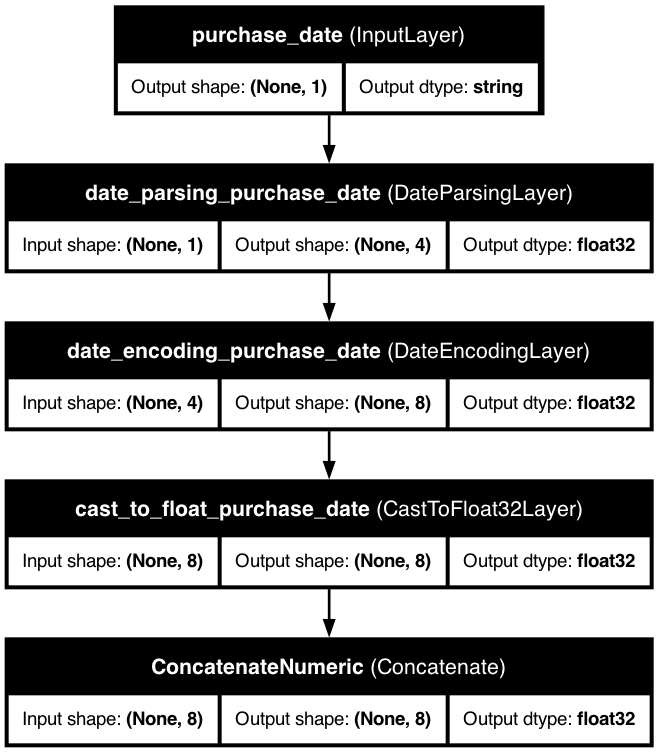

# 📅 Date Features

> Extract powerful patterns from temporal data like timestamps, dates, and time series.

## 📋 Quick Overview

Date features transform timestamps and dates into ML-ready representations. KDP provides basic date processing capabilities.

## 🚀 Basic Usage

The simplest way to define date features is with the `FeatureType` enum:

```python
from kdp import PreprocessingModel, FeatureType

# Quick date feature definition
features = {
    "purchase_date": FeatureType.DATE,     # Transaction dates
    "signup_date": FeatureType.DATE,       # User signup dates
    "last_active": FeatureType.DATE        # Last activity timestamps
}

# Create your preprocessor
preprocessor = PreprocessingModel(
    path_data="customer_data.csv",
    features_specs=features
)
```

## 🧠 Advanced Configuration

For more control, use the `DateFeature` class:

```python
from kdp.features import DateFeature

features = {
    # Transaction date with basic configuration
    "transaction_date": DateFeature(
        name="transaction_date",
        feature_type=FeatureType.DATE
    ),

    # User signup date
    "signup_date": DateFeature(
        name="signup_date",
        feature_type=FeatureType.DATE
    ),

    # Event timestamp
    "event_timestamp": DateFeature(
        name="event_timestamp",
        feature_type=FeatureType.DATE
    )
}
```

## ⚙️ Key Configuration Options

| Parameter | Description | Default | Suggested Range |
|-----------|-------------|---------|----------------|
| `feature_type` | Base feature type | `DATE` | `DATE` |

## 🔥 Power Features

### Date Processing

KDP automatically handles date parsing and formatting:

```python
# Basic date feature configuration
preprocessor = PreprocessingModel(
    features_specs={
        "purchase_date": DateFeature(
            name="purchase_date",
            feature_type=FeatureType.DATE
        )
    }
)
```

## 💼 Real-World Examples

### E-commerce Purchase Analysis

```python
# Analyze purchase patterns over time
preprocessor = PreprocessingModel(
    features_specs={
        "purchase_date": DateFeature(
            name="purchase_date",
            feature_type=FeatureType.DATE
        ),
        "user_signup_date": DateFeature(
            name="user_signup_date",
            feature_type=FeatureType.DATE
        )
    }
)
```

### Time Series Forecasting

```python
# Time series feature extraction
preprocessor = PreprocessingModel(
    features_specs={
        "timestamp": DateFeature(
            name="timestamp",
            feature_type=FeatureType.DATE
        ),
        # Additional features...
        "value": FeatureType.FLOAT_RESCALED
    }
)
```

## 📊 Model Architecture

KDP's date processing handles date parsing and formatting:

### Basic Date Feature



## 💡 Pro Tips

1. **Date Format Handling**
   - KDP automatically handles common date formats
   - The implementation uses standard date parsing techniques

2. **Feature Selection**
   - Use feature selection to identify important temporal patterns
   - This helps reduce dimensionality and improve model performance

3. **Cross Features**
   - Consider using cross features to capture interactions between dates and other features
   - Example: Cross date features with categorical features for better context

## 🔗 Related Topics

- [Feature Crosses](cross-features.md) - Model interactions between features
- [Tabular Attention](../advanced/tabular-attention.md) - Learn temporal patterns
- [Feature Selection](../advanced/feature-selection.md) - Find important time components

---

<div class="prev-next">
  <a href="text-features.md" class="prev">← Text Features</a>
  <a href="cross-features.md" class="next">Cross Features →</a>
</div>

<style>
.prev-next {
  display: flex;
  justify-content: space-between;
  margin-top: 40px;
}
.prev-next a {
  padding: 10px 15px;
  background-color: #f1f1f1;
  border-radius: 5px;
  text-decoration: none;
  color: #333;
}
.prev-next a:hover {
  background-color: #ddd;
}
</style>
