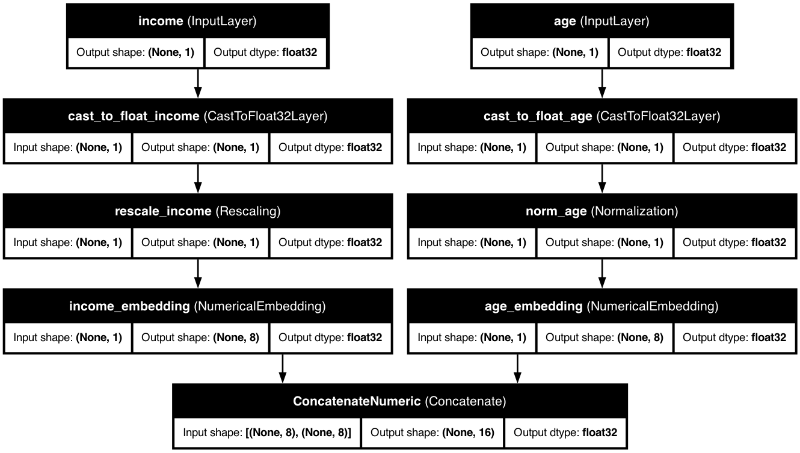
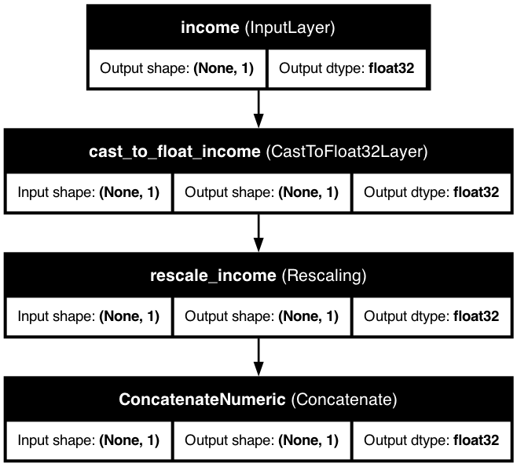
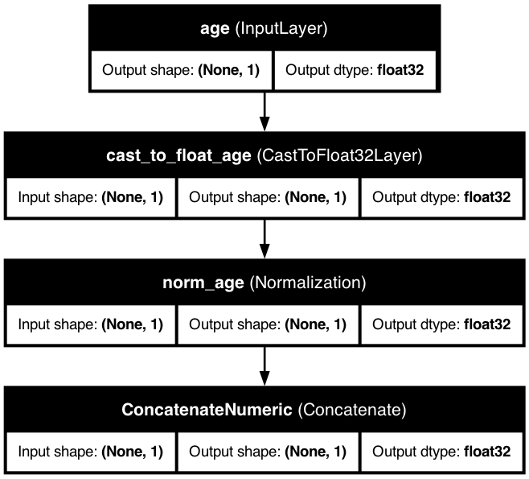
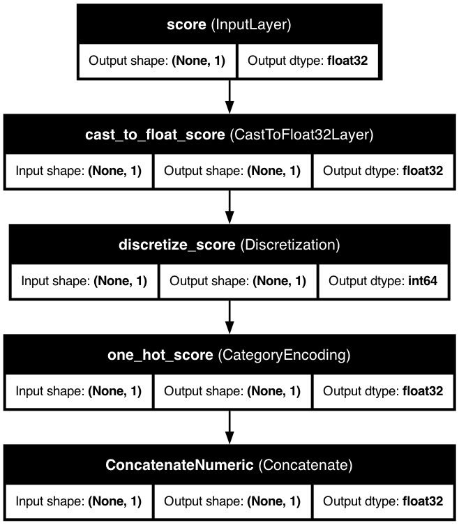

# 🔢 Numerical Features

> Transform your continuous data like age, income, or prices into powerful feature representations.

## 📋 Quick Overview

Numerical features are the backbone of most machine learning models. KDP provides multiple ways to handle them, from simple normalization to advanced neural embeddings.

## 🎯 Types and Use Cases

| Feature Type | Best For | Example Values | When to Use |
|--------------|----------|----------------|-------------|
| `FLOAT_NORMALIZED` | Data with clear bounds | Age: 18-65, Score: 0-100 | When you know your data falls in a specific range |
| `FLOAT_RESCALED` | Unbounded, varied data | Income: $0-$1M+, Revenue | When data has outliers or unknown bounds |
| `FLOAT_DISCRETIZED` | Values that form groups | Years: 1-50, Ratings: 1-5 | When groups of values have special meaning |
| `FLOAT` | Raw pass-through | Machine-generated numbers | When you want no scaling/normalization |

## 🚀 Basic Usage

The simplest way to define numerical features is with the `FeatureType` enum:

```python
from kdp import PreprocessingModel, FeatureType

# Quick numerical feature definition
features = {
    "age": FeatureType.FLOAT_NORMALIZED,          # Age gets 0-1 normalization
    "income": FeatureType.FLOAT_RESCALED,         # Income gets robust scaling
    "transaction_count": FeatureType.FLOAT,       # No preprocessing
    "rating": FeatureType.FLOAT_DISCRETIZED       # Discretized into bins
}

# Create your preprocessor
preprocessor = PreprocessingModel(
    path_data="customer_data.csv",
    features_specs=features
)
```

## 🧠 Advanced Configuration

For more control, use the `NumericalFeature` class:

```python
from kdp.features import NumericalFeature

features = {
    # Simple example with enhanced configuration
    "age": NumericalFeature(
        name="age",
        feature_type=FeatureType.FLOAT_NORMALIZED,
        use_embedding=True,                 # Create neural embeddings
        embedding_dim=16,                   # Size of embedding
        preferred_distribution="normal"      # Hint about distribution
    ),

    # Financial data example
    "transaction_amount": NumericalFeature(
        name="transaction_amount",
        feature_type=FeatureType.FLOAT_RESCALED,
        scaling_method="robust",           # Robust to outliers
        use_embedding=True,
        embedding_dim=32,
        preferred_distribution="heavy_tailed"
    ),

    # Custom binning example
    "years_experience": NumericalFeature(
        name="years_experience",
        feature_type=FeatureType.FLOAT_DISCRETIZED,
        bin_boundaries=[0, 2, 5, 10, 20]    # Custom bin edges
    )
}
```

## ⚙️ Key Configuration Options

| Parameter | Description | Default | Suggested Range |
|-----------|-------------|---------|----------------|
| `feature_type` | Base feature type | `FLOAT_NORMALIZED` | Choose from 4 types |
| `use_embedding` | Enable neural embeddings | `False` | `True`/`False` |
| `embedding_dim` | Dimensionality of embedding | 8 | 4-64 |
| `preferred_distribution` | Hint about data distribution | `None` | "normal", "log_normal", etc. |
| `scaling_method` | Method for FLOAT_RESCALED | "standard" | "standard", "robust", "minmax" |
| `num_bins` | Bins for discretization | 10 | 5-100 |
| `bin_boundaries` | Custom bin edges | `None` | Custom list of values |

## 🔥 Power Features

### Distribution-Aware Processing

Let KDP automatically detect and handle distributions:

```python
# Enable distribution-aware processing for all numerical features
preprocessor = PreprocessingModel(
    features_specs=features,
    use_distribution_aware=True      # Enable distribution detection
)
```

### Advanced Numerical Embeddings

Using advanced numerical embeddings:



### Custom Numerical Feature

Using the `NumericalFeature` class for additional control:



## 💼 Real-World Examples

### Financial Analysis

```python
# Financial metrics with appropriate processing
preprocessor = PreprocessingModel(
    features_specs={
        "income": NumericalFeature(
            name="income",
            feature_type=FeatureType.FLOAT_RESCALED,
            scaling_method="robust",
            preferred_distribution="log_normal"
        ),
        "credit_score": NumericalFeature(
            name="credit_score",
            feature_type=FeatureType.FLOAT_NORMALIZED,
            min_value=300,
            max_value=850
        ),
        "debt_ratio": NumericalFeature(
            name="debt_ratio",
            feature_type=FeatureType.FLOAT_NORMALIZED,
            min_value=0,
            max_value=1
        )
    },
    use_distribution_aware=True
)
```

### Sensor Data

```python
# Processing sensor readings
preprocessor = PreprocessingModel(
    features_specs={
        "temperature": NumericalFeature(
            name="temperature",
            feature_type=FeatureType.FLOAT_RESCALED,
            scaling_method="robust"
        ),
        "humidity": NumericalFeature(
            name="humidity",
            feature_type=FeatureType.FLOAT_NORMALIZED,
            min_value=0,
            max_value=100
        ),
        "pressure": NumericalFeature(
            name="pressure",
            feature_type=FeatureType.FLOAT_RESCALED
        )
    },
    use_numerical_embedding=True,
    numerical_embedding_dim=32
)
```

## 💡 Pro Tips

1. **Understand Your Data Distribution**
   - Use `FLOAT_NORMALIZED` when your data has clear bounds
   - Use `FLOAT_RESCALED` when your data has outliers
   - Use `FLOAT_DISCRETIZED` when your values naturally form groups

2. **Consider Neural Embeddings for Complex Relationships**
   - Enable when a simple scaling doesn't capture the pattern
   - Increase embedding dimensions for more complex patterns

3. **Let KDP Handle Distribution Detection**
   - Enable `use_distribution_aware=True` and let KDP automatically choose
   - This is especially important for skewed or multi-modal distributions

4. **Custom Bin Boundaries**
   - Define domain-specific boundaries for better discretization
   - Example: Age groups [0, 18, 25, 35, 50, 65, 100]

## 🔗 Related Topics

- [Distribution-Aware Encoding](../advanced/distribution-aware-encoding.md) - Smart numerical handling
- [Advanced Numerical Embeddings](../advanced/numerical-embeddings.md) - Neural representations
- [Feature Selection](../advanced/feature-selection.md) - Finding important features

## 💡 Types of Numerical Features

KDP supports different types of numerical features, each with specialized processing:

1. **FLOAT**: Basic floating-point features without normalization or scaling
2. **FLOAT_NORMALIZED**: Values normalized to the [0,1] range using min-max scaling
3. **FLOAT_RESCALED**: Values rescaled using standardization (mean=0, std=1)
4. **FLOAT_DISCRETIZED**: Continuous values binned into discrete buckets

## Architecture Diagrams

### Normalized Numerical Feature

Below is a visualization of a model with a normalized numerical feature:



### Rescaled Numerical Feature

Below is a visualization of a model with a rescaled numerical feature:


### Discretized Numerical Feature

Below is a visualization of a model with a discretized numerical feature:



### Advanced Numerical Embeddings

When using advanced numerical embeddings, the model architecture looks like this:


---

<div class="prev-next">
  <a href="overview.md" class="prev">← Feature Overview</a>
  <a href="categorical-features.md" class="next">Categorical Features →</a>
</div>

<style>
.prev-next {
  display: flex;
  justify-content: space-between;
  margin-top: 40px;
}
.prev-next a {
  padding: 10px 15px;
  background-color: #f1f1f1;
  border-radius: 5px;
  text-decoration: none;
  color: #333;
}
.prev-next a:hover {
  background-color: #ddd;
}
</style>
