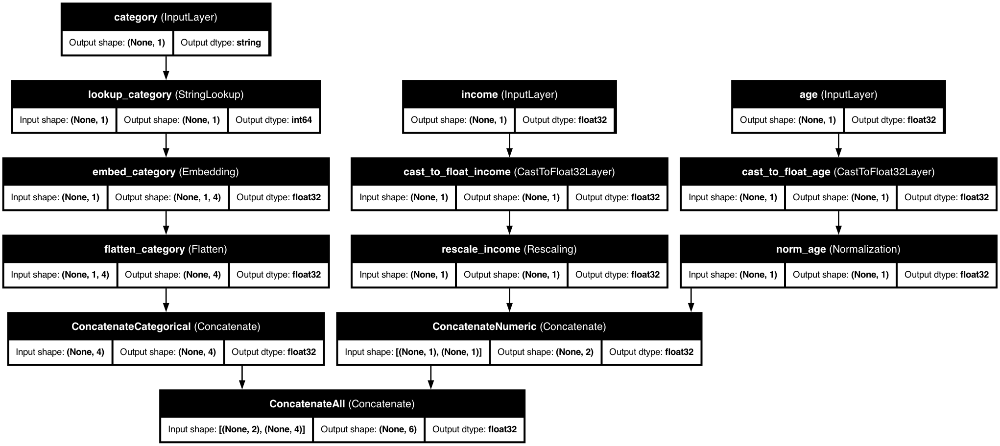
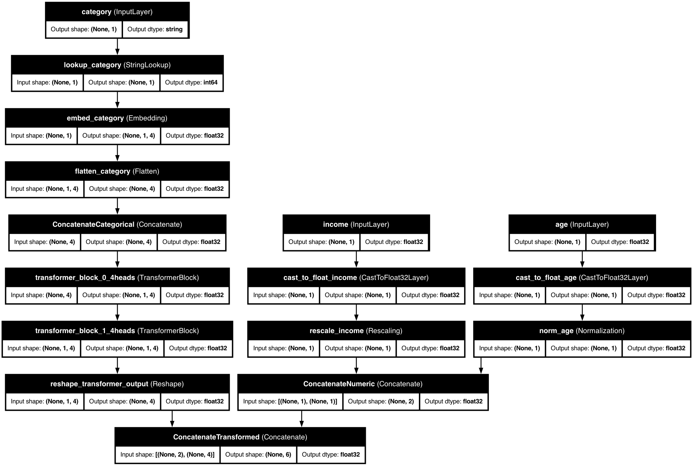
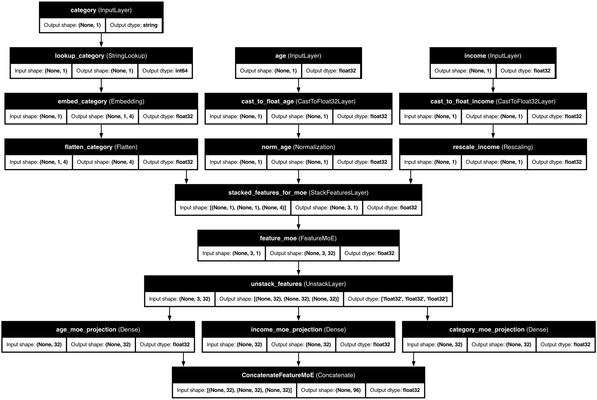
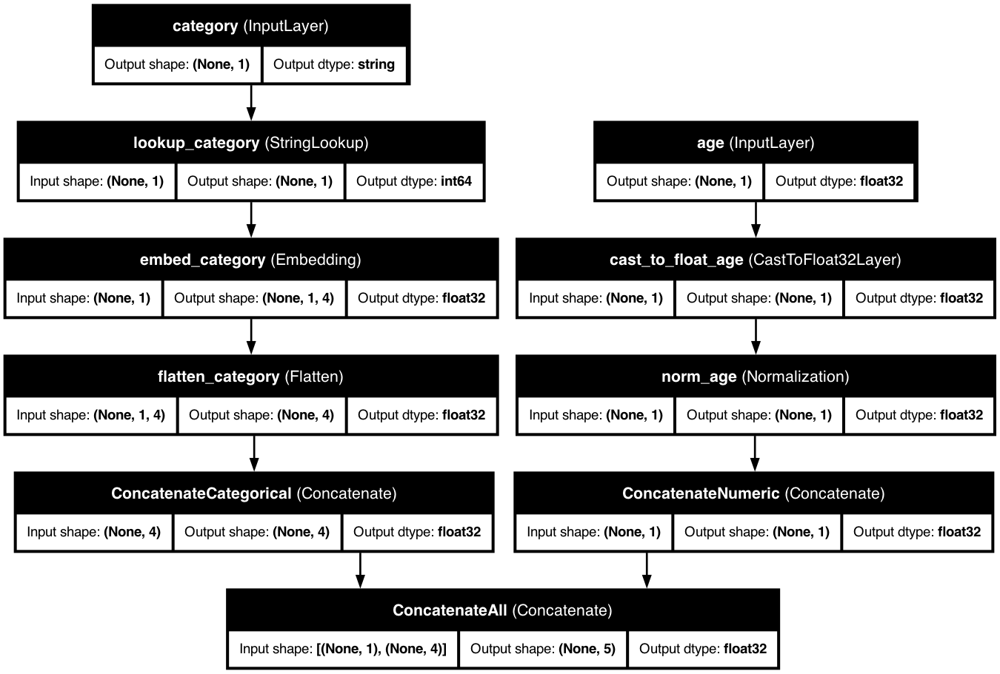
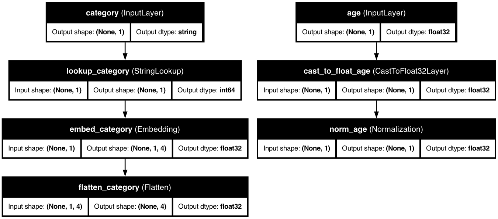

# 🛠️ Feature Types Overview

> KDP makes feature processing intuitive and powerful by transforming your raw data into the optimal format for machine learning.

## 💪 Feature Types at a Glance

KDP supports six primary feature types, each with specialized processing:

| Feature Type | What It's For | Processing Magic |
|--------------|---------------|------------------|
| 🔢 **Numerical** | Continuous values like age, income, scores | Normalization, scaling, embeddings, distribution analysis |
| 🏷️ **Categorical** | Discrete values like occupation, product type | Embeddings, one-hot encoding, vocabulary management |
| 📝 **Text** | Free-form text like reviews, descriptions | Tokenization, embeddings, sequence handling |
| 📅 **Date** | Temporal data like signup dates, transactions | Component extraction, cyclical encoding, seasonality |
| ➕ **Cross Features** | Feature interactions | Combined embeddings, interaction modeling |
| 🔍 **Passthrough** | Pre-processed data, custom vectors | No modification, type casting only |

## 🚀 Getting Started

The simplest way to define features is with the `FeatureType` enum:

```python
from kdp import PreprocessingModel, FeatureType

# Quick and easy feature definition
features = {
    # Numerical features - different processing strategies
    "age": FeatureType.FLOAT_NORMALIZED,        # [0,1] range normalization
    "income": FeatureType.FLOAT_RESCALED,       # Standard scaling
    "transaction_count": FeatureType.FLOAT,     # No preprocessing

    # Categorical features - automatic encoding
    "occupation": FeatureType.STRING_CATEGORICAL,
    "education_level": FeatureType.INTEGER_CATEGORICAL,

    # Text and dates - specialized processing
    "product_review": FeatureType.TEXT,
    "signup_date": FeatureType.DATE,

    # Passthrough feature - use with pre-processed data
    "embedding_vector": FeatureType.PASSTHROUGH
}

# Create your preprocessor
preprocessor = PreprocessingModel(
    path_data="customer_data.csv",
    features_specs=features
)
```

## 🔍 Automatic Feature Detection

Don't know what feature types to use? KDP can detect them automatically:

```python
from kdp import PreprocessingModel

# Let KDP analyze and decide
preprocessor = PreprocessingModel(
    path_data="customer_data.csv",
    auto_detect_features=True
)

# Or specify some features and let KDP handle the rest
features = {
    "income": FeatureType.FLOAT_RESCALED,  # I know this one
    "product_id": None,                   # Let KDP figure this out
    "description": None                   # Let KDP figure this out
}

preprocessor = PreprocessingModel(
    path_data="customer_data.csv",
    features_specs=features
)
```

## 💪 Why Strong Feature Types Matter

KDP's type system provides several advantages:

1. **Optimized Processing**: Each feature type gets specialized handling for better ML performance
2. **Reduced Errors**: Catch type mismatches early in development, not during training
3. **Clearer Code**: Self-documenting feature definitions make your code more maintainable
4. **Enhanced Performance**: Type-specific optimizations improve preprocessing speed

## 📚 Feature Type Documentation

Learn about each feature type in detail:

- [Numerical Features](numerical-features.md) - Handle continuous values
- [Categorical Features](categorical-features.md) - Process discrete categories
- [Text Features](text-features.md) - Work with free-form text
- [Date Features](date-features.md) - Extract temporal patterns
- [Cross Features](cross-features.md) - Model feature interactions
- [Passthrough Features](passthrough-features.md) - Include unmodified data

## 👨‍💻 Advanced Feature Configuration

For more control, use specialized feature classes:

```python
from kdp.features import NumericalFeature, CategoricalFeature, TextFeature, DateFeature, PassthroughFeature
import tensorflow as tf

# Advanced feature configuration
features = {
    # Numerical with advanced embedding
    "income": NumericalFeature(
        name="income",
        feature_type=FeatureType.FLOAT_RESCALED,
        use_embedding=True,
        embedding_dim=32
    ),

    # Categorical with hashing
    "product_id": CategoricalFeature(
        name="product_id",
        feature_type=FeatureType.STRING_CATEGORICAL,
        max_tokens=10000,
        category_encoding="hashing"
    ),

    # Text with custom tokenization
    "description": TextFeature(
        name="description",
        max_tokens=5000,
        embedding_dim=64,
        sequence_length=128,
        ngrams=2
    ),

    # Date with cyclical encoding
    "purchase_date": DateFeature(
        name="purchase_date",
        add_day_of_week=True,
        add_month=True,
        cyclical_encoding=True
    ),

    # Passthrough feature
    "embedding": PassthroughFeature(
        name="embedding",
        dtype=tf.float32
    )
}
```

## 💡 Pro Tips for Feature Definition

1. **Start Simple**: Begin with basic `FeatureType` definitions
2. **Add Complexity Gradually**: Refactor to specialized feature classes when needed
3. **Combine Approaches**: Mix distribution-aware, attention, embeddings for best results
4. **Check Distributions**: Review your data distribution before choosing feature types
5. **Experiment with Types**: Sometimes a different encoding provides better results
6. **Consider Passthrough**: Use passthrough features for pre-processed data or custom vectors

## 📊 Model Architecture Diagrams

KDP creates optimized preprocessing architectures based on your feature definitions. Here are examples of different model configurations:

### Basic Feature Combinations

When combining numerical and categorical features:



### All Feature Types Combined

KDP can handle all feature types in a single model:


### Advanced Configurations

#### Tabular Attention

Enhance feature interactions with tabular attention:


#### Transformer Blocks

Process categorical features with transformer blocks:



#### Feature MoE (Mixture of Experts)

Specialized feature processing with Mixture of Experts:



#### Output Modes

KDP supports different output modes for your preprocessed features:

**Concatenated Output:**



**Dictionary Output:**



---

<div class="prev-next">
  <a href="../getting-started/architecture.md" class="prev">← Architecture</a>
  <a href="numerical-features.md" class="next">Numerical Features →</a>
</div>

<style>
.prev-next {
  display: flex;
  justify-content: space-between;
  margin-top: 40px;
}
.prev-next a {
  padding: 10px 15px;
  background-color: #f1f1f1;
  border-radius: 5px;
  text-decoration: none;
  color: #333;
}
.prev-next a:hover {
  background-color: #ddd;
}
</style>
