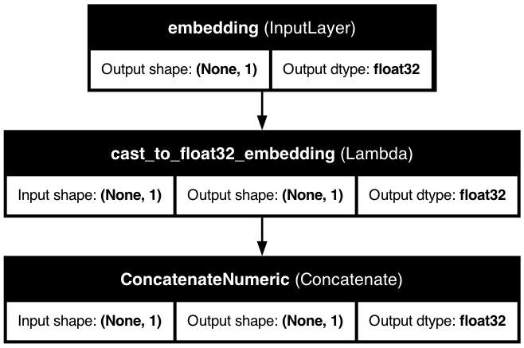

# 🔍 Passthrough Features

<div class="feature-header">
  <div class="feature-title">
    <h2>Passthrough Features in KDP</h2>
    <p>Include pre-processed data and custom vectors in your model without additional transformations.</p>
  </div>
</div>

## 📋 Overview

<div class="overview-card">
  <p>Passthrough features allow you to include data in your model without any preprocessing modifications. They're perfect for pre-processed data, custom vectors, and scenarios where you need to preserve exact values.</p>
</div>

<div class="key-benefits">
  <div class="benefit-card">
    <span class="benefit-icon">⚡</span>
    <h3>Direct Integration</h3>
    <p>Include pre-processed data without modifications</p>
  </div>
  <div class="benefit-card">
    <span class="benefit-icon">🔢</span>
    <h3>Custom Vectors</h3>
    <p>Use pre-computed embeddings and vectors</p>
  </div>
  <div class="benefit-card">
    <span class="benefit-icon">📊</span>
    <h3>Raw Values</h3>
    <p>Preserve exact original values in your model</p>
  </div>
  <div class="benefit-card">
    <span class="benefit-icon">🔄</span>
    <h3>Flexible Integration</h3>
    <p>Seamlessly combine with other feature types</p>
  </div>
</div>

## 🚀 When to Use Passthrough Features

<div class="use-cases-container">
  <div class="use-case-card">
    <span class="use-case-icon">🔄</span>
    <h3>Pre-processed Data</h3>
    <p>You have already processed the data externally</p>
  </div>

  <div class="use-case-card">
    <span class="use-case-icon">🔢</span>
    <h3>Custom Vectors</h3>
    <p>You want to include pre-computed embeddings or vectors</p>
  </div>

  <div class="use-case-card">
    <span class="use-case-icon">📊</span>
    <h3>Raw Values</h3>
    <p>You need the exact original values in your model</p>
  </div>

  <div class="use-case-card">
    <span class="use-case-icon">🔍</span>
    <h3>Feature Testing</h3>
    <p>You want to compare raw vs processed feature performance</p>
  </div>

  <div class="use-case-card">
    <span class="use-case-icon">🔄</span>
    <h3>Gradual Migration</h3>
    <p>You're moving from a legacy system and need compatibility</p>
  </div>
</div>

## 💡 Defining Passthrough Features

<div class="code-container">

```python
from kdp import PreprocessingModel, FeatureType
from kdp.features import PassthroughFeature
import tensorflow as tf

# Simple approach using enum
features = {
    "embedding_vector": FeatureType.PASSTHROUGH,
    "age": FeatureType.FLOAT_NORMALIZED,
    "category": FeatureType.STRING_CATEGORICAL
}

# Advanced configuration with PassthroughFeature class
features = {
    "embedding_vector": PassthroughFeature(
        name="embedding_vector",
        dtype=tf.float32  # Specify the data type
    ),
    "raw_text_embedding": PassthroughFeature(
        name="raw_text_embedding",
        dtype=tf.float32
    ),
    "age": FeatureType.FLOAT_NORMALIZED,
    "category": FeatureType.STRING_CATEGORICAL
}

# Create your preprocessor
preprocessor = PreprocessingModel(
    path_data="customer_data.csv",
    features_specs=features
)
```

</div>

## 📊 How Passthrough Features Work

<div class="architecture-diagram">
  
  <div class="diagram-caption">
    <p>Passthrough features are included in model inputs without any transformations, maintaining their original values throughout the pipeline.</p>
  </div>
</div>

<div class="workflow-container">
  <div class="workflow-card">
    <span class="workflow-icon">➕</span>
    <h3>Added to Inputs</h3>
    <p>Included in model inputs like other features</p>
  </div>

  <div class="workflow-card">
    <span class="workflow-icon">🔄</span>
    <h3>Type Casting</h3>
    <p>Cast to specified dtype for compatibility</p>
  </div>

  <div class="workflow-card">
    <span class="workflow-icon">⚡</span>
    <h3>No Transformation</h3>
    <p>Pass through without normalization or encoding</p>
  </div>

  <div class="workflow-card">
    <span class="workflow-icon">🎯</span>
    <h3>Feature Selection</h3>
    <p>Optional feature selection if enabled</p>
  </div>
</div>

## 🔧 Configuration Options

<div class="table-container">
  <table class="config-table">
    <thead>
      <tr>
        <th>Parameter</th>
        <th>Type</th>
        <th>Description</th>
      </tr>
    </thead>
    <tbody>
      <tr>
        <td><code>name</code></td>
        <td>str</td>
        <td>The name of the feature</td>
      </tr>
      <tr>
        <td><code>feature_type</code></td>
        <td>FeatureType</td>
        <td>Set to <code>FeatureType.PASSTHROUGH</code> by default</td>
      </tr>
      <tr>
        <td><code>dtype</code></td>
        <td>tf.DType</td>
        <td>The data type of the feature (default: tf.float32)</td>
      </tr>
    </tbody>
  </table>
</div>

## 🎯 Example: Using Pre-computed Embeddings

<div class="example-card">
  <div class="code-container">

```python
import pandas as pd
from kdp import PreprocessingModel, FeatureType
from kdp.features import PassthroughFeature, NumericalFeature
import tensorflow as tf

# Define features
features = {
    # Regular features
    "age": NumericalFeature(
        name="age",
        feature_type=FeatureType.FLOAT_NORMALIZED
    ),
    "category": FeatureType.STRING_CATEGORICAL,

    # Passthrough features for pre-computed embeddings
    "product_embedding": PassthroughFeature(
        name="product_embedding",
        dtype=tf.float32
    )
}

# Create your preprocessor
preprocessor = PreprocessingModel(
    path_data="data.csv",
    features_specs=features
)

# Build the model
model = preprocessor.build_preprocessor()
```

  </div>
</div>

## ⚠️ Things to Consider

<div class="considerations-container">
  <div class="consideration-card">
    <span class="consideration-icon">🔍</span>
    <h3>Data Type Compatibility</h3>
    <p>Ensure the data type of your passthrough feature is compatible with the overall model</p>
  </div>

  <div class="consideration-card">
    <span class="consideration-icon">📊</span>
    <h3>Dimensionality</h3>
    <p>Make sure the feature dimensions fit your model architecture</p>
  </div>

  <div class="consideration-card">
    <span class="consideration-icon">🧹</span>
    <h3>Data Quality</h3>
    <p>Since no preprocessing is applied, ensure your data is clean and ready for use</p>
  </div>

  <div class="consideration-card">
    <span class="consideration-icon">⚡</span>
    <h3>Performance Impact</h3>
    <p>Using raw data may affect model performance; test both approaches</p>
  </div>
</div>

## 🚀 Best Practices

<div class="best-practices-container">
  <div class="best-practice-card">
    <span class="best-practice-icon">📝</span>
    <h3>Document Your Decision</h3>
    <p>Make it clear why certain features are passed through</p>
  </div>

  <div class="best-practice-card">
    <span class="best-practice-icon">🔍</span>
    <h3>Test Both Approaches</h3>
    <p>Compare passthrough vs preprocessed features for performance</p>
  </div>

  <div class="best-practice-card">
    <span class="best-practice-icon">🎯</span>
    <h3>Feature Importance</h3>
    <p>Use feature selection to see if passthrough features contribute meaningfully</p>
  </div>

  <div class="best-practice-card">
    <span class="best-practice-icon">📈</span>
    <h3>Monitor Gradients</h3>
    <p>Watch for gradient issues since passthrough features may have different scales</p>
  </div>
</div>

<div class="navigation-buttons">
  <a href="cross-features.md" class="nav-button prev">
    <span class="nav-icon">←</span>
    <span class="nav-text">Cross Features</span>
  </a>
  <a href="../optimization/overview.md" class="nav-button next">
    <span class="nav-text">Optimization</span>
    <span class="nav-icon">→</span>
  </a>
</div>

<style>
/* Base styling */
body {
  font-family: -apple-system, BlinkMacSystemFont, "Segoe UI", Roboto, Helvetica, Arial, sans-serif;
  line-height: 1.6;
  color: #333;
  margin: 0;
  padding: 0;
}

/* Feature header */
.feature-header {
  background: linear-gradient(135deg, #ff9800 0%, #f57c00 100%);
  border-radius: 10px;
  padding: 30px;
  margin: 30px 0;
  box-shadow: 0 4px 6px rgba(0,0,0,0.1);
  color: white;
}

.feature-title h2 {
  margin-top: 0;
  font-size: 28px;
}

.feature-title p {
  font-size: 18px;
  margin-bottom: 0;
  opacity: 0.9;
}

/* Overview card */
.overview-card {
  background-color: #fff;
  border-radius: 10px;
  padding: 20px 25px;
  margin: 20px 0;
  box-shadow: 0 2px 5px rgba(0,0,0,0.05);
  border-left: 4px solid #ff9800;
}

.overview-card p {
  margin: 0;
  font-size: 16px;
}

/* Key benefits */
.key-benefits {
  display: grid;
  grid-template-columns: repeat(auto-fill, minmax(250px, 1fr));
  gap: 20px;
  margin: 30px 0;
}

.benefit-card {
  background-color: #fff;
  border-radius: 10px;
  padding: 20px;
  box-shadow: 0 4px 8px rgba(0,0,0,0.05);
  transition: transform 0.3s ease, box-shadow 0.3s ease;
  display: flex;
  flex-direction: column;
  align-items: center;
  text-align: center;
}

.benefit-card:hover {
  transform: translateY(-5px);
  box-shadow: 0 8px 16px rgba(0,0,0,0.1);
}

.benefit-icon {
  font-size: 2.5em;
  margin-bottom: 15px;
}

.benefit-card h3 {
  margin: 0 0 10px 0;
  color: #ff9800;
}

.benefit-card p {
  margin: 0;
}

/* Use cases */
.use-cases-container {
  display: grid;
  grid-template-columns: repeat(auto-fill, minmax(250px, 1fr));
  gap: 20px;
  margin: 30px 0;
}

.use-case-card {
  background-color: #fff;
  border-radius: 10px;
  padding: 20px;
  box-shadow: 0 4px 8px rgba(0,0,0,0.05);
  transition: transform 0.3s ease, box-shadow 0.3s ease;
  display: flex;
  flex-direction: column;
  align-items: center;
  text-align: center;
}

.use-case-card:hover {
  transform: translateY(-5px);
  box-shadow: 0 8px 16px rgba(0,0,0,0.1);
}

.use-case-icon {
  font-size: 2.5em;
  margin-bottom: 15px;
}

.use-case-card h3 {
  margin: 0 0 10px 0;
  color: #ff9800;
}

.use-case-card p {
  margin: 0;
}

/* Architecture diagram */
.architecture-diagram {
  background-color: white;
  border-radius: 10px;
  padding: 20px;
  margin: 30px 0;
  box-shadow: 0 4px 8px rgba(0,0,0,0.05);
  text-align: center;
}

.architecture-image {
  max-width: 100%;
  border-radius: 5px;
}

.diagram-caption {
  margin-top: 20px;
  text-align: center;
  font-style: italic;
}

/* Workflow */
.workflow-container {
  display: grid;
  grid-template-columns: repeat(auto-fill, minmax(250px, 1fr));
  gap: 20px;
  margin: 30px 0;
}

.workflow-card {
  background-color: #fff;
  border-radius: 10px;
  padding: 20px;
  box-shadow: 0 4px 8px rgba(0,0,0,0.05);
  transition: transform 0.3s ease, box-shadow 0.3s ease;
  display: flex;
  flex-direction: column;
  align-items: center;
  text-align: center;
}

.workflow-card:hover {
  transform: translateY(-5px);
  box-shadow: 0 8px 16px rgba(0,0,0,0.1);
}

.workflow-icon {
  font-size: 2.5em;
  margin-bottom: 15px;
}

.workflow-card h3 {
  margin: 0 0 10px 0;
  color: #ff9800;
}

.workflow-card p {
  margin: 0;
}

/* Code containers */
.code-container {
  background-color: #f8f9fa;
  border-radius: 8px;
  overflow: hidden;
  box-shadow: 0 2px 5px rgba(0,0,0,0.1);
  margin: 20px 0;
}

.code-container pre {
  margin: 0;
  padding: 20px;
}

/* Tables */
.table-container {
  margin: 30px 0;
  border-radius: 10px;
  overflow: hidden;
  box-shadow: 0 4px 8px rgba(0,0,0,0.05);
}

.config-table {
  width: 100%;
  border-collapse: collapse;
}

.config-table th {
  background-color: #fff3e0;
  padding: 15px;
  text-align: left;
  font-weight: 600;
  border-bottom: 2px solid #ff9800;
}

.config-table td {
  padding: 12px 15px;
  border-bottom: 1px solid #eaecef;
}

.config-table tr:nth-child(even) {
  background-color: #f8f9fa;
}

.config-table tr:hover {
  background-color: #fff3e0;
}

/* Considerations */
.considerations-container {
  display: grid;
  grid-template-columns: repeat(auto-fill, minmax(250px, 1fr));
  gap: 20px;
  margin: 30px 0;
}

.consideration-card {
  background-color: #fff;
  border-radius: 10px;
  padding: 20px;
  box-shadow: 0 4px 8px rgba(0,0,0,0.05);
  transition: transform 0.3s ease, box-shadow 0.3s ease;
  display: flex;
  flex-direction: column;
  align-items: center;
  text-align: center;
}

.consideration-card:hover {
  transform: translateY(-5px);
  box-shadow: 0 8px 16px rgba(0,0,0,0.1);
}

.consideration-icon {
  font-size: 2.5em;
  margin-bottom: 15px;
}

.consideration-card h3 {
  margin: 0 0 10px 0;
  color: #ff9800;
}

.consideration-card p {
  margin: 0;
}

/* Best practices */
.best-practices-container {
  display: grid;
  grid-template-columns: repeat(auto-fill, minmax(250px, 1fr));
  gap: 20px;
  margin: 30px 0;
}

.best-practice-card {
  background-color: #fff;
  border-radius: 10px;
  padding: 20px;
  box-shadow: 0 4px 8px rgba(0,0,0,0.05);
  transition: transform 0.3s ease, box-shadow 0.3s ease;
  display: flex;
  flex-direction: column;
  align-items: center;
  text-align: center;
}

.best-practice-card:hover {
  transform: translateY(-5px);
  box-shadow: 0 8px 16px rgba(0,0,0,0.1);
}

.best-practice-icon {
  font-size: 2.5em;
  margin-bottom: 15px;
}

.best-practice-card h3 {
  margin: 0 0 10px 0;
  color: #ff9800;
}

.best-practice-card p {
  margin: 0;
}

/* Navigation buttons */
.navigation-buttons {
  display: flex;
  justify-content: space-between;
  margin-top: 40px;
}

.nav-button {
  display: flex;
  align-items: center;
  padding: 12px 20px;
  background-color: #fff;
  border-radius: 8px;
  text-decoration: none;
  color: #333;
  box-shadow: 0 2px 5px rgba(0,0,0,0.05);
  transition: transform 0.3s ease, box-shadow 0.3s ease;
}

.nav-button:hover {
  transform: translateY(-2px);
  box-shadow: 0 4px 8px rgba(0,0,0,0.1);
}

.nav-icon {
  font-size: 1.2em;
  margin: 0 10px;
}

/* Responsive adjustments */
@media (max-width: 768px) {
  .key-benefits,
  .use-cases-container,
  .workflow-container,
  .considerations-container,
  .best-practices-container {
    grid-template-columns: 1fr;
  }

  .navigation-buttons {
    flex-direction: column;
    gap: 20px;
  }

  .nav-button {
    justify-content: center;
  }
}
</style>
