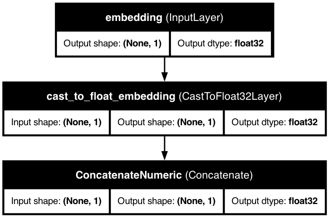

# 🔍 Passthrough Features

<div class="feature-header">
  <div class="feature-title">
    <h2>Passthrough Features in KDP</h2>
    <p>Handle IDs, metadata, and pre-processed data without unwanted transformations.</p>
  </div>
</div>

## 📋 Overview

<div class="overview-card">
  <p>Passthrough features allow you to include data in your model inputs without any preprocessing modifications. They're perfect for IDs, metadata, pre-processed data, and scenarios where you need to preserve exact values. With KDP v1.11.1+, you can now choose whether passthrough features are included in the main model output or kept separately for manual use.</p>
</div>

<div class="key-benefits">
  <div class="benefit-card">
    <span class="benefit-icon">🔑</span>
    <h3>ID Preservation</h3>
    <p>Keep product IDs, user IDs for result mapping</p>
  </div>
  <div class="benefit-card">
    <span class="benefit-icon">🏷️</span>
    <h3>Metadata Handling</h3>
    <p>Include metadata without processing it</p>
  </div>
  <div class="benefit-card">
    <span class="benefit-icon">⚡</span>
    <h3>Direct Integration</h3>
    <p>Include pre-processed data without modifications</p>
  </div>
  <div class="benefit-card">
    <span class="benefit-icon">🔄</span>
    <h3>Flexible Output</h3>
    <p>Choose between processed inclusion or separate access</p>
  </div>
</div>

## 🚀 When to Use Passthrough Features

<div class="use-cases-container">
  <div class="use-case-card">
    <span class="use-case-icon">🔑</span>
    <h3>IDs & Identifiers</h3>
    <p>Product IDs, user IDs, transaction IDs that you need for mapping results but shouldn't influence the model</p>
  </div>

  <div class="use-case-card">
    <span class="use-case-icon">🏷️</span>
    <h3>Metadata</h3>
    <p>Timestamps, source information, or other metadata needed for post-processing but not for ML</p>
  </div>

  <div class="use-case-card">
    <span class="use-case-icon">🔢</span>
    <h3>Pre-computed Features</h3>
    <p>Pre-computed embeddings or features that should be included in model processing</p>
  </div>

  <div class="use-case-card">
    <span class="use-case-icon">📊</span>
    <h3>Raw Values</h3>
    <p>Exact original values that need to be preserved without any transformations</p>
  </div>

  <div class="use-case-card">
    <span class="use-case-icon">🔍</span>
    <h3>Feature Testing</h3>
    <p>Compare raw vs processed feature performance in experiments</p>
  </div>
</div>

## 💡 Two Modes of Operation

<div class="important-note">
  <p><strong>KDP v1.11.1+ introduces two distinct modes for passthrough features:</strong></p>
</div>

### 🔄 Legacy Mode (Processed Output)
**When:** `include_passthrough_in_output=True` (default for backwards compatibility)
**Use case:** Pre-computed features that should be part of model processing

```python
preprocessor = PreprocessingModel(
    path_data="data.csv",
    features_specs=features,
    include_passthrough_in_output=True  # Default - backwards compatible
)
```

### 🎯 Recommended Mode (Separate Access)
**When:** `include_passthrough_in_output=False`
**Use case:** IDs, metadata that should be preserved but not processed

```python
preprocessor = PreprocessingModel(
    path_data="data.csv",
    features_specs=features,
    include_passthrough_in_output=False  # Recommended for IDs/metadata
)
```

## 💡 Defining Passthrough Features

<div class="code-container">

```python
from kdp import PreprocessingModel, FeatureType
from kdp.features import PassthroughFeature
import tensorflow as tf

# Simple approach using enum
features = {
    "product_id": FeatureType.PASSTHROUGH,  # Will use default tf.float32
    "price": FeatureType.FLOAT_NORMALIZED,
    "category": FeatureType.STRING_CATEGORICAL
}

# Advanced configuration with explicit dtype
features = {
    "product_id": PassthroughFeature(
        name="product_id",
        dtype=tf.string  # Specify string for IDs
    ),
    "user_id": PassthroughFeature(
        name="user_id",
        dtype=tf.int64   # Specify int for numeric IDs
    ),
    "embedding_vector": PassthroughFeature(
        name="embedding_vector",
        dtype=tf.float32  # For pre-computed features
    ),
    "price": FeatureType.FLOAT_NORMALIZED,
    "category": FeatureType.STRING_CATEGORICAL
}
```

</div>

## 🏗️ Real-World Example: E-commerce Recommendation

<div class="example-card">
  <div class="code-container">

```python
import pandas as pd
from kdp import PreprocessingModel, FeatureType
from kdp.features import PassthroughFeature
import tensorflow as tf

# Sample e-commerce data
data = pd.DataFrame({
    'product_id': ['P001', 'P002', 'P003'],      # String ID - for mapping
    'user_id': [1001, 1002, 1003],              # Numeric ID - for mapping
    'price': [29.99, 49.99, 19.99],             # ML feature
    'category': ['electronics', 'books', 'clothing'],  # ML feature
    'rating': [4.5, 3.8, 4.2]                   # ML feature
})

# Define features with proper separation
features = {
    # IDs for mapping - should NOT influence the model
    'product_id': PassthroughFeature(name='product_id', dtype=tf.string),
    'user_id': PassthroughFeature(name='user_id', dtype=tf.int64),

    # Actual ML features - should be processed
    'price': FeatureType.FLOAT_NORMALIZED,
    'category': FeatureType.STRING_CATEGORICAL,
    'rating': FeatureType.FLOAT_NORMALIZED
}

# Create preprocessor with separate passthrough access
preprocessor = PreprocessingModel(
    path_data="ecommerce_data.csv",
    features_specs=features,
    output_mode='dict',
    include_passthrough_in_output=False  # Keep IDs separate
)

model = preprocessor.build_preprocessor()

# Now you can:
# 1. Use the model for ML predictions (price, category, rating)
# 2. Access product_id and user_id separately for mapping results
# 3. No dtype concatenation issues between string IDs and numeric features
```

</div>

## 📊 How Passthrough Features Work

<div class="architecture-diagram">
  
  <div class="diagram-caption">
    <p>Passthrough features create input signatures but can be processed or kept separate based on your configuration.</p>
  </div>
</div>

### Legacy Mode Flow (include_passthrough_in_output=True)
<div class="workflow-container">
  <div class="workflow-card">
    <span class="workflow-icon">➕</span>
    <h3>Input Signature</h3>
    <p>Added to model inputs with proper dtype</p>
  </div>

  <div class="workflow-card">
    <span class="workflow-icon">🔄</span>
    <h3>Minimal Processing</h3>
    <p>Type casting and optional reshaping only</p>
  </div>

  <div class="workflow-card">
    <span class="workflow-icon">🔗</span>
    <h3>Concatenated</h3>
    <p>Included in main model output (grouped by dtype)</p>
  </div>
</div>

### Recommended Mode Flow (include_passthrough_in_output=False)
<div class="workflow-container">
  <div class="workflow-card">
    <span class="workflow-icon">➕</span>
    <h3>Input Signature</h3>
    <p>Added to model inputs with proper dtype</p>
  </div>

  <div class="workflow-card">
    <span class="workflow-icon">🚫</span>
    <h3>No Processing</h3>
    <p>Completely bypasses KDP transformations</p>
  </div>

  <div class="workflow-card">
    <span class="workflow-icon">📦</span>
    <h3>Separate Access</h3>
    <p>Available separately for manual use</p>
  </div>
</div>

## 🔧 Configuration Options

<div class="table-container">
  <table class="config-table">
    <thead>
      <tr>
        <th>Parameter</th>
        <th>Type</th>
        <th>Description</th>
      </tr>
    </thead>
    <tbody>
      <tr>
        <td><code>name</code></td>
        <td>str</td>
        <td>The name of the feature</td>
      </tr>
      <tr>
        <td><code>feature_type</code></td>
        <td>FeatureType</td>
        <td>Set to <code>FeatureType.PASSTHROUGH</code> by default</td>
      </tr>
      <tr>
        <td><code>dtype</code></td>
        <td>tf.DType</td>
        <td>The data type of the feature (default: tf.float32)</td>
      </tr>
      <tr>
        <td><code>include_passthrough_in_output</code></td>
        <td>bool</td>
        <td>Whether to include in main output (True) or keep separate (False)</td>
      </tr>
    </tbody>
  </table>
</div>

## 🎯 Advanced Examples

### Example 1: Mixed Dtype IDs
<div class="code-container">

```python
# Handles both string and numeric IDs without concatenation errors
features = {
    'product_id': PassthroughFeature(name='product_id', dtype=tf.string),
    'user_id': PassthroughFeature(name='user_id', dtype=tf.int64),
    'session_id': PassthroughFeature(name='session_id', dtype=tf.string),
    'price': FeatureType.FLOAT_NORMALIZED
}

preprocessor = PreprocessingModel(
    path_data="data.csv",
    features_specs=features,
    include_passthrough_in_output=False  # No dtype mixing issues
)
```

</div>

### Example 2: Pre-computed Embeddings
<div class="code-container">

```python
# Include pre-computed features in model processing
features = {
    'text_embedding': PassthroughFeature(
        name='text_embedding',
        dtype=tf.float32
    ),
    'image_embedding': PassthroughFeature(
        name='image_embedding',
        dtype=tf.float32
    ),
    'user_age': FeatureType.FLOAT_NORMALIZED
}

preprocessor = PreprocessingModel(
    path_data="embeddings.csv",
    features_specs=features,
    include_passthrough_in_output=True  # Include in model processing
)
```

</div>

### Example 3: Metadata Preservation
<div class="code-container">

```python
# Keep metadata for post-processing without affecting the model
features = {
    'timestamp': PassthroughFeature(name='timestamp', dtype=tf.string),
    'source_system': PassthroughFeature(name='source_system', dtype=tf.string),
    'batch_id': PassthroughFeature(name='batch_id', dtype=tf.int64),
    'sales_amount': FeatureType.FLOAT_NORMALIZED,
    'product_category': FeatureType.STRING_CATEGORICAL
}

preprocessor = PreprocessingModel(
    path_data="sales_data.csv",
    features_specs=features,
    include_passthrough_in_output=False  # Metadata separate from ML
)
```

</div>

## ⚠️ Important Considerations

<div class="warning-container">
  <div class="warning-card">
    <span class="warning-icon">⚠️</span>
    <h3>Dtype Compatibility</h3>
    <p>When using <code>include_passthrough_in_output=True</code>, passthrough features are grouped by dtype to prevent concatenation errors. String and numeric passthrough features are handled separately.</p>
  </div>

  <div class="warning-card">
    <span class="warning-icon">🎯</span>
    <h3>Recommended Usage</h3>
    <p>Use <code>include_passthrough_in_output=False</code> for IDs and metadata that shouldn't influence your model. Use <code>True</code> only for pre-processed features that should be part of model processing.</p>
  </div>

  <div class="warning-card">
    <span class="warning-icon">🔄</span>
    <h3>Backwards Compatibility</h3>
    <p>The default is <code>True</code> to maintain backwards compatibility with existing code. New projects should explicitly choose the appropriate mode.</p>
  </div>
</div>

## 🔍 Troubleshooting

<div class="troubleshooting-container">
  <div class="trouble-card">
    <h3>❌ "Cannot concatenate tensors of different dtypes"</h3>
    <p><strong>Solution:</strong> Set <code>include_passthrough_in_output=False</code> for ID/metadata features, or ensure all passthrough features have compatible dtypes.</p>
  </div>

  <div class="trouble-card">
    <h3>❌ "inputs not connected to outputs"</h3>
    <p><strong>Solution:</strong> This can happen with passthrough-only models. Ensure you have at least one processed feature, or use dict mode for passthrough-only scenarios.</p>
  </div>

  <div class="trouble-card">
    <h3>❌ String features showing as tf.float32</h3>
    <p><strong>Solution:</strong> Explicitly specify dtype in PassthroughFeature: <code>dtype=tf.string</code></p>
  </div>
</div>

## 📈 Performance Tips

<div class="tips-container">
  <div class="tip-card">
    <span class="tip-icon">⚡</span>
    <h3>Reduce Model Complexity</h3>
    <p>Use <code>include_passthrough_in_output=False</code> for IDs to keep your model focused on actual ML features</p>
  </div>

  <div class="tip-card">
    <span class="tip-icon">🎯</span>
    <h3>Clear Separation</h3>
    <p>Separate concerns: IDs for mapping, features for ML, metadata for analysis</p>
  </div>

  <div class="tip-card">
    <span class="tip-icon">🔄</span>
    <h3>Choose the Right Mode</h3>
    <p>Legacy mode for pre-computed features, recommended mode for identifiers and metadata</p>
  </div>
</div>

<div class="navigation-buttons">
  <a href="cross-features.md" class="nav-button prev">
    <span class="nav-icon">←</span>
    <span class="nav-text">Cross Features</span>
  </a>
  <a href="../optimization/overview.md" class="nav-button next">
    <span class="nav-text">Optimization</span>
    <span class="nav-icon">→</span>
  </a>
</div>

<style>
/* Base styling */
body {
  font-family: -apple-system, BlinkMacSystemFont, "Segoe UI", Roboto, Helvetica, Arial, sans-serif;
  line-height: 1.6;
  color: #333;
  margin: 0;
  padding: 0;
}

/* Feature header */
.feature-header {
  background: linear-gradient(135deg, #ff9800 0%, #f57c00 100%);
  border-radius: 10px;
  padding: 30px;
  margin: 30px 0;
  box-shadow: 0 4px 6px rgba(0,0,0,0.1);
  color: white;
}

.feature-title h2 {
  margin-top: 0;
  font-size: 28px;
}

.feature-title p {
  font-size: 18px;
  margin-bottom: 0;
  opacity: 0.9;
}

/* Overview card */
.overview-card {
  background-color: #fff;
  border-radius: 10px;
  padding: 20px 25px;
  margin: 20px 0;
  box-shadow: 0 2px 5px rgba(0,0,0,0.05);
  border-left: 4px solid #ff9800;
}

.overview-card p {
  margin: 0;
  font-size: 16px;
}

/* Key benefits */
.key-benefits {
  display: grid;
  grid-template-columns: repeat(auto-fill, minmax(250px, 1fr));
  gap: 20px;
  margin: 30px 0;
}

.benefit-card {
  background-color: #fff;
  border-radius: 10px;
  padding: 20px;
  box-shadow: 0 4px 8px rgba(0,0,0,0.05);
  transition: transform 0.3s ease, box-shadow 0.3s ease;
  display: flex;
  flex-direction: column;
  align-items: center;
  text-align: center;
}

.benefit-card:hover {
  transform: translateY(-5px);
  box-shadow: 0 8px 16px rgba(0,0,0,0.1);
}

.benefit-icon {
  font-size: 2.5em;
  margin-bottom: 15px;
}

.benefit-card h3 {
  margin: 0 0 10px 0;
  color: #ff9800;
}

.benefit-card p {
  margin: 0;
}

/* Use cases */
.use-cases-container {
  display: grid;
  grid-template-columns: repeat(auto-fill, minmax(250px, 1fr));
  gap: 20px;
  margin: 30px 0;
}

.use-case-card {
  background-color: #fff;
  border-radius: 10px;
  padding: 20px;
  box-shadow: 0 4px 8px rgba(0,0,0,0.05);
  transition: transform 0.3s ease, box-shadow 0.3s ease;
  display: flex;
  flex-direction: column;
  align-items: center;
  text-align: center;
}

.use-case-card:hover {
  transform: translateY(-5px);
  box-shadow: 0 8px 16px rgba(0,0,0,0.1);
}

.use-case-icon {
  font-size: 2.5em;
  margin-bottom: 15px;
}

.use-case-card h3 {
  margin: 0 0 10px 0;
  color: #ff9800;
}

.use-case-card p {
  margin: 0;
}

/* Architecture diagram */
.architecture-diagram {
  background-color: white;
  border-radius: 10px;
  padding: 20px;
  margin: 30px 0;
  box-shadow: 0 4px 8px rgba(0,0,0,0.05);
  text-align: center;
}

.architecture-image {
  max-width: 100%;
  border-radius: 5px;
}

.diagram-caption {
  margin-top: 20px;
  text-align: center;
  font-style: italic;
}

/* Workflow */
.workflow-container {
  display: grid;
  grid-template-columns: repeat(auto-fill, minmax(250px, 1fr));
  gap: 20px;
  margin: 30px 0;
}

.workflow-card {
  background-color: #fff;
  border-radius: 10px;
  padding: 20px;
  box-shadow: 0 4px 8px rgba(0,0,0,0.05);
  transition: transform 0.3s ease, box-shadow 0.3s ease;
  display: flex;
  flex-direction: column;
  align-items: center;
  text-align: center;
}

.workflow-card:hover {
  transform: translateY(-5px);
  box-shadow: 0 8px 16px rgba(0,0,0,0.1);
}

.workflow-icon {
  font-size: 2.5em;
  margin-bottom: 15px;
}

.workflow-card h3 {
  margin: 0 0 10px 0;
  color: #ff9800;
}

.workflow-card p {
  margin: 0;
}

/* Code containers */
.code-container {
  background-color: #f8f9fa;
  border-radius: 8px;
  overflow: hidden;
  box-shadow: 0 2px 5px rgba(0,0,0,0.1);
  margin: 20px 0;
}

.code-container pre {
  margin: 0;
  padding: 20px;
}

/* Tables */
.table-container {
  margin: 30px 0;
  border-radius: 10px;
  overflow: hidden;
  box-shadow: 0 4px 8px rgba(0,0,0,0.05);
}

.config-table {
  width: 100%;
  border-collapse: collapse;
}

.config-table th {
  background-color: #fff3e0;
  padding: 15px;
  text-align: left;
  font-weight: 600;
  border-bottom: 2px solid #ff9800;
}

.config-table td {
  padding: 12px 15px;
  border-bottom: 1px solid #eaecef;
}

.config-table tr:nth-child(even) {
  background-color: #f8f9fa;
}

.config-table tr:hover {
  background-color: #fff3e0;
}

/* Considerations */
.considerations-container {
  display: grid;
  grid-template-columns: repeat(auto-fill, minmax(250px, 1fr));
  gap: 20px;
  margin: 30px 0;
}

.consideration-card {
  background-color: #fff;
  border-radius: 10px;
  padding: 20px;
  box-shadow: 0 4px 8px rgba(0,0,0,0.05);
  transition: transform 0.3s ease, box-shadow 0.3s ease;
  display: flex;
  flex-direction: column;
  align-items: center;
  text-align: center;
}

.consideration-card:hover {
  transform: translateY(-5px);
  box-shadow: 0 8px 16px rgba(0,0,0,0.1);
}

.consideration-icon {
  font-size: 2.5em;
  margin-bottom: 15px;
}

.consideration-card h3 {
  margin: 0 0 10px 0;
  color: #ff9800;
}

.consideration-card p {
  margin: 0;
}

/* Best practices */
.best-practices-container {
  display: grid;
  grid-template-columns: repeat(auto-fill, minmax(250px, 1fr));
  gap: 20px;
  margin: 30px 0;
}

.best-practice-card {
  background-color: #fff;
  border-radius: 10px;
  padding: 20px;
  box-shadow: 0 4px 8px rgba(0,0,0,0.05);
  transition: transform 0.3s ease, box-shadow 0.3s ease;
  display: flex;
  flex-direction: column;
  align-items: center;
  text-align: center;
}

.best-practice-card:hover {
  transform: translateY(-5px);
  box-shadow: 0 8px 16px rgba(0,0,0,0.1);
}

.best-practice-icon {
  font-size: 2.5em;
  margin-bottom: 15px;
}

.best-practice-card h3 {
  margin: 0 0 10px 0;
  color: #ff9800;
}

.best-practice-card p {
  margin: 0;
}

/* Navigation buttons */
.navigation-buttons {
  display: flex;
  justify-content: space-between;
  margin-top: 40px;
}

.nav-button {
  display: flex;
  align-items: center;
  padding: 12px 20px;
  background-color: #fff;
  border-radius: 8px;
  text-decoration: none;
  color: #333;
  box-shadow: 0 2px 5px rgba(0,0,0,0.05);
  transition: transform 0.3s ease, box-shadow 0.3s ease;
}

.nav-button:hover {
  transform: translateY(-2px);
  box-shadow: 0 4px 8px rgba(0,0,0,0.1);
}

.nav-icon {
  font-size: 1.2em;
  margin: 0 10px;
}

/* Responsive adjustments */
@media (max-width: 768px) {
  .key-benefits,
  .use-cases-container,
  .workflow-container,
  .considerations-container,
  .best-practices-container {
    grid-template-columns: 1fr;
  }

  .navigation-buttons {
    flex-direction: column;
    gap: 20px;
  }

  .nav-button {
    justify-content: center;
  }
}
</style>
