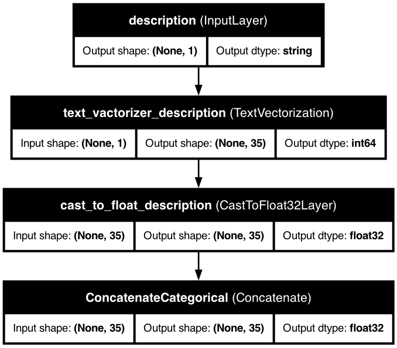

# 📝 Text Features

> Transform free-form text like reviews, descriptions, or comments into powerful machine learning features.

## 📋 Quick Overview

Text features allow KDP to process natural language data efficiently. From customer feedback to product descriptions, KDP's text processing capabilities make it easy to incorporate text data into your ML pipelines.

## 🚀 Basic Usage

The simplest way to define text features is with the `FeatureType` enum:

```python
from kdp import PreprocessingModel, FeatureType

# Quick text feature definition
features = {
    "product_review": FeatureType.TEXT,      # Customer reviews
    "product_description": FeatureType.TEXT,  # Product descriptions
    "user_comments": FeatureType.TEXT         # User comments
}

# Create your preprocessor
preprocessor = PreprocessingModel(
    path_data="product_data.csv",
    features_specs=features
)
```

## 🧠 Advanced Configuration

For more control, use the `TextFeature` class:

```python
from kdp.features import TextFeature

features = {
    # Basic text feature with custom settings
    "product_review": TextFeature(
        name="product_review",
        feature_type=FeatureType.TEXT
    )
}
```

## ⚙️ Key Configuration Options

| Parameter | Description | Default | Suggested Range |
|-----------|-------------|---------|----------------|
| `feature_type` | Base feature type | `TEXT` | `TEXT` |

## 🔥 Power Features

### Global Text Settings

Configure all text features at once:

```python
# Global settings for all text features
preprocessor = PreprocessingModel(
    features_specs=features
)
```

## 💼 Real-World Examples

### Sentiment Analysis

```python
# Text features for sentiment analysis
preprocessor = PreprocessingModel(
    features_specs={
        "review_text": TextFeature(
            name="review_text",
            feature_type=FeatureType.TEXT
        ),
        "review_title": TextFeature(
            name="review_title",
            feature_type=FeatureType.TEXT
        )
    }
)
```

### Product Search

```python
# Text features for product search
preprocessor = PreprocessingModel(
    features_specs={
        "search_query": TextFeature(
            name="search_query",
            feature_type=FeatureType.TEXT
        ),
        "product_name": TextFeature(
            name="product_name",
            feature_type=FeatureType.TEXT
        ),
        "product_description": TextFeature(
            name="product_description",
            feature_type=FeatureType.TEXT
        )
    }
)
```

## 📊 Model Architecture

KDP's text processing architecture handles tokenization and vocabulary management:

### Basic Text Feature



## 💡 Pro Tips

1. **Text Processing Strategy**
   - KDP automatically handles text tokenization and vocabulary management
   - The implementation uses standard text preprocessing techniques

2. **Feature Selection**
   - Use feature selection to identify important text features
   - This helps reduce dimensionality and improve model performance

3. **Cross Features**
   - Consider using cross features to capture interactions between text and other features
   - Example: Cross text features with categorical features for better context

## 🔗 Related Topics

- [Transformer Blocks](../advanced/transformer-blocks.md) - Advanced text processing
- [Tabular Attention](../advanced/tabular-attention.md) - Learn feature relationships
- [Feature Selection](../advanced/feature-selection.md) - Finding important features

---

<div class="prev-next">
  <a href="categorical-features.md" class="prev">← Categorical Features</a>
  <a href="date-features.md" class="next">Date Features →</a>
</div>

<style>
.prev-next {
  display: flex;
  justify-content: space-between;
  margin-top: 40px;
}
.prev-next a {
  padding: 10px 15px;
  background-color: #f1f1f1;
  border-radius: 5px;
  text-decoration: none;
  color: #333;
}
.prev-next a:hover {
  background-color: #ddd;
}
</style>
