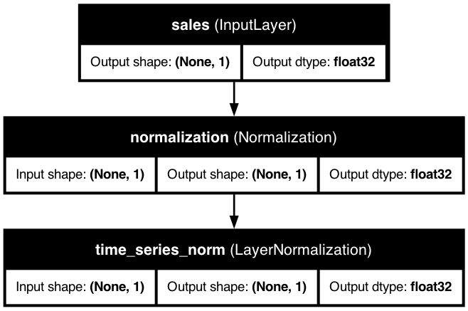
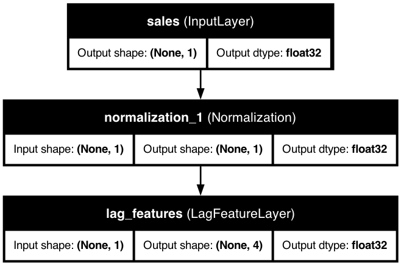

# ⏱️ Time Series Features

<div class="feature-header">
  <div class="feature-title">
    <h2>Time Series Features in KDP</h2>
    <p>Transform temporal data with powerful lag features, moving averages, differencing, rolling statistics, wavelet transforms, statistical features, and calendar features.</p>
  </div>
</div>

## 📋 Overview

<div class="overview-card">
  <p>Time series features enable processing of chronological data by creating transformations that capture temporal patterns and relationships. KDP provides specialized layers for common time series operations that maintain data ordering while enabling advanced machine learning on sequential data.</p>
</div>

## 🚀 Types of Time Series Transformations

<div class="table-container">
  <table class="features-table">
    <thead>
      <tr>
        <th>Transformation</th>
        <th>Purpose</th>
        <th>Example</th>
        <th>When to Use</th>
      </tr>
    </thead>
    <tbody>
      <tr>
        <td><code>Lag Features</code></td>
        <td>Create features from past values</td>
        <td>Yesterday's sales, last week's sales</td>
        <td>When past values help predict future ones</td>
      </tr>
      <tr>
        <td><code>Rolling Statistics</code></td>
        <td>Compute statistics over windows</td>
        <td>7-day average, 30-day standard deviation</td>
        <td>When trends or volatility matter</td>
      </tr>
      <tr>
        <td><code>Differencing</code></td>
        <td>Calculate changes between values</td>
        <td>Day-over-day change in price</td>
        <td>When changes are more important than absolute values</td>
      </tr>
      <tr>
        <td><code>Moving Averages</code></td>
        <td>Smooth data over time</td>
        <td>7-day, 14-day, 28-day moving averages</td>
        <td>When you need to reduce noise and focus on trends</td>
      </tr>
      <tr>
        <td><code>Wavelet Transforms</code></td>
        <td>Multi-resolution analysis of time series</td>
        <td>Extracting coefficients at different scales</td>
        <td>When you need to analyze signals at multiple scales or frequencies</td>
      </tr>
      <tr>
        <td><code>Statistical Features</code></td>
        <td>Extract comprehensive statistical features</td>
        <td>Mean, variance, kurtosis, entropy, peaks</td>
        <td>When you need a rich set of features summarizing time series properties</td>
      </tr>
      <tr>
        <td><code>Calendar Features</code></td>
        <td>Extract date and time components</td>
        <td>Day of week, month, is_weekend, seasonality</td>
        <td>When seasonal patterns related to calendar time are relevant</td>
      </tr>
    </tbody>
  </table>
</div>

## 📝 Basic Usage

There are two ways to define time series features in KDP:

### Option 1: Using Feature Type Directly

<div class="code-container">

```python
from kdp import PreprocessingModel, FeatureType

# Define features with simple types
features = {
    "sales": FeatureType.TIME_SERIES,  # Basic time series feature
    "date": FeatureType.DATE,          # Date feature for sorting
    "store_id": FeatureType.STRING_CATEGORICAL  # Grouping variable
}

# Create preprocessor
preprocessor = PreprocessingModel(
    path_data="sales_data.csv",
    features_specs=features
)
```

</div>

### Option 2: Using TimeSeriesFeature Class (Recommended)

<div class="code-container">

```python
from kdp import PreprocessingModel, TimeSeriesFeature

# Create a time series feature for daily sales data
sales_ts = TimeSeriesFeature(
    name="sales",
    # Sort by date column to ensure chronological order
    sort_by="date",
    # Group by store to handle multiple time series
    group_by="store_id",
    # Create lag features for yesterday, last week, and two weeks ago
    lag_config={
        "lags": [1, 7, 14],
        "drop_na": True,
        "fill_value": 0.0,
        "keep_original": True
    }
)

# Define features using both approaches
features = {
    "sales": sales_ts,
    "date": "DATE",          # String shorthand for date feature
    "store_id": "STRING_CATEGORICAL"  # String shorthand for categorical
}

# Create preprocessor
preprocessor = PreprocessingModel(
    path_data="sales_data.csv",
    features_specs=features
)
```

</div>

## 🧠 Advanced Configuration

<div class="advanced-section">
  <p>For comprehensive time series processing, configure multiple transformations in a single feature:</p>

  <div class="code-container">

```python
from kdp import TimeSeriesFeature, PreprocessingModel

# Complete time series configuration with multiple transformations
sales_feature = TimeSeriesFeature(
    name="sales",
    # Data ordering configuration
    sort_by="date",                    # Column to sort by
    sort_ascending=True,               # Sort chronologically
    group_by="store_id",               # Group by store

    # Lag feature configuration
    lag_config={
        "lags": [1, 7, 14, 28],        # Previous day, week, 2 weeks, 4 weeks
        "drop_na": True,               # Remove rows with insufficient history
        "fill_value": 0.0,             # Value for missing lags if drop_na=False
        "keep_original": True          # Include original values
    },

    # Rolling statistics configuration
    rolling_stats_config={
        "window_size": 7,              # 7-day rolling window
        "statistics": ["mean", "std", "min", "max"],  # Statistics to compute
        "window_stride": 1,            # Move window by 1 time step
        "drop_na": True                # Remove rows with insufficient history
    },

    # Differencing configuration
    differencing_config={
        "order": 1,                    # First-order differencing (t - (t-1))
        "drop_na": True,               # Remove rows with insufficient history
        "fill_value": 0.0,             # Value for missing diffs if drop_na=False
        "keep_original": True          # Include original values
    },

    # Moving average configuration
    moving_average_config={
        "periods": [7, 14, 28],        # Weekly, bi-weekly, monthly averages
        "drop_na": True,               # Remove rows with insufficient history
        "pad_value": 0.0               # Value for padding if drop_na=False
    },

    # Wavelet transform configuration
    wavelet_transform_config={
        "levels": 3,                   # Number of decomposition levels
        "window_sizes": [4, 8, 16],    # Optional custom window sizes for each level
        "keep_levels": "all",          # Which levels to keep (all or specific indices)
        "flatten_output": True,        # Whether to flatten multi-level output
        "drop_na": True                # Handle missing values
    },

    # TSFresh statistical features configuration
    tsfresh_feature_config={
        "features": ["mean", "std", "min", "max", "median"],  # Features to extract
        "window_size": None,           # Window size (None for entire series)
        "stride": 1,                   # Stride for sliding window
        "drop_na": True,               # Handle missing values
        "normalize": False             # Whether to normalize features
    },

    # Calendar feature configuration for date input
    calendar_feature_config={
        "features": ["month", "day", "day_of_week", "is_weekend"],  # Features to extract
        "cyclic_encoding": True,       # Use cyclic encoding for cyclical features
        "input_format": "%Y-%m-%d",    # Input date format
        "normalize": True              # Whether to normalize outputs
    }
)

# Create features dictionary
features = {
    "sales": sales_feature,
    "date": "DATE",
    "store_id": "STRING_CATEGORICAL"
}

# Create preprocessor with time series feature
preprocessor = PreprocessingModel(
    path_data="sales_data.csv",
    features_specs=features
)
```

  </div>
</div>

## ⚙️ Key Configuration Parameters

<div class="table-container">
  <table class="config-table">
    <thead>
      <tr>
        <th>Parameter</th>
        <th>Description</th>
        <th>Default</th>
        <th>Notes</th>
      </tr>
    </thead>
    <tbody>
      <tr>
        <td><code>sort_by</code></td>
        <td>Column used for ordering data</td>
        <td>Required</td>
        <td>Typically a date or timestamp column</td>
      </tr>
      <tr>
        <td><code>sort_ascending</code></td>
        <td>Sort direction</td>
        <td>True</td>
        <td>True for oldest→newest, False for newest→oldest</td>
      </tr>
      <tr>
        <td><code>group_by</code></td>
        <td>Column for grouping multiple series</td>
        <td>None</td>
        <td>Optional, for handling multiple related series</td>
      </tr>
      <tr>
        <td><code>lags</code></td>
        <td>Time steps to look back</td>
        <td>None</td>
        <td>List of integers, e.g. [1, 7] for yesterday and last week</td>
      </tr>
      <tr>
        <td><code>window_size</code></td>
        <td>Size of rolling window</td>
        <td>7</td>
        <td>Number of time steps to include in window</td>
      </tr>
      <tr>
        <td><code>statistics</code></td>
        <td>Rolling statistics to compute</td>
        <td>["mean"]</td>
        <td>Options: "mean", "std", "min", "max", "sum"</td>
      </tr>
      <tr>
        <td><code>order</code></td>
        <td>Differencing order</td>
        <td>1</td>
        <td>1=first difference, 2=second difference, etc.</td>
      </tr>
      <tr>
        <td><code>periods</code></td>
        <td>Moving average periods</td>
        <td>None</td>
        <td>List of integers, e.g. [7, 30] for weekly and monthly</td>
      </tr>
      <tr>
        <td><code>levels</code></td>
        <td>Number of wavelet decomposition levels</td>
        <td>3</td>
        <td>Higher values capture more scales of patterns</td>
      </tr>
      <tr>
        <td><code>window_sizes</code></td>
        <td>Custom window sizes for wavelet transform</td>
        <td>None</td>
        <td>Optional list of sizes, e.g. [4, 8, 16]</td>
      </tr>
      <tr>
        <td><code>tsfresh_features</code></td>
        <td>Statistical features to extract</td>
        <td>["mean", "std", "min", "max", "median"]</td>
        <td>List of statistical features to compute</td>
      </tr>
      <tr>
        <td><code>calendar_features</code></td>
        <td>Calendar components to extract</td>
        <td>["month", "day", "day_of_week", "is_weekend"]</td>
        <td>Date-based features extracted from timestamp</td>
      </tr>
      <tr>
        <td><code>cyclic_encoding</code></td>
        <td>Use sine/cosine encoding for cyclical features</td>
        <td>True</td>
        <td>Better captures cyclical nature of time features</td>
      </tr>
      <tr>
        <td><code>drop_na</code></td>
        <td>Remove rows with insufficient history</td>
        <td>True</td>
        <td>Set to False to keep all rows with padding</td>
      </tr>
    </tbody>
  </table>
</div>

## 💡 Powerful Features

<div class="power-features">
  <div class="power-feature-card">
    <h3>🔄 Automatic Data Ordering</h3>
    <p>KDP automatically handles the correct ordering of time series data:</p>
    <div class="code-container">

```python
from kdp import TimeSeriesFeature, PreprocessingModel

# Define a time series feature with automatic ordering
sales_ts = TimeSeriesFeature(
    name="sales",
    # Specify which column contains timestamps/dates
    sort_by="timestamp",
    # Sort in ascending order (oldest first)
    sort_ascending=True,
    # Group by store to create separate series per store
    group_by="store_id",
    # Simple lag configuration
    lag_config={"lags": [1, 7]}
)

# Create features dictionary
features = {
    "sales": sales_ts,
    "timestamp": "DATE",
    "store_id": "STRING_CATEGORICAL"
}

# Even with shuffled data, KDP will correctly order the features
preprocessor = PreprocessingModel(
    path_data="shuffled_sales_data.csv",
    features_specs=features
)

# The preprocessor handles ordering before applying transformations
model = preprocessor.build_preprocessor()
```

    </div>
  </div>

  <div class="power-feature-card">
    <h3>🌊 Wavelet Transform Analysis</h3>
    <p>Extract multi-resolution features from time series data:</p>
    <div class="code-container">

```python
from kdp import TimeSeriesFeature, PreprocessingModel

# Define a feature with wavelet transform
sensor_data = TimeSeriesFeature(
    name="sensor_readings",
    sort_by="timestamp",
    # Wavelet transform configuration
    wavelet_transform_config={
        "levels": 3,                # Number of decomposition levels
        "window_sizes": [4, 8, 16], # Increasing window sizes for multi-scale analysis
        "keep_levels": "all",       # Keep coefficients from all levels
        "flatten_output": True      # Flatten coefficients into feature vector
    }
)

# Create features dictionary
features = {
    "sensor_readings": sensor_data,
    "timestamp": "DATE"
}

# Create preprocessor for signal analysis
preprocessor = PreprocessingModel(
    path_data="sensor_data.csv",
    features_specs=features
)

# The wavelet transform decomposes the signal into different frequency bands,
# helping to identify patterns at multiple scales
```

    </div>
  </div>

  <div class="power-feature-card">
    <h3>📊 Statistical Feature Extraction</h3>
    <p>Automatically extract rich statistical features from time series:</p>
    <div class="code-container">

```python
from kdp import TimeSeriesFeature, PreprocessingModel

# Define a feature with statistical features extraction
ecg_data = TimeSeriesFeature(
    name="ecg_signal",
    sort_by="timestamp",
    # Statistical feature extraction
    tsfresh_feature_config={
        "features": [
            "mean", "std", "min", "max", "median",
            "abs_energy", "count_above_mean", "count_below_mean",
            "kurtosis", "skewness"
        ],
        "window_size": 100,  # Extract features from windows of 100 points
        "stride": 50,        # Slide window by 50 points
        "normalize": True    # Normalize extracted features
    }
)

# Create features dictionary
features = {
    "ecg_signal": ecg_data,
    "timestamp": "DATE",
    "patient_id": "STRING_CATEGORICAL"
}

# Create preprocessor
preprocessor = PreprocessingModel(
    path_data="ecg_data.csv",
    features_specs=features
)

# The statistical features capture important characteristics of the signal
# without requiring domain expertise to manually design features
```

    </div>
  </div>

  <div class="power-feature-card">
    <h3>📅 Calendar Feature Integration</h3>
    <p>Extract and encode calendar features directly from date inputs:</p>
    <div class="code-container">

```python
from kdp import TimeSeriesFeature, PreprocessingModel

# Define a feature with calendar feature extraction
traffic_data = TimeSeriesFeature(
    name="traffic_volume",
    sort_by="timestamp",
    group_by="location_id",

    # Lag features for short-term patterns
    lag_config={"lags": [1, 2, 3, 24, 24*7]},  # Hours back

    # Calendar features for temporal patterns
    calendar_feature_config={
        "features": [
            "month", "day_of_week", "hour", "is_weekend",
            "is_month_start", "is_month_end"
        ],
        "cyclic_encoding": True,     # Use sine/cosine encoding for cyclical features
        "input_format": "%Y-%m-%d %H:%M:%S"  # Datetime format
    }
)

# Create features dictionary
features = {
    "traffic_volume": traffic_data,
    "timestamp": "DATE",
    "location_id": "STRING_CATEGORICAL"
}

# Create preprocessor for traffic prediction
preprocessor = PreprocessingModel(
    path_data="traffic_data.csv",
    features_specs=features
)

# Calendar features automatically capture important temporal patterns
# like rush hour traffic, weekend effects, and monthly patterns
```

    </div>
  </div>
</div>

## 🔧 Real-World Examples

<div class="examples-container">
  <div class="example-card">
    <h3>📈 Retail Sales Forecasting</h3>
    <div class="code-container">

```python
from kdp import PreprocessingModel, TimeSeriesFeature, DateFeature, CategoricalFeature

# Define features for sales forecasting
features = {
    # Time series features for sales data
    "sales": TimeSeriesFeature(
        name="sales",
        sort_by="date",
        group_by="store_id",
        # Recent sales and same period in previous years
        lag_config={
            "lags": [1, 2, 3, 7, 14, 28, 365, 365+7],
            "keep_original": True
        },
        # Weekly and monthly trends
        rolling_stats_config={
            "window_size": 7,
            "statistics": ["mean", "std", "min", "max"]
        },
        # Day-over-day changes
        differencing_config={
            "order": 1,
            "keep_original": True
        },
        # Weekly, monthly, quarterly smoothing
        moving_average_config={
            "periods": [7, 30, 90]
        },
        # Calendar features for seasonal patterns
        calendar_feature_config={
            "features": ["month", "day_of_week", "is_weekend", "is_holiday"],
            "cyclic_encoding": True
        }
    ),

    # Store features
    "store_id": CategoricalFeature(
        name="store_id",
        embedding_dim=8
    ),

    # Product category
    "product_category": CategoricalFeature(
        name="product_category",
        embedding_dim=8
    )
}

# Create preprocessor
sales_forecaster = PreprocessingModel(
    path_data="sales_data.csv",
    features_specs=features,
    output_mode="concat"
)

# Build preprocessor
result = sales_forecaster.build_preprocessor()
```

    </div>
  </div>

  <div class="example-card">
    <h3>📊 Stock Price Analysis with Advanced Features</h3>
    <div class="code-container">

```python
from kdp import PreprocessingModel, TimeSeriesFeature, NumericalFeature, CategoricalFeature

# Define features for financial analysis
features = {
    # Price as time series
    "price": TimeSeriesFeature(
        name="price",
        sort_by="date",
        group_by="ticker",
        # Recent prices and historical patterns
        lag_config={
            "lags": [1, 2, 3, 5, 10, 20, 60],  # Days back
            "keep_original": True
        },
        # Trend analysis
        rolling_stats_config={
            "window_size": 20,  # Trading month
            "statistics": ["mean", "std", "min", "max"]
        },
        # Multi-scale price patterns with wavelet transform
        wavelet_transform_config={
            "levels": 3,  # Capture short, medium, and long-term patterns
            "flatten_output": True
        },
        # Statistical features for price characteristics
        tsfresh_feature_config={
            "features": ["mean", "variance", "skewness", "kurtosis",
                         "abs_energy", "count_above_mean", "longest_strike_above_mean"]
        }
    ),

    # Volume information
    "volume": TimeSeriesFeature(
        name="volume",
        sort_by="date",
        group_by="ticker",
        lag_config={"lags": [1, 5, 20]},
        rolling_stats_config={
            "window_size": 20,
            "statistics": ["mean", "std"]
        }
    ),

    # Market cap
    "market_cap": NumericalFeature(name="market_cap"),

    # Sector/industry
    "sector": CategoricalFeature(
        name="sector",
        embedding_dim=12
    ),

    # Date feature with calendar effects
    "date": TimeSeriesFeature(
        name="date",
        calendar_feature_config={
            "features": ["month", "day_of_week", "is_month_start", "is_month_end", "quarter"],
            "cyclic_encoding": True
        }
    )
}

# Create preprocessor for stock price prediction
stock_predictor = PreprocessingModel(
    path_data="stock_data.csv",
    features_specs=features,
    output_mode="concat"
)
```

    </div>
  </div>

  <div class="example-card">
    <h3>⚕️ Patient Monitoring with Advanced Features</h3>
    <div class="code-container">

```python
from kdp import PreprocessingModel, TimeSeriesFeature, NumericalFeature, CategoricalFeature

# Define features for patient monitoring
features = {
    # Vital signs as time series
    "heart_rate": TimeSeriesFeature(
        name="heart_rate",
        sort_by="timestamp",
        group_by="patient_id",
        # Recent measurements
        lag_config={
            "lags": [1, 2, 3, 6, 12, 24],  # Hours back
            "keep_original": True
        },
        # Short and long-term trends
        rolling_stats_config={
            "window_size": 6,  # 6-hour window
            "statistics": ["mean", "std", "min", "max"]
        },
        # Extract rich statistical features automatically
        tsfresh_feature_config={
            "features": ["mean", "variance", "abs_energy", "count_above_mean",
                        "skewness", "kurtosis", "maximum", "minimum"],
            "window_size": 24  # 24-hour window for comprehensive analysis
        },
        # Multi-scale analysis for pattern detection
        wavelet_transform_config={
            "levels": 2,
            "flatten_output": True
        }
    ),

    # Blood pressure
    "blood_pressure": TimeSeriesFeature(
        name="blood_pressure",
        sort_by="timestamp",
        group_by="patient_id",
        lag_config={
            "lags": [1, 6, 12, 24]
        },
        rolling_stats_config={
            "window_size": 12,  # 12-hour window
            "statistics": ["mean", "std"]
        },
        # Extract statistical patterns
        tsfresh_feature_config={
            "features": ["mean", "variance", "maximum", "minimum"]
        }
    ),

    # Body temperature
    "temperature": TimeSeriesFeature(
        name="temperature",
        sort_by="timestamp",
        group_by="patient_id",
        lag_config={
            "lags": [1, 2, 6, 12]
        },
        rolling_stats_config={
            "window_size": 6,
            "statistics": ["mean", "min", "max"]
        }
    ),

    # Patient demographics
    "age": NumericalFeature(name="age"),
    "gender": CategoricalFeature(name="gender"),
    "diagnosis": CategoricalFeature(
        name="diagnosis",
        embedding_dim=16
    ),

    # Time information with calendar features
    "timestamp": TimeSeriesFeature(
        name="timestamp",
        calendar_feature_config={
            "features": ["hour", "day_of_week", "is_weekend", "month"],
            "cyclic_encoding": True,
            "normalize": True
        }
    )
}

# Create preprocessor for patient risk prediction
patient_monitor = PreprocessingModel(
    path_data="patient_data.csv",
    features_specs=features,
    output_mode="concat"
)

# The combination of lag features, statistical features, and wavelet transform
# enables detection of complex patterns in vital signs, while calendar features
# capture temporal variations in patient condition by time of day and day of week
```

    </div>
  </div>
</div>

## 💎 Pro Tips

<div class="pro-tips-grid">
  <div class="pro-tip-card">
    <h3>🔍 Choose Meaningful Lag Features</h3>
    <p>When selecting lag indices, consider domain knowledge about your data:</p>
    <ul>
      <li>For daily data: include 1 (yesterday), 7 (last week), and 30 (last month)</li>
      <li>For hourly data: include 1, 24 (same hour yesterday), 168 (same hour last week)</li>
      <li>For seasonal patterns: include 365 (same day last year) for annual data</li>
      <li>For quarterly financials: include 1, 4 (same quarter last year)</li>
    </ul>
    <p>This captures daily, weekly, and seasonal patterns that might exist in your data.</p>
  </div>

  <div class="pro-tip-card">
    <h3>📊 Combine Multiple Transformations</h3>
    <p>Different time series transformations capture different aspects of your data:</p>
    <ul>
      <li><strong>Lag features:</strong> Capture direct dependencies on past values</li>
      <li><strong>Rolling statistics:</strong> Capture trends and volatility</li>
      <li><strong>Differencing:</strong> Captures changes and removes trend</li>
      <li><strong>Moving averages:</strong> Smooths noise and highlights trends</li>
    </ul>
    <p>Using these together creates a rich feature set that captures various temporal patterns.</p>
  </div>

  <div class="pro-tip-card">
    <h3>⚠️ Handle the Cold Start Problem</h3>
    <p>New time series may not have enough history for lag features:</p>
    <div class="code-container">

```python
# Gracefully handle new entities with insufficient history
sales_ts = TimeSeriesFeature(
    name="sales",
    sort_by="date",
    group_by="store_id",
    lag_config={
        "lags": [1, 7],
        "drop_na": False,     # Keep rows with missing lags
        "fill_value": 0.0     # Use 0 for missing values
    }
)

# Alternative approach for handling new stores
features = {
    "sales": sales_ts,
    "store_age": NumericalFeature(name="store_age"),  # Track how long the store has existed
    "date": "DATE",
    "store_id": "STRING_CATEGORICAL"
}
```

   </div>
  </div>

  <div class="pro-tip-card">
    <h3>🔬 Advanced Time Series Feature Engineering</h3>
    <p>The new advanced time series features provide powerful tools for extracting patterns:</p>
    <ul>
      <li><strong>Wavelet Transforms:</strong> Ideal for capturing multi-scale patterns and transient events. Use higher levels (3-5) for more decomposition detail.</li>
      <li><strong>Statistical Features:</strong> The TSFresh-inspired features automatically extract a comprehensive set of statistical descriptors that would be time-consuming to calculate manually.</li>
      <li><strong>Calendar Features:</strong> Combine with cyclic encoding to properly represent the circular nature of time (e.g., December is close to January).</li>
    </ul>
    <p>For optimal results, combine these advanced features with traditional ones:</p>
    <div class="code-container">

```python
# Comprehensive time series feature engineering
sensor_feature = TimeSeriesFeature(
    name="sensor_data",
    sort_by="timestamp",

    # Traditional features
    lag_config={"lags": [1, 2, 3]},
    rolling_stats_config={"window_size": 10, "statistics": ["mean", "std"]},

    # Advanced features
    wavelet_transform_config={"levels": 3},
    tsfresh_feature_config={"features": ["mean", "variance", "abs_energy"]},
    calendar_feature_config={"features": ["hour", "day_of_week"]}
)

# This combination captures temporal dependencies (lags),
# local statistics (rolling stats), multi-scale patterns (wavelets),
# global statistics (tsfresh), and temporal context (calendar)
```

   </div>
  </div>
</div>

## 📊 Model Architecture Diagrams

<div class="model-diagrams">
  <div class="diagram-card">
    <h3>Basic Time Series Feature</h3>
    <div class="diagram-image">
      
    </div>
    <p>A basic time series feature with date sorting and group handling, showing how KDP integrates time series data with date features and categorical grouping variables.</p>
  </div>

  <div class="diagram-card">
    <h3>Time Series with Lag Features</h3>
    <div class="diagram-image">
      
    </div>
    <p>This diagram shows how lag features are integrated into the preprocessing model, allowing the model to access historical values from previous time steps.</p>
  </div>

  <div class="diagram-card">
    <h3>Time Series with Moving Averages</h3>
    <div class="diagram-image">
      
    </div>
    <p>Moving averages smooth out noise in the time series data, highlighting underlying trends. This diagram shows how KDP implements moving average calculations in the preprocessing pipeline.</p>
  </div>

  <div class="diagram-card">
    <h3>Time Series with Differencing</h3>
    <div class="diagram-image">
      
    </div>
    <p>Differencing captures changes between consecutive time steps, helping to make time series stationary. This diagram shows the implementation of differencing in the KDP architecture.</p>
  </div>

  <div class="diagram-card">
    <h3>Time Series with All Features</h3>
    <div class="diagram-image">
      
    </div>
    <p>A comprehensive time series preprocessing pipeline that combines lag features, rolling statistics, differencing, and moving averages to capture all aspects of the temporal patterns in the data.</p>
  </div>
</div>

## 🔗 Related Topics

<div class="related-topics">
  <a href="categorical-features.md" class="topic-link">
    <span class="topic-icon">🏷️</span>
    <span class="topic-text">Categorical Features</span>
  </a>
  <a href="numerical-features.md" class="topic-link">
    <span class="topic-icon">🔢</span>
    <span class="topic-text">Numerical Features</span>
  </a>
  <a href="../advanced/custom-layers.md" class="topic-link">
    <span class="topic-icon">🧩</span>
    <span class="topic-text">Custom Preprocessing Layers</span>
  </a>
  <a href="../examples/time-series-forecasting.md" class="topic-link">
    <span class="topic-icon">📈</span>
    <span class="topic-text">Time Series Forecasting Examples</span>
  </a>
</div>

---

<div class="nav-container">
  <a href="text-features.md" class="nav-button prev">
    <span class="nav-icon">←</span>
    <span class="nav-text">Text Features</span>
  </a>
  <a href="image-features.md" class="nav-button next">
    <span class="nav-text">Image Features</span>
    <span class="nav-icon">→</span>
  </a>
</div>

<style>
/* Base styling */
body {
  font-family: -apple-system, BlinkMacSystemFont, "Segoe UI", Roboto, Helvetica, Arial, sans-serif;
  line-height: 1.6;
  color: #333;
  margin: 0;
  padding: 0;
}

/* Feature header */
.feature-header {
  background: linear-gradient(135deg, #43a047 0%, #1de9b6 100%);
  border-radius: 10px;
  padding: 30px;
  margin: 30px 0;
  box-shadow: 0 4px 6px rgba(0,0,0,0.1);
  color: white;
}

.feature-title h2 {
  margin-top: 0;
  font-size: 28px;
}

.feature-title p {
  font-size: 18px;
  margin-bottom: 0;
  opacity: 0.9;
}

/* Overview card */
.overview-card {
  background-color: #fff;
  border-radius: 10px;
  padding: 20px 25px;
  margin: 20px 0;
  box-shadow: 0 2px 5px rgba(0,0,0,0.05);
  border-left: 4px solid #43a047;
}

.overview-card p {
  margin: 0;
  font-size: 16px;
}

/* Tables */
.table-container {
  margin: 30px 0;
  border-radius: 10px;
  overflow: hidden;
  box-shadow: 0 4px 8px rgba(0,0,0,0.05);
}

.features-table, .config-table {
  width: 100%;
  border-collapse: collapse;
}

.features-table th, .config-table th {
  background-color: #f0fff0;
  padding: 15px;
  text-align: left;
  font-weight: 600;
  border-bottom: 2px solid #43a047;
}

.features-table td, .config-table td {
  padding: 12px 15px;
  border-bottom: 1px solid #eaecef;
}

.features-table tr:nth-child(even), .config-table tr:nth-child(even) {
  background-color: #f8f9fa;
}

.features-table tr:hover, .config-table tr:hover {
  background-color: #f0fff0;
}

/* Code containers */
.code-container {
  background-color: #f8f9fa;
  border-radius: 8px;
  overflow: hidden;
  box-shadow: 0 2px 5px rgba(0,0,0,0.1);
  margin: 20px 0;
}

.code-container pre {
  margin: 0;
  padding: 20px;
}

/* Advanced section */
.advanced-section {
  background-color: #f8f9fa;
  border-radius: 10px;
  padding: 20px;
  margin: 30px 0;
  border-left: 4px solid #43a047;
}

.advanced-section p {
  margin-top: 0;
}

/* Power features */
.power-features {
  display: grid;
  grid-template-columns: repeat(auto-fill, minmax(400px, 1fr));
  gap: 20px;
  margin: 30px 0;
}

.power-feature-card {
  background-color: #fff;
  border-radius: 10px;
  padding: 20px;
  box-shadow: 0 4px 8px rgba(0,0,0,0.05);
  transition: transform 0.3s ease, box-shadow 0.3s ease;
}

.power-feature-card:hover {
  transform: translateY(-5px);
  box-shadow: 0 8px 16px rgba(0,0,0,0.1);
}

.power-feature-card h3 {
  margin-top: 0;
  color: #43a047;
}

/* Examples */
.examples-container {
  display: grid;
  grid-template-columns: repeat(auto-fill, minmax(400px, 1fr));
  gap: 20px;
  margin: 30px 0;
}

.example-card {
  background-color: #fff;
  border-radius: 10px;
  padding: 20px;
  box-shadow: 0 4px 8px rgba(0,0,0,0.05);
  transition: transform 0.3s ease, box-shadow 0.3s ease;
}

.example-card:hover {
  transform: translateY(-5px);
  box-shadow: 0 8px 16px rgba(0,0,0,0.1);
}

.example-card h3 {
  margin-top: 0;
  color: #43a047;
}

/* Pro tips */
.pro-tips-grid {
  display: grid;
  grid-template-columns: repeat(auto-fill, minmax(400px, 1fr));
  gap: 20px;
  margin: 30px 0;
}

.pro-tip-card {
  background-color: #fff;
  border-radius: 10px;
  padding: 20px;
  box-shadow: 0 4px 8px rgba(0,0,0,0.05);
  transition: transform 0.3s ease, box-shadow 0.3s ease;
}

.pro-tip-card:hover {
  transform: translateY(-5px);
  box-shadow: 0 8px 16px rgba(0,0,0,0.1);
}

.pro-tip-card h3 {
  margin-top: 0;
  color: #43a047;
}

.pro-tip-card p {
  margin-bottom: 10px;
}

/* Architecture diagram */
.architecture-diagram {
  background-color: white;
  border-radius: 10px;
  padding: 20px;
  margin: 30px 0;
  box-shadow: 0 4px 8px rgba(0,0,0,0.05);
  text-align: center;
}

.diagram-caption {
  margin-top: 20px;
  text-align: center;
  font-style: italic;
}

/* Related topics */
.related-topics {
  display: flex;
  flex-wrap: wrap;
  gap: 15px;
  margin: 30px 0;
}

.topic-link {
  display: flex;
  align-items: center;
  padding: 10px 15px;
  background-color: #f0fff0;
  border-radius: 8px;
  text-decoration: none;
  color: #333;
  box-shadow: 0 2px 5px rgba(0,0,0,0.05);
  transition: background-color 0.3s ease, transform 0.3s ease;
}

.topic-link:hover {
  background-color: #e0f2e0;
  transform: translateY(-2px);
}

.topic-icon {
  font-size: 1.2em;
  margin-right: 10px;
}

/* Navigation */
.nav-container {
  display: flex;
  justify-content: space-between;
  margin: 40px 0;
}

.nav-button {
  display: flex;
  align-items: center;
  padding: 10px 15px;
  background-color: #f8f9fa;
  border-radius: 8px;
  text-decoration: none;
  color: #333;
  box-shadow: 0 2px 5px rgba(0,0,0,0.1);
  transition: background-color 0.3s ease, transform 0.3s ease;
}

.nav-button:hover {
  background-color: #f0fff0;
  transform: translateY(-2px);
}

.nav-button.prev {
  padding-left: 10px;
}

.nav-button.next {
  padding-right: 10px;
}

.nav-icon {
  font-size: 1.2em;
  margin: 0 8px;
}

/* Responsive adjustments */
@media (max-width: 768px) {
  .power-features,
  .examples-container,
  .pro-tips-grid {
    grid-template-columns: 1fr;
  }

  .related-topics {
    flex-direction: column;
  }
}
</style>
