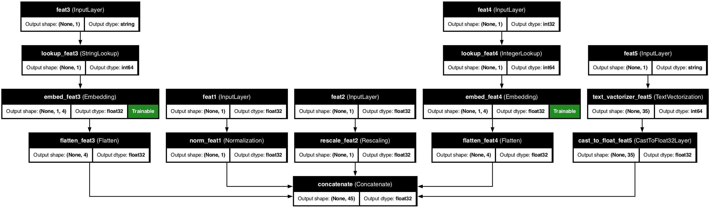

# 🏗️ KDP Architecture: How the Magic Works

<div class="intro-container">
  <div class="intro-content">
    <h2>What happens behind the scenes?</h2>
    <p>Ever wondered what happens when KDP transforms your raw data into ML-ready features? This guide takes you under the hood.</p>
  </div>
</div>

## 📋 Quick Overview

<div class="overview-card">
  <p>KDP's architecture consists of interconnected components that work together to make preprocessing faster, smarter, and more efficient. This guide will walk you through each component and show you how they transform raw data into powerful ML features.</p>
</div>

## 🧩 KDP's Building Blocks

<div class="architecture-image-container">
  
</div>

<div class="architecture-description">
  <p>KDP operates like a high-performance factory with specialized stations:</p>

  <div class="component-cards">
    <div class="component-card">
      <div class="component-number">1</div>
      <div class="component-content">
        <h3>Feature Definition Layer</h3>
        <p>Where you describe your data</p>
      </div>
    </div>

    <div class="component-card">
      <div class="component-number">2</div>
      <div class="component-content">
        <h3>Smart Processors</h3>
        <p>Specialized handlers for each data type</p>
      </div>
    </div>

    <div class="component-card">
      <div class="component-number">3</div>
      <div class="component-content">
        <h3>Advanced Processing Modules</h3>
        <p>Deep learning enhancements</p>
      </div>
    </div>

    <div class="component-card">
      <div class="component-number">4</div>
      <div class="component-content">
        <h3>Combination Engine</h3>
        <p>Brings everything together</p>
      </div>
    </div>

    <div class="component-card">
      <div class="component-number">5</div>
      <div class="component-content">
        <h3>Deployment Bridge</h3>
        <p>Connects to your ML pipeline</p>
      </div>
    </div>
  </div>
</div>

## 🚀 The Magic in Action

<div class="workflow-container">
  <div class="workflow-header">
    <h3>Let's follow the journey of your data through KDP:</h3>
  </div>

  <div class="workflow-diagram">
    <div class="workflow-step">Raw Data</div>
    <div class="workflow-arrow">→</div>
    <div class="workflow-step">Feature Processing</div>
    <div class="workflow-arrow">→</div>
    <div class="workflow-step">Advanced Transformations</div>
    <div class="workflow-arrow">→</div>
    <div class="workflow-step">Feature Combination</div>
    <div class="workflow-arrow">→</div>
    <div class="workflow-step">ML-Ready Features</div>
  </div>
</div>

### 1️⃣ Feature Definition: Tell KDP About Your Data

<div class="step-card">
  <div class="code-container">

```python
# This is your blueprint - tell KDP what you're working with
features = {
    "age": FeatureType.FLOAT_NORMALIZED,          # Simple definition
    "income": NumericalFeature(                   # Detailed configuration
        name="income",
        feature_type=FeatureType.FLOAT_RESCALED,
        use_embedding=True
    ),
    "occupation": FeatureType.STRING_CATEGORICAL,
    "purchase_date": FeatureType.DATE
}

# Create your data transformer
preprocessor = PreprocessingModel(
    path_data="customer_data.csv",
    features_specs=features
)
```

  </div>
</div>

### 2️⃣ Smart Processors: Type-Specific Transformation

<div class="processor-container">
  <p>Each feature gets processed by a specialized component:</p>

  <div class="table-container">
    <table class="processor-table">
      <thead>
        <tr>
          <th>Feature Type</th>
          <th>Handled By</th>
          <th>What It Does</th>
        </tr>
      </thead>
      <tbody>
        <tr>
          <td>🔢 <strong>Numerical</strong></td>
          <td><code>NumericalProcessor</code></td>
          <td>Normalization, scaling, distribution-aware transformations</td>
        </tr>
        <tr>
          <td>🏷️ <strong>Categorical</strong></td>
          <td><code>CategoricalProcessor</code></td>
          <td>Vocabulary creation, embedding generation, encoding</td>
        </tr>
        <tr>
          <td>📝 <strong>Text</strong></td>
          <td><code>TextProcessor</code></td>
          <td>Tokenization, n-gram analysis, semantic embedding</td>
        </tr>
        <tr>
          <td>📅 <strong>Date</strong></td>
          <td><code>DateProcessor</code></td>
          <td>Component extraction, cyclical encoding, temporal pattern detection</td>
        </tr>
      </tbody>
    </table>
  </div>

  <div class="code-container">

```python
# Behind the scenes: KDP creates a processor chain
numerical_processor = NumericalProcessor(feature_config)
category_processor = CategoricalProcessor(feature_config)
text_processor = TextProcessor(feature_config)
date_processor = DateProcessor(feature_config)
```

  </div>
</div>

### 3️⃣ Advanced Modules: Deep Learning Power

<div class="modules-container">
  <p>KDP enhances basic processing with deep learning:</p>

  <div class="modules-grid">
    <div class="module-card">
      <span class="module-icon">📊</span>
      <h3>Distribution-Aware Encoder</h3>
      <p>Automatically detects and handles data distributions</p>
    </div>

    <div class="module-card">
      <span class="module-icon">👁️</span>
      <h3>Tabular Attention</h3>
      <p>Learns relationships between features</p>
    </div>

    <div class="module-card">
      <span class="module-icon">🎯</span>
      <h3>Feature Selection</h3>
      <p>Identifies which features matter most</p>
    </div>

    <div class="module-card">
      <span class="module-icon">🔀</span>
      <h3>Feature MoE</h3>
      <p>Applies different processing strategies per feature</p>
    </div>
  </div>

  <div class="code-container">

```python
# Enable advanced processing in one line each
preprocessor = PreprocessingModel(
    features_specs=features,
    use_distribution_aware=True,       # Smart distribution handling
    tabular_attention=True,            # Feature relationships
    feature_selection_placement="all"  # Automatic feature importance
)
```

  </div>
</div>

### 4️⃣ Combination Engine: Bringing Features Together

<div class="combination-container">
  <p>KDP combines all processed features based on your configuration:</p>

  <div class="combination-methods">
    <div class="combination-method">
      <span class="combination-icon">🔗</span>
      <h3>Concatenation</h3>
      <p>Simple joining of features</p>
    </div>

    <div class="combination-method">
      <span class="combination-icon">⚖️</span>
      <h3>Weighted Combination</h3>
      <p>Features weighted by importance</p>
    </div>

    <div class="combination-method">
      <span class="combination-icon">🧠</span>
      <h3>Multi-head Attention</h3>
      <p>Complex interaction modeling</p>
    </div>

    <div class="combination-method">
      <span class="combination-icon">🔄</span>
      <h3>Transformer Blocks</h3>
      <p>Advanced feature mixing</p>
    </div>
  </div>
</div>

### 5️⃣ Deployment Bridge: Production-Ready

<div class="deployment-container">
  <p>The final component connects your preprocessing to training and inference:</p>

  <div class="code-container">

```python
# Build the processing pipeline
result = preprocessor.build_preprocessor()
model = result["model"]  # Standard Keras model

# Save for production
preprocessor.save_model("customer_preprocess_model")

# Load anywhere
from kdp import PreprocessingModel
loaded = PreprocessingModel.load_model("customer_preprocess_model")
```

  </div>
</div>

## 🧠 Smart Decision Making

<div class="decisions-container">
  <div class="decisions-header">
    <h3>KDP makes intelligent decisions at multiple points to optimize your preprocessing pipeline:</h3>
  </div>
</div>

### 🔍 Feature Type Detection

<div class="decision-section">
  <div class="decision-description">
    <p>KDP can automatically analyze your data to determine the most appropriate feature types:</p>
  </div>

  <div class="code-container">

```python
# KDP detects the best type when you don't specify
auto_detected_features = {
    "mystery_column": None  # KDP will analyze and decide
}

# Behind the scenes, KDP:
# 1. Examines sample distribution and uniqueness
# 2. Detects data patterns (numbers, text, dates)
# 3. Recommends optimal encoding strategy
```

  </div>
</div>

### 📊 Distribution Detection & Handling

<div class="decision-section">
  <div class="decision-description">
    <p>KDP examines the statistical properties of each numerical feature to apply appropriate transformations:</p>
  </div>

  <div class="code-container">

```python
# Enable distribution-aware processing
preprocessor = PreprocessingModel(
    features_specs=features,
    use_distribution_aware=True,
    distribution_aware_bins=1000  # Higher resolution for complex distributions
)

# KDP automatically detects and handles:
# - Normal distributions → Standard scaling
# - Skewed distributions → Log transformations
# - Multimodal distributions → Specialized encoding
# - Outliers → Robust scaling techniques
# - Missing values → Imputation strategies
```

  </div>
</div>

### ⚙️ Optimization Strategies

<div class="decision-section">
  <div class="decision-description">
    <p>KDP dynamically optimizes preprocessing for both efficiency and effectiveness:</p>
  </div>

  <div class="code-container">

```python
# KDP automatically:
# - Caches intermediate results for faster processing
# - Uses batch processing for memory efficiency
# - Parallelizes operations when possible
# - Reduces dimensionality when beneficial
```

  </div>

  <div class="optimization-factors">
    <p>Processing strategies are determined based on:</p>
    <ul>
      <li>Data size and complexity</li>
      <li>Available computational resources</li>
      <li>Feature interdependencies</li>
      <li>Statistical significance of features</li>
    </ul>
  </div>
</div>

### 🛑 Edge Case Handling

<div class="decision-section">
  <div class="decision-description">
    <p>KDP implements sophisticated handling for challenging data situations:</p>
  </div>

  <div class="code-container">

```python
# KDP handles these edge cases automatically:
preprocessor = PreprocessingModel(
    features_specs=features,
    # No additional configuration needed!
)
```

  </div>

  <div class="edge-cases">
    <p>Edge cases managed by KDP include:</p>
    <ul>
      <li><strong>Out-of-vocabulary</strong> values in categorical features</li>
      <li><strong>Previously unseen patterns</strong> in text data</li>
      <li><strong>Date values outside training range</strong></li>
      <li><strong>Missing values</strong> or <strong>unexpected nulls</strong></li>
      <li><strong>Extreme outliers</strong> in numerical columns</li>
    </ul>
  </div>
</div>

### 🔄 Adaptive Learning

<div class="decision-section">
  <div class="decision-description">
    <p>KDP continually refines its understanding of your data:</p>
  </div>

  <div class="code-container">

```python
# Analyze additional data after initial build
preprocessor.update_statistics(new_data)

# Preprocessor automatically adapts to:
# - Shifting distributions
# - New categorical values
# - Changing relationships between features
```

  </div>

  <div class="adaptive-note">
    <p>This adaptive approach ensures your preprocessing remains optimal even as data evolves over time.</p>
  </div>
</div>

---

<div class="nav-container">
  <a href="motivation.md" class="nav-button prev">
    <span class="nav-icon">←</span>
    <span class="nav-text">Motivation</span>
  </a>
  <a href="quick-start.md" class="nav-button next">
    <span class="nav-text">Quick Start Guide</span>
    <span class="nav-icon">→</span>
  </a>
</div>

<style>
/* Base styling */
body {
  font-family: -apple-system, BlinkMacSystemFont, "Segoe UI", Roboto, Helvetica, Arial, sans-serif;
  line-height: 1.6;
  color: #333;
  margin: 0;
  padding: 0;
}

/* Intro container */
.intro-container {
  background: linear-gradient(135deg, #f0f7ff 0%, #e9ecef 100%);
  border-radius: 10px;
  padding: 30px;
  margin: 30px 0;
  box-shadow: 0 4px 6px rgba(0,0,0,0.05);
}

.intro-content h2 {
  margin-top: 0;
  color: #4a86e8;
}

.intro-content p {
  font-size: 18px;
  margin-bottom: 0;
}

/* Overview card */
.overview-card {
  background-color: #fff;
  border-radius: 10px;
  padding: 20px 25px;
  margin: 20px 0;
  box-shadow: 0 2px 5px rgba(0,0,0,0.05);
  border-left: 4px solid #4a86e8;
}

.overview-card p {
  margin: 0;
  font-size: 16px;
}

/* Architecture image */
.architecture-image-container {
  text-align: center;
  margin: 30px 0;
}

.architecture-image {
  max-width: 100%;
  height: auto;
  border-radius: 10px;
  box-shadow: 0 4px 8px rgba(0,0,0,0.1);
  transition: transform 0.3s ease;
}

.architecture-image:hover {
  transform: scale(1.02);
}

.architecture-description {
  margin: 30px 0;
}

.component-cards {
  display: grid;
  grid-template-columns: repeat(auto-fill, minmax(300px, 1fr));
  gap: 20px;
  margin-top: 20px;
}

.component-card {
  display: flex;
  align-items: flex-start;
  background-color: #fff;
  border-radius: 10px;
  padding: 20px;
  box-shadow: 0 4px 8px rgba(0,0,0,0.1);
  transition: transform 0.3s ease, box-shadow 0.3s ease;
}

.component-card:hover {
  transform: translateY(-5px);
  box-shadow: 0 8px 16px rgba(0,0,0,0.1);
}

.component-number {
  display: flex;
  align-items: center;
  justify-content: center;
  width: 30px;
  height: 30px;
  background-color: #4a86e8;
  color: white;
  border-radius: 50%;
  margin-right: 15px;
  font-weight: bold;
}

.component-content h3 {
  margin-top: 0;
  margin-bottom: 10px;
  color: #4a86e8;
}

.component-content p {
  margin: 0;
}

/* Workflow diagram */
.workflow-container {
  margin: 30px 0;
}

.workflow-header {
  margin-bottom: 20px;
}

.workflow-header h3 {
  margin: 0;
}

.workflow-diagram {
  display: flex;
  align-items: center;
  justify-content: space-between;
  flex-wrap: wrap;
  margin: 0 -10px;
}

.workflow-step {
  flex: 1;
  min-width: 120px;
  background-color: #fff;
  padding: 15px 10px;
  margin: 10px;
  text-align: center;
  border-radius: 10px;
  box-shadow: 0 4px 8px rgba(0,0,0,0.1);
  font-weight: 500;
}

.workflow-arrow {
  font-size: 24px;
  color: #4a86e8;
  margin: 0 5px;
}

/* Step card */
.step-card {
  background-color: #fff;
  border-radius: 10px;
  overflow: hidden;
  margin: 20px 0;
  box-shadow: 0 4px 8px rgba(0,0,0,0.1);
}

/* Code containers */
.code-container {
  background-color: #f8f9fa;
  border-radius: 8px;
  overflow: hidden;
  box-shadow: 0 2px 5px rgba(0,0,0,0.1);
  margin: 20px 0;
}

.code-container pre {
  margin: 0;
  padding: 20px;
}

/* Processor section */
.processor-container {
  margin: 20px 0;
}

.table-container {
  margin: 20px 0;
  border-radius: 10px;
  overflow: hidden;
  box-shadow: 0 4px 8px rgba(0,0,0,0.1);
}

.processor-table {
  width: 100%;
  border-collapse: collapse;
}

.processor-table th {
  background-color: #f0f7ff;
  padding: 15px;
  text-align: left;
  font-weight: 600;
  border-bottom: 2px solid #4a86e8;
}

.processor-table td {
  padding: 12px 15px;
  border-bottom: 1px solid #eaecef;
}

.processor-table tr:nth-child(even) {
  background-color: #f8f9fa;
}

.processor-table tr:hover {
  background-color: #f0f7ff;
}

/* Advanced modules section */
.modules-container {
  margin: 20px 0;
}

.modules-grid {
  display: grid;
  grid-template-columns: repeat(auto-fill, minmax(250px, 1fr));
  gap: 20px;
  margin: 20px 0;
}

.module-card {
  background-color: #fff;
  border-radius: 10px;
  padding: 20px;
  box-shadow: 0 4px 8px rgba(0,0,0,0.1);
  transition: transform 0.3s ease, box-shadow 0.3s ease;
  text-align: center;
}

.module-card:hover {
  transform: translateY(-5px);
  box-shadow: 0 8px 16px rgba(0,0,0,0.1);
}

.module-icon {
  font-size: 2.5em;
  margin-bottom: 15px;
  display: block;
}

.module-card h3 {
  margin: 0 0 10px 0;
  color: #4a86e8;
}

.module-card p {
  margin: 0;
}

/* Combination section */
.combination-container {
  margin: 20px 0;
}

.combination-methods {
  display: grid;
  grid-template-columns: repeat(auto-fill, minmax(250px, 1fr));
  gap: 20px;
  margin: 20px 0;
}

.combination-method {
  background-color: #fff;
  border-radius: 10px;
  padding: 20px;
  box-shadow: 0 4px 8px rgba(0,0,0,0.1);
  transition: transform 0.3s ease, box-shadow 0.3s ease;
  text-align: center;
}

.combination-method:hover {
  transform: translateY(-5px);
  box-shadow: 0 8px 16px rgba(0,0,0,0.1);
}

.combination-icon {
  font-size: 2.5em;
  margin-bottom: 15px;
  display: block;
}

.combination-method h3 {
  margin: 0 0 10px 0;
  color: #4a86e8;
}

.combination-method p {
  margin: 0;
}

/* Deployment section */
.deployment-container {
  margin: 20px 0;
}

/* Decision making section */
.decisions-container {
  margin: 30px 0;
}

.decisions-header {
  background-color: #fff;
  border-radius: 10px;
  padding: 20px;
  box-shadow: 0 4px 8px rgba(0,0,0,0.1);
  border-left: 4px solid #9b59b6;
}

.decisions-header h3 {
  margin: 0;
  color: #333;
}

.decision-section {
  margin: 30px 0;
  padding: 20px;
  background-color: #fff;
  border-radius: 10px;
  box-shadow: 0 4px 8px rgba(0,0,0,0.1);
}

.decision-description {
  margin-bottom: 15px;
}

.decision-description p {
  margin: 0;
}

.optimization-factors, .edge-cases, .adaptive-note {
  margin-top: 20px;
  padding: 20px;
  background-color: #f8f9fa;
  border-radius: 8px;
  border-left: 4px solid #4a86e8;
}

.optimization-factors p, .edge-cases p, .adaptive-note p {
  margin-top: 0;
  font-weight: 500;
}

.optimization-factors ul, .edge-cases ul {
  margin-bottom: 0;
}

.optimization-factors li, .edge-cases li {
  margin-bottom: 5px;
}

/* Navigation */
.nav-container {
  display: flex;
  justify-content: space-between;
  margin: 40px 0;
}

.nav-button {
  display: flex;
  align-items: center;
  padding: 10px 15px;
  background-color: #f8f9fa;
  border-radius: 8px;
  text-decoration: none;
  color: #333;
  box-shadow: 0 2px 5px rgba(0,0,0,0.1);
  transition: background-color 0.3s ease, transform 0.3s ease;
}

.nav-button:hover {
  background-color: #f0f7ff;
  transform: translateY(-2px);
}

.nav-button.prev {
  padding-left: 10px;
}

.nav-button.next {
  padding-right: 10px;
}

.nav-icon {
  font-size: 1.2em;
  margin: 0 8px;
}

/* Responsive adjustments */
@media (max-width: 1024px) {
  .workflow-step {
    min-width: 100px;
  }
}

@media (max-width: 768px) {
  .workflow-diagram {
    flex-direction: column;
  }

  .workflow-step {
    width: 100%;
    margin: 5px 0;
  }

  .workflow-arrow {
    transform: rotate(90deg);
    margin: 5px 0;
  }

  .component-cards,
  .modules-grid,
  .combination-methods {
    grid-template-columns: 1fr;
  }
}
</style>
