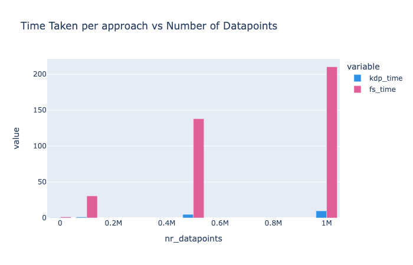

# 🚀 Why KDP Exists: The Origin Story

  

    <h2>Born from frustration with existing preprocessing tools</h2>
    
KDP was created when traditional preprocessing tools collapsed under the weight of real-world data.

  

## ❓ The Breaking Point with Existing Tools

  

    🐌
    

      <h3>Preprocessing Took Forever</h3>
      
Each feature required a separate data pass, turning minutes into hours

    

  

  

    💥
    

      <h3>Memory Explosions</h3>
      
OOM errors became the norm rather than the exception

    

  

  

    🧩
    

      <h3>Customization Nightmares</h3>
      
Implementing specialized preprocessing meant fighting the framework

    

  

  

    🔍
    

      <h3>Feature-Specific Needs</h3>
      
Different data types needed different handling, not one-size-fits-all approaches

    

  

## 🛠️ How KDP Changes Everything

  

    <h3>KDP fundamentally reimagines tabular data preprocessing:</h3>
  

  

    

      ⚡
      <h3>10-50x Faster Processing</h3>
      
Single-pass architecture transforms preprocessing from hours to minutes

    

    

      🧠
      <h3>Smart Memory Management</h3>
      
Process GB-scale datasets on standard laptops without OOM errors

    

    

      🔧
      <h3>Built for Customization</h3>
      
Plug in your own processing components or use our advanced features

    

    

      🤖
      <h3>Distribution-Aware Processing</h3>
      
Automatically detects and handles complex data distributions

    

  

## 📊 See the Difference

  

    <h3>Our benchmarks show the dramatic impact on real-world workloads:</h3>
  

  

    

      <h3>Performance Benchmarks</h3>
      
KDP outperforms alternative preprocessing approaches, especially as data size increases:

      

        
      

    

    

      <h3>Scaling with Features</h3>
      
KDP's scaling is nearly linear with feature count:

      

        
      

    

  

  

    
<strong>As your data grows</strong>: Traditional tools scale linearly or worse, while KDP stays efficient.

  

## 👨‍💻 From Real-World Pain to Real-World Solution

  

    
❝

    
We were spending 70% of our ML development time just waiting for preprocessing to finish. With KDP, that dropped to under 10%.

  

  

    
❝

    
Our preprocessing pipeline kept crashing on 50GB datasets. KDP processed it without breaking a sweat on the same hardware.

  

## 💎 Benefits You'll Feel Immediately

  

    🚀
    

      <h3>From Idea to Model Faster</h3>
      
When preprocessing takes minutes instead of hours, you can iterate rapidly

    

  

  

    💻
    

      <h3>Works on Your Existing Hardware</h3>
      
No need for specialized machines just for preprocessing

    

  

  

    🧪
    

      <h3>More Experiments, Better Models</h3>
      
Run 10x more experiments in the same time

    

  

  

    🔄
    

      <h3>Smoother Production Transitions</h3>
      
The same code works for both small-scale development and production-scale deployment

    

  

## ✨ KDP's Unique Approaches

  

    
1

    

      <h3>Smart Feature Detection</h3>
      
Automatic identification of feature types and optimal processing

    

  

  

    
2

    

      <h3>Efficient Caching System</h3>
      
Intelligently caches intermediate results to avoid redundant computation

    

  

  

    
3

    

      <h3>Vectorized Operations</h3>
      
Utilizes TensorFlow's optimized ops for maximum throughput

    

  

  

    
4

    

      <h3>Batch Processing Architecture</h3>
      
Processes data in optimized chunks to balance memory and speed

    

  

## 🔮 The Future We're Building

  

    
1

    

      <h3>Expanded Hardware Support</h3>
      
Optimizations for specialized processors (TPUs, etc.)

    

  

  

    
2

    

      <h3>Even Smarter Defaults</h3>
      
Auto-configuration based on your specific dataset characteristics

    

  

  

    
3

    

      <h3>More Integration Options</h3>
      
Seamless workflows with popular ML frameworks

    

  

  

    
4

    

      <h3>Community Contributions</h3>
      
Your ideas becoming features that help everyone

    

  

## 🤝 Join the KDP Movement

  

    <h3>Found this useful? Help us make KDP even better:</h3>
  

  

    

      🌟
      
Star our repository and spread the word

    

    

      🐛
      
Report issues when you find them

    

    

      🔧
      
Contribute improvements and extensions

    

    

      💡
      
Share your success stories

    

  

  

    
Check out our <a href="../contributing/contributing.md">Contributing Guide</a> to get started.

  

## 🚦 Ready to Begin?

  <a href="quick-start.md" class="next-step-card">
    ⏱️
    

      <h3>5-Minute Quick Start</h3>
      
See KDP in action with minimal code

    

  </a>

  <a href="../optimization/tabular-optimization.md" class="next-step-card">
    🔍
    

      <h3>Performance Deep Dive</h3>
      
Understand the optimizations in detail

    

  </a>

  <a href="../examples/complex-examples.md" class="next-step-card">
    🧩
    

      <h3>Complex Real-World Examples</h3>
      
See how KDP handles sophisticated scenarios

    

  </a>

---

  <a href="installation.md" class="nav-button prev">
    ←
    Installation
  </a>
  <a href="architecture.md" class="nav-button next">
    Architecture Overview
    →
  </a>

