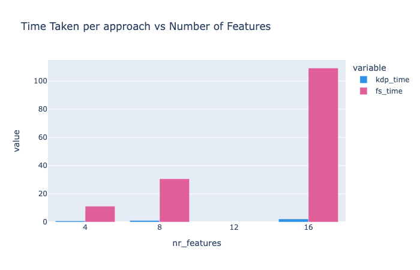

# 🚀 Why KDP Exists: The Origin Story

> KDP was born from frustration with existing preprocessing tools that collapsed under the weight of real-world data.

## ❓ The Breaking Point with Existing Tools

We love Keras and its ecosystem, but when scaling to production datasets:

- 🐌 **Preprocessing Took Forever**: Each feature required a separate data pass, turning minutes into hours
- 💥 **Memory Explosions**: OOM errors became the norm rather than the exception
- 🧩 **Customization Nightmares**: Implementing specialized preprocessing meant fighting the framework
- 🔍 **Feature-Specific Needs**: Different data types needed different handling, not one-size-fits-all approaches

## 🛠️ How KDP Changes Everything

KDP fundamentally reimagines tabular data preprocessing:

- ⚡ **10-50x Faster Processing**: Single-pass architecture transforms preprocessing from hours to minutes
- 🧠 **Smart Memory Management**: Process GB-scale datasets on standard laptops without OOM errors
- 🔧 **Built for Customization**: Plug in your own processing components or use our advanced features
- 🤖 **Distribution-Aware Processing**: Automatically detects and handles complex data distributions

## 📊 See the Difference

Our benchmarks show the dramatic impact on real-world workloads:

## Performance Benchmarks

KDP outperforms alternative preprocessing approaches, especially as data size increases:

KDP's scaling is nearly linear with feature count:

**As your data grows**: Traditional tools scale linearly or worse, while KDP stays efficient.

## 👨‍💻 From Real-World Pain to Real-World Solution

KDP was built by practitioners facing the same challenges you do:

> "We were spending 70% of our ML development time just waiting for preprocessing to finish. With KDP, that dropped to under 10%."
>
> "Our preprocessing pipeline kept crashing on 50GB datasets. KDP processed it without breaking a sweat on the same hardware."

## 💎 Benefits You'll Feel Immediately

- 🚀 **From Idea to Model Faster**: When preprocessing takes minutes instead of hours, you can iterate rapidly
- 💻 **Works on Your Existing Hardware**: No need for specialized machines just for preprocessing
- 🧪 **More Experiments, Better Models**: Run 10x more experiments in the same time
- 🔄 **Smoother Production Transitions**: The same code works for both small-scale development and production-scale deployment

## ✨ KDP's Unique Approaches

1. **Smart Feature Detection**: Automatic identification of feature types and optimal processing
2. **Efficient Caching System**: Intelligently caches intermediate results to avoid redundant computation
3. **Vectorized Operations**: Utilizes TensorFlow's optimized ops for maximum throughput
4. **Batch Processing Architecture**: Processes data in optimized chunks to balance memory and speed

## 🔮 The Future We're Building

KDP continues to evolve based on real-world needs:

1. **Expanded Hardware Support**: Optimizations for specialized processors (TPUs, etc.)
2. **Even Smarter Defaults**: Auto-configuration based on your specific dataset characteristics
3. **More Integration Options**: Seamless workflows with popular ML frameworks
4. **Community Contributions**: Your ideas becoming features that help everyone

## 🤝 Join the KDP Movement

Found this useful? Help us make KDP even better:

- 🌟 Star our repository and spread the word
- 🐛 Report issues when you find them
- 🔧 Contribute improvements and extensions
- 💡 Share your success stories

Check out our [Contributing Guide](../contributing/contributing.md) to get started.

## 🚦 Ready to Begin?

- [5-Minute Quick Start](quick-start.md) - See KDP in action with minimal code
- [Performance Deep Dive](../optimization/tabular-optimization.md) - Understand the optimizations in detail
- [Complex Real-World Examples](../examples/complex-examples.md) - See how KDP handles sophisticated scenarios

---

  <a href="installation.md" class="prev">← Installation</a>
  <a href="architecture.md" class="next">Architecture Overview →</a>

