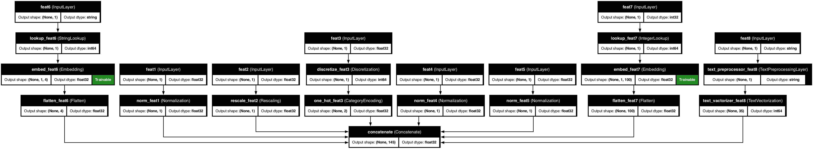

# 🌟 Welcome to Keras Data Processor - Preprocessing Power with TensorFlow Keras 🌟

<p align="center">
  
</p>

**Welcome to the Future of Data Preprocessing!**

Diving into the world of machine learning and data science, we often find ourselves tangled in the preprocessing jungle. Worry no more! Introducing a state-of-the-art data preprocessing model based on TensorFlow Keras and the innovative use of Keras preprocessing layers.

Say goodbye to tedious data preparation tasks and hello to streamlined, efficient, and scalable data pipelines. Whether you're a seasoned data scientist or just starting out, this tool is designed to supercharge your ML workflows, making them more robust and faster than ever!

## 🔑 Key Features:

- 🛠 **Flexible Feature Engineering**: Applies predefined preprocessing steps based on user-specified feature types, allowing for efficient and customizable data preparation with minimal manual coding.

- 🎨 **Customizable Preprocessing Pipelines**: Tailor your preprocessing steps with ease. Choose from a comprehensive range of options for numeric, categorical, text data, and even complex feature crosses, allowing for precise and effective data handling.

- 📊 **Scalability and Efficiency**: Engineered for high performance, this tool handles large datasets effortlessly, leveraging TensorFlow's robust computational capabilities.

- 🧠 **Enhanced with Transformer Blocks**: Incorporate transformer blocks into your preprocessing model to boost feature interaction analysis and uncover complex patterns, enhancing predictive model accuracy.

- ⚙️ **Easy Integration**: Designed to seamlessly integrate as the first layers in your TensorFlow Keras models, facilitating a smooth transition from raw data to trained model, accelerating your workflow significantly.

## 🚀 Getting started:

We use poetry for handling dependencies so you will need to install it first.
Then you can install the dependencies by running:

To install dependencies:

```bash
poetry install
```

or to enter a dedicated env directly:

```bash
poetry shell
```

Then you can simply configure your preprocessor:

## 🛠️ Building Preprocessor:

The simplest application of the preprocessing model is as follows:

```python
from kdp import PreprocessingModel
from kdp import FeatureType

# DEFINING FEATURES PROCESSORS
features_specs = {
    # ======= NUMERICAL Features =========================
    "feat1": FeatureType.FLOAT_NORMALIZED,
    "feat2": FeatureType.FLOAT_RESCALED,
    # ======= CATEGORICAL Features ========================
    "feat3": FeatureType.STRING_CATEGORICAL,
    "feat4": FeatureType.INTEGER_CATEGORICAL,
    # ======= TEXT Features ========================
    "feat5": FeatureType.TEXT,
}

# INSTANTIATE THE PREPROCESSING MODEL with your data
ppr = PreprocessingModel(
    path_data="data/my_data.csv",
    features_specs=features_spec,
)
# construct the preprocessing pipelines
ppr.build_preprocessor()
```

This will output:

```JS
{
'model': <Functional name=preprocessor, built=True>,
'inputs': {
    'feat1': <KerasTensor shape=(None, 1), dtype=float32, sparse=None, name=feat1>,
    'feat2': <KerasTensor shape=(None, 1), dtype=float32, sparse=None, name=feat2>,
    'feat3': <KerasTensor shape=(None, 1), dtype=string, sparse=None, name=feat3>,
    'feat4': <KerasTensor shape=(None, 1), dtype=int32, sparse=None, name=feat4>,
    'feat5': <KerasTensor shape=(None, 1), dtype=string, sparse=None, name=feat5>
    },
'signature': {
    'feat1': TensorSpec(shape=(None, 1), dtype=tf.float32, name='feat1'),
    'feat2': TensorSpec(shape=(None, 1), dtype=tf.float32, name='feat2'),
    'feat3': TensorSpec(shape=(None, 1), dtype=tf.string, name='feat3'),
    'feat4': TensorSpec(shape=(None, 1), dtype=tf.int32, name='feat4'),
    'feat5': TensorSpec(shape=(None, 1), dtype=tf.string, name='feat5')
    },
'output_dims': 45
}
```

This will result in the following preprocessing steps:

<p align="center">
  
</p>

!!! success
    You can define the preprocessing model with the `features_specs` dictionary, where the keys are the feature names and the values are the feature types. The model will automatically apply the appropriate preprocessing steps based on the feature type.

    You have access to several layers of customization per feature type, such as normalization, rescaling, or even definition of custom preprocessing steps.

    See 👀 [Defining Features](features.md) for more details.

!!! info
    You can use the preprocessing model independently to preprocess your data or integrate it into your Keras model as the first layer, see 👀 [Integrations](integrations.md)

## 💪🏻 Advanced Configuration Options

### 🤖 Transformer Blocks Configuration

Enhance your preprocessing model with transformer blocks to capture complex patterns and interactions between features, see 👀 [Transformer Blocks](transformer_blocks.md). You can configure the transformer blocks as follows:

- **Number of Blocks**: Define how many transformer blocks to include in the preprocessing pipeline.
- **Number of Heads**: Set the number of attention heads in each transformer block.
- **Feed Forward Units**: Specify the number of units in the feed-forward network of each block.
- **Dropout Rate**: Adjust the dropout rate to prevent overfitting during training.
- **Placement**: Choose whether to apply transformer blocks to only categorical features (`CATEGORICAL`) or to all features (`ALL_FEATURES`).

Example configuration:

```python
transfo_config = {
    'transfo_nr_blocks': 3,
    'transfo_nr_heads': 4,
    'transfo_ff_units': 64,
    'transfo_dropout_rate': 0.1,
    'transfo_placement': 'ALL_FEATURES'
}

ppr = PreprocessingModel(
    path_data="data/my_data.csv",
    features_specs=features_spec,
    **transfo_config
)
```

### 🏗️ Custom Preprocessors

Tailor your preprocessing steps with custom preprocessors for each feature type. Define specific preprocessing logic that fits your data characteristics or domain-specific requirements, see 👀 [Custom Preprocessors](features.md#🚀-custom-preprocessing-steps).

- **Custom Steps**: Add custom preprocessing layers or functions to the predefined feature types.
- **Flexibility**: Mix and match standard and custom preprocessing steps to achieve optimal data transformation.

Example of adding a custom preprocessor:

```python
from kdp.custom_preprocessors import MyCustomScaler

features_specs = {
    "feat1": {
        'feature_type': FeatureType.FLOAT_NORMALIZED,
        'preprocessors': [MyCustomScaler()]
    }
}

ppr = PreprocessingModel(
    path_data="data/my_data.csv",
    features_specs=features_spec
)
```

### ♱ Feature Crosses

Create complex feature interactions by crossing features. This method combines features into a single feature, which can be particularly useful for models that benefit from understanding interactions between specific features, see 👀 [Feature Crosses](features.md#❌-cross-features).

- **Crossing Features**: Specify pairs of features to be crossed and the number of bins for hashing the crossed feature.

Example of defining feature crosses:

```python
feature_crosses = [
    ("feat1", "feat2", 10),
    ("feat3", "feat4", 5)
]

ppr = PreprocessingModel(
    path_data="data/my_data.csv",
    features_specs=features_spec,
    feature_crosses=feature_crosses
)
```

These advanced configurations allow for greater flexibility and power in your preprocessing pipelines, enabling more sophisticated data transformations and feature engineering.
