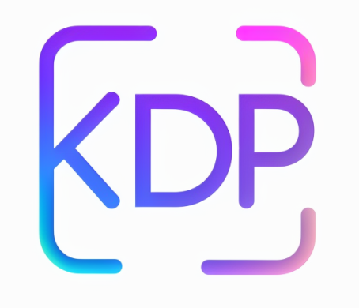

# 🌟 Keras Data Processor (KDP) 🌟

<div align="center">

  


  <p><strong>Provided and maintained by <a href="https://unicolab.ai">🦄 UnicoLab</a></strong></p>

</div>

<div class="header-container">
  <div class="tagline">
    <h2>Transform your raw data into powerful ML-ready features</h2>
    <p>A high-performance preprocessing library for tabular data built on TensorFlow. KDP combines the best of traditional preprocessing with advanced neural approaches to create state-of-the-art feature transformations. Built with ❤️ by <a href="https://unicolab.ai">🦄 UnicoLab</a> for enterprise AI applications.</p>
  </div>
</div>

<div class="grid-container">
  <div class="grid-item">
    <h3>🚀 Getting Started</h3>
    <ul class="feature-list">
      <li><a href="getting-started/quick-start.md">Quick Start Guide</a></li>
      <li><a href="getting-started/motivation.md">Why KDP Exists</a></li>
      <li><a href="getting-started/installation.md">Installation</a></li>
      <li><a href="getting-started/architecture.md">Architecture Overview</a></li>
    </ul>
  </div>
  <div class="grid-item">
    <h3>🛠️ Feature Processing</h3>
    <ul class="feature-list">
      <li><a href="features/overview.md">Feature Types Overview</a></li>
      <li><a href="features/numerical-features.md">Numerical Features</a></li>
      <li><a href="features/categorical-features.md">Categorical Features</a></li>
      <li><a href="features/text-features.md">Text Features</a></li>
      <li><a href="features/date-features.md">Date Features</a></li>
      <li><a href="features/cross-features.md">Cross Features</a></li>
    </ul>
  </div>
  <div class="grid-item">
    <h3>🧠 Advanced Features</h3>
    <ul class="feature-list">
      <li><a href="advanced/distribution-aware-encoding.md">Distribution-Aware Encoding</a></li>
      <li><a href="advanced/tabular-attention.md">Tabular Attention</a></li>
      <li><a href="advanced/feature-moe.md">Feature-wise Mixture of Experts</a></li>
      <li><a href="advanced/feature-selection.md">Feature Selection</a></li>
      <li><a href="advanced/numerical-embeddings.md">Advanced Numerical Embeddings</a></li>
      <li><a href="advanced/transformer-blocks.md">Transformer Blocks</a></li>
    </ul>
  </div>
</div>

<div class="grid-container">
  <div class="grid-item">
    <h3>⚡ Optimization</h3>
    <ul class="feature-list">
      <li><a href="optimization/tabular-optimization.md">Tabular Optimization</a></li>
      <li><a href="optimization/auto-configuration.md">Auto-Configuration</a></li>
      <li><a href="optimization/feature-selection.md">Feature Selection</a></li>
    </ul>
  </div>
  <div class="grid-item">
    <h3>🔗 Integrations</h3>
    <ul class="feature-list">
      <li><a href="integrations/overview.md">Integration Overview</a></li>
    </ul>
  </div>
  <div class="grid-item">
    <h3>📚 Examples</h3>
    <ul class="feature-list">
      <li><a href="examples/basic-examples.md">Basic Examples</a></li>
      <li><a href="examples/complex-examples.md">Complex Examples</a></li>
    </ul>
  </div>
</div>

<div class="grid-container">
  <div class="grid-item">
    <h3>📚 Reference</h3>
    <ul class="feature-list">
      <li><a href="generated/api_index.md">API Reference</a></li>
    </ul>
  </div>
  <div class="grid-item">
    <h3>🤝 Contributing</h3>
    <ul class="feature-list">
      <li><a href="contributing/overview.md">Contribution Guide</a></li>
      <li><a href="contributing/development/auto-documentation.md">Auto-Documentation</a></li>
    </ul>
  </div>
  <div class="grid-item">
    <h3>📈 Key Features</h3>
    <ul class="key-features-list">
      <li><span class="check-mark">✓</span> Smart distribution detection</li>
      <li><span class="check-mark">✓</span> Neural feature interactions</li>
      <li><span class="check-mark">✓</span> Feature-wise Mixture of Experts</li>
      <li><span class="check-mark">✓</span> Memory-efficient processing</li>
      <li><span class="check-mark">✓</span> Single-pass optimization</li>
      <li><span class="check-mark">✓</span> Production-ready scaling</li>
    </ul>
  </div>
</div>

## 🏆 Why Choose KDP?

<div class="comparison-table-container">
  <table class="comparison-table">
    <thead>
      <tr>
        <th>Challenge</th>
        <th>Traditional Approach</th>
        <th>KDP's Solution</th>
      </tr>
    </thead>
    <tbody>
      <tr>
        <td>Complex Distributions</td>
        <td>Fixed binning strategies</td>
        <td><span class="solution-icon">📊</span> <strong>Distribution-Aware Encoding</strong> that adapts to your specific data</td>
      </tr>
      <tr>
        <td>Interaction Discovery</td>
        <td>Manual feature crosses</td>
        <td><span class="solution-icon">👁️</span> <strong>Tabular Attention</strong> that automatically finds important relationships</td>
      </tr>
      <tr>
        <td>Heterogeneous Features</td>
        <td>Uniform processing</td>
        <td><span class="solution-icon">🧩</span> <strong>Feature-wise Mixture of Experts</strong> that specializes processing per feature</td>
      </tr>
      <tr>
        <td>Feature Importance</td>
        <td>Post-hoc analysis</td>
        <td><span class="solution-icon">🎯</span> <strong>Built-in Feature Selection</strong> during training</td>
      </tr>
      <tr>
        <td>Performance at Scale</td>
        <td>Memory issues with large datasets</td>
        <td><span class="solution-icon">⚡</span> <strong>Optimized Processing Pipeline</strong> with batching and caching</td>
      </tr>
    </tbody>
  </table>
</div>

## 🚀 Quick Example

<div class="code-container">

```python
from kdp import PreprocessingModel, FeatureType

# Define your features
features = {
    "age": FeatureType.FLOAT_NORMALIZED,
    "income": FeatureType.FLOAT_RESCALED,
    "occupation": FeatureType.STRING_CATEGORICAL,
    "description": FeatureType.TEXT
}

# Create and build your preprocessor
preprocessor = PreprocessingModel(
    path_data="data.csv",
    features_specs=features,
    use_distribution_aware=True,  # Smart distribution handling
    tabular_attention=True,       # Automatic feature interactions
    use_feature_moe=True,         # Specialized processing per feature
    feature_moe_num_experts=4     # Number of specialized experts
)

# Build and use
result = preprocessor.build_preprocessor()
model = result["model"]
```

</div>

### 🔄 Architecture Diagram

<div class="diagram-container">


</div>

## 🔍 Find What You Need

<div class="find-container">
  <div class="find-item">
    <span class="find-icon">🔰</span>
    <strong>New to KDP?</strong> Start with the <a href="getting-started/quick-start.md">Quick Start Guide</a>
  </div>
  <div class="find-item">
    <span class="find-icon">🔍</span>
    <strong>Specific feature type?</strong> Check the <a href="features/overview.md">Feature Processing</a> section
  </div>
  <div class="find-item">
    <span class="find-icon">⚡</span>
    <strong>Performance issues?</strong> See the <a href="optimization/tabular-optimization.md">Optimization</a> guides
  </div>
  <div class="find-item">
    <span class="find-icon">🔌</span>
    <strong>Integration help?</strong> Visit the <a href="integrations/overview.md">Integration Overview</a> section
  </div>
  <div class="find-item">
    <span class="find-icon">📝</span>
    <strong>Practical examples?</strong> Browse our <a href="examples/basic-examples.md">Examples</a>
  </div>
  <div class="find-item">
    <span class="find-icon">📚</span>
    <strong>API details?</strong> Refer to the <a href="generated/api_index.md">API Reference</a> documentation
  </div>
</div>

## 📣 Community & Support

<div class="community-container">
  <a href="https://github.com/UnicoLab/keras-data-processor" class="community-item">
    <span class="community-icon">🐙</span>
    <span class="community-text">GitHub Repository</span>
  </a>
  <a href="https://github.com/UnicoLab/keras-data-processor/issues" class="community-item">
    <span class="community-icon">🐛</span>
    <span class="community-text">Issue Tracker</span>
  </a>
  <a href="https://unicolab.ai" class="community-item">
    <span class="community-icon">🦄</span>
    <span class="community-text">UnicoLab - Enterprise AI</span>
  </a>
  <div class="community-item">
    <span class="community-icon">📜</span>
    <span class="community-text">MIT License - Open source and free to use</span>
  </div>
</div>

---

<p align="center">

  <strong>Built with ❤️ for the ML community by 🦄 UnicoLab.ai</strong>

</p>

<style>
/* Base styling */
body {
  font-family: -apple-system, BlinkMacSystemFont, "Segoe UI", Roboto, Helvetica, Arial, sans-serif;
  line-height: 1.6;
  color: #333;
}

/* Header styling */
.header-container {
  display: flex;
  align-items: center;
  margin: 30px 0 50px 0;
  padding: 20px;
  background: linear-gradient(135deg, #f8f9fa 0%, #e9ecef 100%);
  border-radius: 10px;
  box-shadow: 0 4px 6px rgba(0,0,0,0.05);
}

.logo {
  border-radius: 8px;
  box-shadow: 0 4px 8px rgba(0,0,0,0.1);
  margin-right: 30px;
  transition: transform 0.3s ease;
}

.logo:hover {
  transform: translateY(-5px);
}

.tagline {
  flex: 1;
}

.tagline h2 {
  margin-top: 0;
  color: #4a86e8;
  font-size: 24px;
}

.tagline p {
  font-size: 16px;
  color: #555;
}

/* Grid styling */
.grid-container {
  display: grid;
  grid-template-columns: 1fr 1fr 1fr;
  grid-gap: 20px;
  margin-bottom: 30px;
}

.grid-item {
  padding: 20px;
  background-color: #f8f9fa;
  border-radius: 8px;
  box-shadow: 0 2px 5px rgba(0,0,0,0.1);
  transition: transform 0.3s ease, box-shadow 0.3s ease;
}

.grid-item:hover {
  transform: translateY(-5px);
  box-shadow: 0 5px 15px rgba(0,0,0,0.1);
}

.grid-item h3 {
  margin-top: 0;
  border-bottom: 2px solid #eaecef;
  padding-bottom: 10px;
  color: #333;
}

/* List styling */
.feature-list, .key-features-list {
  padding-left: 20px;
}

.feature-list li, .key-features-list li {
  margin-bottom: 8px;
  position: relative;
}

.feature-list a {
  color: #0366d6;
  text-decoration: none;
  transition: color 0.2s ease;
}

.feature-list a:hover {
  color: #0056b3;
  text-decoration: underline;
}

.key-features-list {
  list-style-type: none;
  padding-left: 10px;
}

.key-features-list .check-mark {
  color: #4CAF50;
  font-weight: bold;
  margin-right: 8px;
}

/* Table styling */
.comparison-table-container {
  margin: 30px 0;
  border-radius: 8px;
  overflow: hidden;
  box-shadow: 0 4px 8px rgba(0,0,0,0.1);
}

.comparison-table {
  width: 100%;
  border-collapse: collapse;
}

.comparison-table th {
  background-color: #f0f7ff;
  padding: 15px;
  text-align: left;
  font-weight: 600;
  border-bottom: 2px solid #4a86e8;
}

.comparison-table td {
  padding: 12px 15px;
  border-bottom: 1px solid #eaecef;
}

.comparison-table tr:nth-child(even) {
  background-color: #f8f9fa;
}

.comparison-table tr:hover {
  background-color: #f0f7ff;
}

.solution-icon {
  display: inline-block;
  margin-right: 8px;
  font-size: 1.2em;
}

/* Code section */
.code-container {
  margin: 25px 0;
  border-radius: 8px;
  overflow: hidden;
  box-shadow: 0 4px 8px rgba(0,0,0,0.1);
}

.code-container pre {
  margin: 0;
  border-radius: 8px;
}

/* Diagram styling */
.diagram-container {
  margin: 30px 0;
  padding: 15px;
  background-color: white;
  border-radius: 8px;
  box-shadow: 0 4px 8px rgba(0,0,0,0.1);
}

/* Find section styling */
.find-container {
  display: grid;
  grid-template-columns: 1fr 1fr;
  grid-gap: 15px;
  margin: 30px 0;
}

.find-item {
  padding: 15px;
  background-color: #f8f9fa;
  border-radius: 8px;
  box-shadow: 0 2px 5px rgba(0,0,0,0.1);
  display: flex;
  align-items: center;
  transition: transform 0.3s ease, box-shadow 0.3s ease;
}

.find-item:hover {
  transform: translateY(-3px);
  box-shadow: 0 4px 8px rgba(0,0,0,0.1);
  background-color: #f0f7ff;
}

.find-icon {
  font-size: 1.5em;
  margin-right: 12px;
}

.find-item a {
  color: #0366d6;
  text-decoration: none;
  font-weight: 500;
}

.find-item a:hover {
  text-decoration: underline;
}

/* Community section */
.community-container {
  display: flex;
  flex-wrap: wrap;
  gap: 15px;
  margin: 30px 0;
}

.community-item {
  flex: 1;
  min-width: 250px;
  padding: 15px;
  background-color: #f8f9fa;
  border-radius: 8px;
  box-shadow: 0 2px 5px rgba(0,0,0,0.1);
  display: flex;
  align-items: center;
  text-decoration: none;
  color: #333;
  transition: transform 0.3s ease, box-shadow 0.3s ease;
}

.community-item:hover {
  transform: translateY(-3px);
  box-shadow: 0 4px 8px rgba(0,0,0,0.1);
  background-color: #f0f7ff;
}

.community-icon {
  font-size: 1.5em;
  margin-right: 12px;
}

/* Responsive adjustments */
@media (max-width: 1024px) {
  .grid-container {
    grid-template-columns: 1fr 1fr;
  }

  .header-container {
    flex-direction: column;
    text-align: center;
  }

  .logo {
    margin-right: 0;
    margin-bottom: 20px;
  }
}

@media (max-width: 768px) {
  .grid-container, .find-container {
    grid-template-columns: 1fr;
  }
}
</style>
