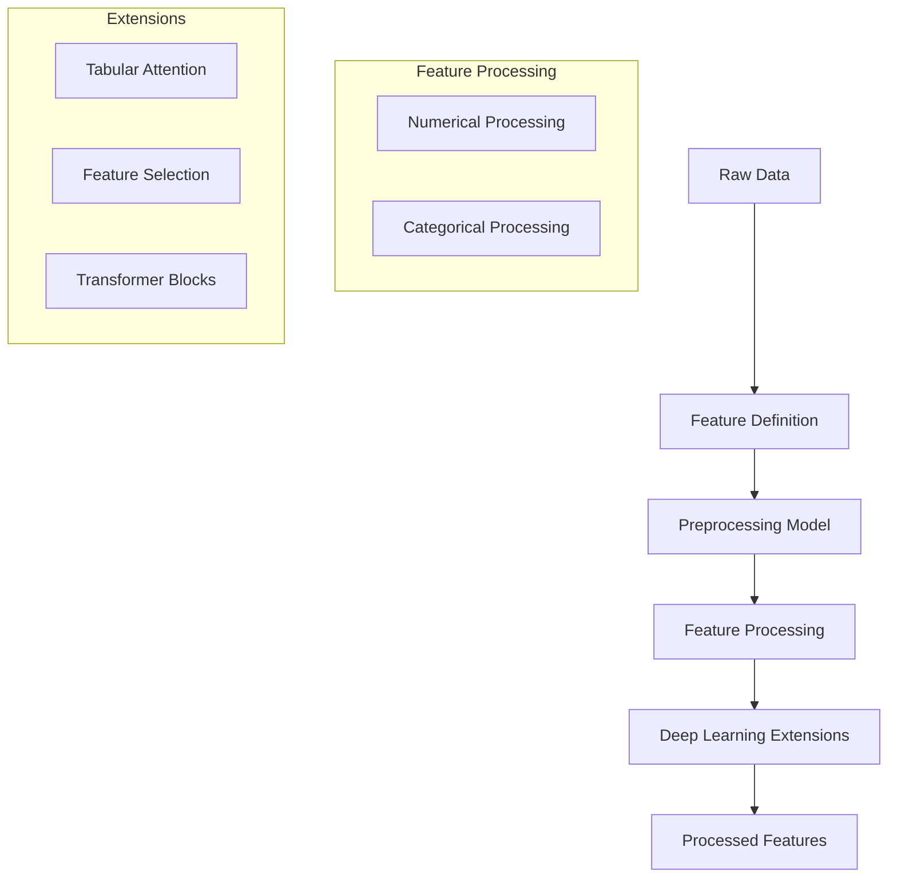

# 💡 Understanding KDP

## 🎯 What is KDP?

KDP (Keras Data Processor) is a powerful preprocessing library designed to streamline and enhance data preparation for deep learning models. It combines modern deep learning techniques with traditional preprocessing methods to create a flexible and efficient data processing pipeline.

## 🌟 Key Features

### 1. 🔄 Unified Preprocessing
- Single interface for all preprocessing needs
- Seamless integration with Keras models
- End-to-end differentiable pipeline

### 2. 🎛️ Advanced Feature Processing
- **Numerical Features**
  - Multiple scaling options
  - Automatic outlier handling
  - Missing value imputation

- **Categorical Features**
  - Learned embeddings
  - Automatic vocabulary management
  - Handling of unknown categories

### 3. 🧠 Deep Learning Enhancements
- **Tabular Attention**
  - Feature interaction modeling
  - Adaptive feature importance
  - Multi-head attention support

- **Feature Selection**
  - Automatic importance learning
  - Dynamic feature filtering
  - Interpretable weights

## 🏗️ Architecture Overview

## 💪 Why Choose KDP?

### 1. 🎯 Simplicity
- Intuitive API design
- Minimal boilerplate code
- Clear documentation

### 2. 🚀 Performance
- Optimized for large datasets
- GPU acceleration support
- Memory-efficient processing

### 3. 🔧 Flexibility
- Customizable preprocessing
- Extensible architecture
- Framework agnostic

### 4. 🤝 Integration
- Seamless Keras integration
- Easy model export/import
- Cloud platform support

## 🛠️ Core Components

### 1. Feature Definitions
- Define data types and processing
- Configure feature-specific parameters
- Set preprocessing strategies

### 2. Preprocessing Model
- Manages feature transformations
- Handles data flow
- Maintains state

### 3. Extensions
- Add advanced capabilities
- Enhance preprocessing
- Improve model performance

## 📈 Use Cases

### 1. 📊 Tabular Data
- Financial data processing
- Customer analytics
- Time series analysis

### 2. 🎯 Feature Engineering
- Automatic feature selection
- Feature interaction modeling
- Dimensionality reduction

### 3. 🔄 Model Integration
- Deep learning pipelines
- AutoML systems
- Production deployments

## 🚀 Getting Started

1. Check out our [Quick Start Guide](quick_start.md)
2. Explore [Key Features](features.md)
3. Try [Complex Examples](complex_examples.md)

## 📚 Learning Path

1. 🎓 **Beginner**
   - Basic feature definition
   - Simple preprocessing
   - Data transformation

2. 🏃 **Intermediate**
   - Advanced features
   - Custom preprocessing
   - Performance optimization

3. 🚀 **Advanced**
   - Extension development
   - Pipeline optimization
   - Production deployment

## 🔗 Next Steps

- [🛠️ Key Features](features.md)
- [🚀 Quick Start](quick_start.md)
- [📚 Complex Examples](complex_examples.md)
- [🤝 Contributing Guide](contributing.md)
